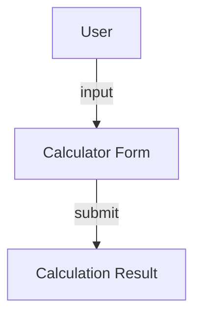
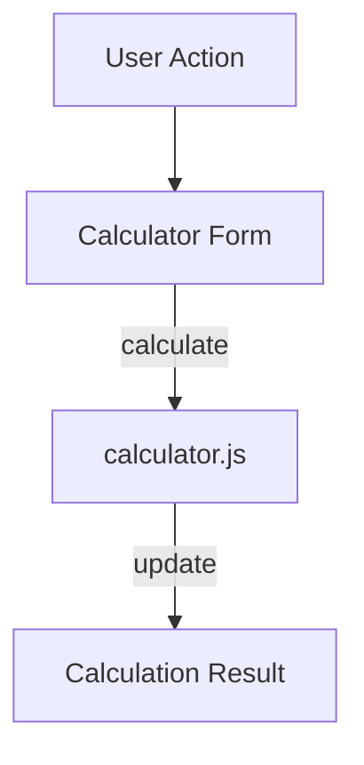

# calculator.md

## Summary
This document describes the Financial Calculator page, where users can perform various financial calculations. It covers both the user experience and the technical implementation, including form usage, result display, and calculation logic.

## UX/UI

### User Experience Overview
- The Calculator page allows users to select a formula and enter parameters via a dynamic form.
- Results are displayed instantly after calculation.
- The interface is simple, with clear input fields and result display.

### Available Functions and UI Elements
- Dynamic form for selecting formulas and entering parameters
- Result display area
- Navigation via the shared navbar

### Usage Example
- Select a formula (e.g., compound interest), enter values, and view the result.

### UI Diagram


---

## Technical Overview

### Internal Functions and Data Flow
- The Calculator page uses `calculator.js` for all calculation logic and dynamic form fields.
- No persistent data is read or written; calculations are session-only.
- The form dynamically updates based on the selected formula.

### Data Flow Diagram


### Variable Scope
- **Module:** calculator.js functions
- **Function:** Local variables within event handlers and calculation functions

### Key Code Snippet
```js
// Example calculation handler
function calculate(formula, params) {
  switch (formula) {
    case 'compoundInterest':
      return calculateCompoundInterest(params);
    // ...other cases
  }
}
```

---
