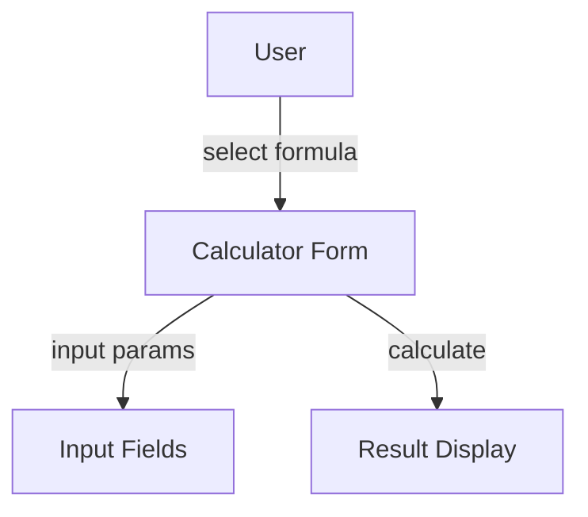
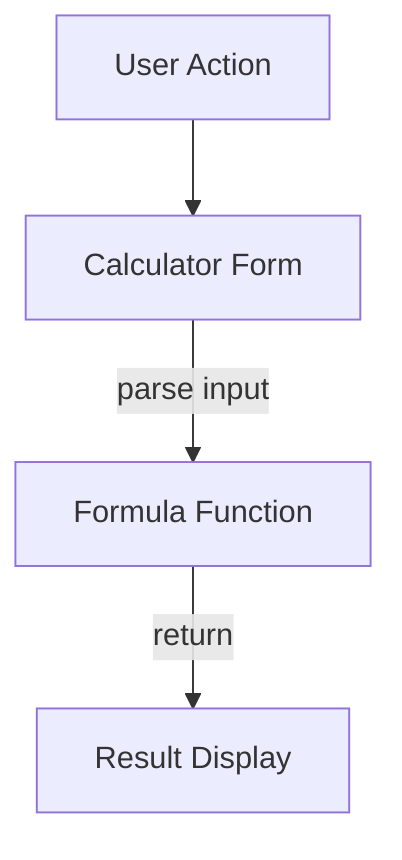

# compound-interest-formulas.md

## Summary
This document provides the standard formulas for compound interest, annuities, perpetuities, and effective annual rate (EAR) used throughout the app. It covers both the user experience and the technical implementation, including formula usage and calculation logic.

## UX/UI

### User Experience Overview
- Users can access these formulas via the calculator page or documentation.
- The calculator page allows users to select a formula, enter parameters, and view results instantly.
- Clear explanations and variable definitions are provided for each formula.

### Available Functions and UI Elements
- Formula selection in the calculator
- Input fields for all required parameters
- Result display area
- Explanatory notes for each formula

### Usage Example
- Select "Compound Interest (Future Value)", enter principal, rate, periods, and years, and view the calculated future value.

### UI Diagram


---

## Technical Overview

### Internal Functions and Data Flow
- The calculator module implements each formula as a function.
- User input is parsed and passed to the appropriate function.
- Results are displayed instantly after calculation.

### Data Flow Diagram


### Variable Scope
- **Module:** calculator.js functions for each formula
- **Function:** Local variables for parameters and intermediate results

### Key Code Snippet
```js
// Example: Compound Interest (Future Value)
function compoundInterestFV(PV, r, n, t) {
  return PV * Math.pow(1 + r/n, n*t);
}
```

---

# Compound Interest and Annuity Formulas

## 1. Compound Interest (Future Value)
- **Formula:**
  FV = PV × (1 + r/n)^(n×t)
- **Where:**
  - FV = future value
  - PV = present value (initial principal)
  - r = annual interest rate (decimal)
  - n = number of compounding periods per year
  - t = number of years

## 2. Compound Interest (Present Value)
- **Formula:**
  PV = FV / (1 + r/n)^(n×t)

## 3. Future Value of an Ordinary Annuity
- **Formula:**
  FV = P × [((1 + r/n)^(n×t) - 1) / (r/n)]
- **Where:**
  - P = payment per period
  - r = annual interest rate (decimal)
  - n = number of compounding periods per year
  - t = number of years

## 4. Present Value of an Ordinary Annuity
- **Formula:**
  PV = P × [1 - (1 + r/n)^(-n×t)] / (r/n)

## 5. Future Value of an Annuity Due
- **Formula:**
  FV = P × [((1 + r/n)^(n×t) - 1) / (r/n)] × (1 + r/n)

## 6. Present Value of an Annuity Due
- **Formula:**
  PV = P × [1 - (1 + r/n)^(-n×t)] / (r/n) × (1 + r/n)

## 7. Perpetuity (Infinite Annuity)
- **Formula:**
  PV = P / r
- **Where:**
  - P = payment per period
  - r = interest rate per period

## 8. Effective Annual Rate (EAR)
- **Formula:**
  EAR = (1 + r/n)^(n) - 1

---

**Notes:**
- For annuity due, payments are made at the beginning of each period; for ordinary annuity, at the end.
- Adjust n and r for different compounding frequencies (monthly, quarterly, etc.).
- These formulas are standard in finance for savings, loans, and investment calculations.
