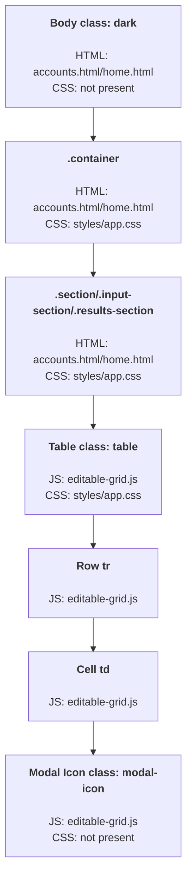
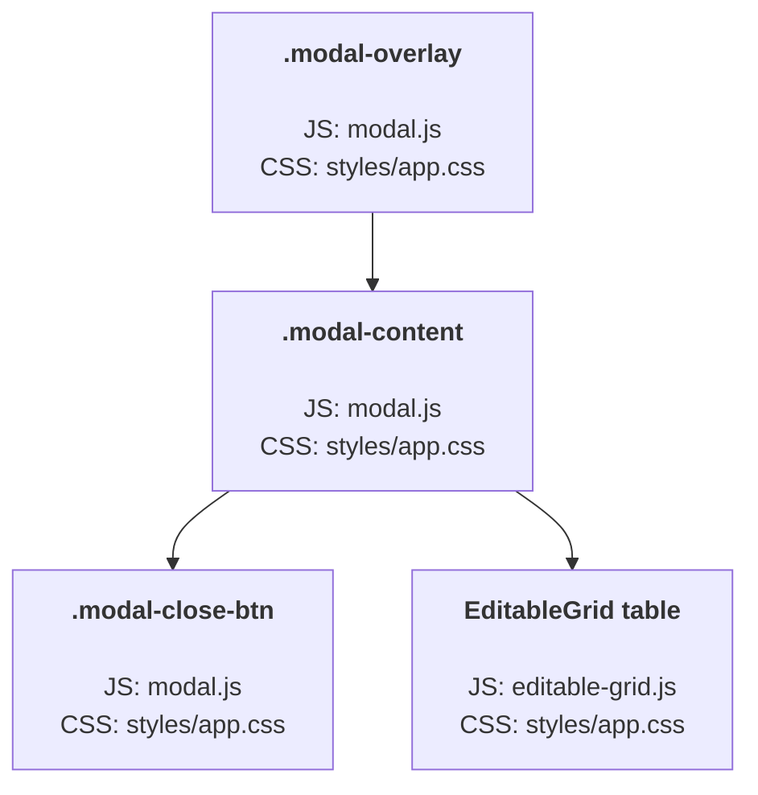
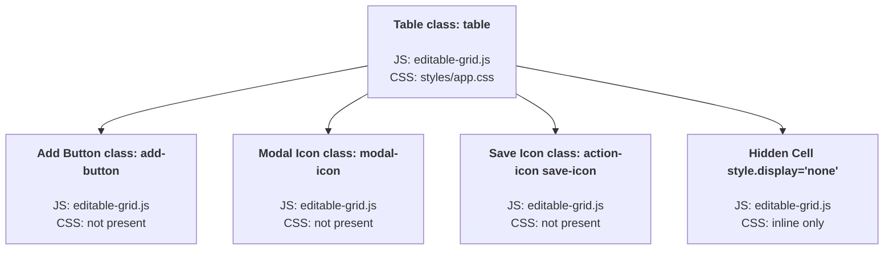

# CSS/DOM Usage Review: Modal, EditableGrid, Accounts, Home

## 1. Modal (`modal.js`)

**Classes (all dynamically added):**
- `modal-overlay` (dynamic):  
  - Added to overlay div (`this.modalOverlay`).  
  - **CSS:** Styles modal background overlay.
- `modal-content` (dynamic):  
  - Added to modal box (`this.modalBox`).  
  - **CSS:** Styles modal dialog container.
- `modal-close-btn` (dynamic):  
  - Added to close button.  
  - **CSS:** Styles close button in modal.

**IDs:**  
- None set in `modal.js`.

**Inline Styles:**  
- None set directly in `modal.js`.

---

## 2. EditableGrid (`editable-grid.js`)

**Classes (all dynamically added):**
- `table` (dynamic):  
  - Added to main table element.  
  - **CSS:** Styles tables globally.
- `add-button` (dynamic):  
  - Added to add row button (span).  
  - **CSS:** Not found in CSS, could be added for clarity.
- `modal-icon` (dynamic):  
  - Added to modal icon span in modal cell.  
  - **CSS:** Not found in CSS, could be added for clarity.
- `action-icon save-icon` (dynamic):  
  - Added to save icon span in actions cell.  
  - **CSS:** Not found in CSS, could be added for clarity.

**IDs:**  
- None set in `editable-grid.js`.

**Inline Styles:**  
- `cellContent.style.display = 'none'` (dynamic):  
  - Hides table cells for columns with `display: false`.

---

## 3. Accounts Page (`accounts.html`)

**Classes (static in markup):**
- `dark` (static):  
  - On `<body>`.  
  - **CSS:** Not found in app.css, but may be used for dark mode.
- `container` (static):  
  - On main wrapper div.  
  - **CSS:** Styles main content area.
- `input-section` (static):  
  - On section div.  
  - **CSS:** Styles input panels/sections.

**IDs (static):**
- `main-navbar`
- `panel-accounts`

**Inline Styles:**  
- None.

---

## 4. Home Page (`home.html`)

**Classes (static in markup):**
- `dark` (static):  
  - On `<body>`.
- `container` (static):  
  - On main wrapper div.
- `desc` (static):  
  - On welcome text div.  
  - **CSS:** Styles description text.
- `section` (static):  
  - On overview section.  
  - **CSS:** Styles content sections.

**IDs (static):**
- `main-navbar`
- `overview-section`
- `overview-list`
- `overview-accounts`
- `overview-balance`
- `overview-transactions`
- `overview-periods`

**Inline Styles:**  
- `style="margin-bottom:24px;"` (static):  
  - On `.desc` div.

---

## 5. CSS Class/ID Mapping (from `app.css`)

**Modal-related:**
- `.modal-overlay` — Modal background overlay.
- `.modal-content` — Modal dialog container.
- `.modal-header`, `.modal-title`, `.modal-close-btn`, `.modal-body`, `.modal-table`, `.modal-footer` — Modal structure (not all used in current JS).
- `.modal-hide` — Utility to hide elements in modal context.
- `.modal` — Base modal style (not directly used in JS, but could be for generic modals).
- `.recurrence-modal`, `.create-account-modal` — Specialized modal styles (not used in current JS).

**Grid-related:**
- `.table` — Main table style.
- `.editable-grid-input`, `.editable-grid-table` — For grid input and table (not directly used in current JS, but could be).
- `.actions`, `.icon-btn`, `.icon-btn svg` — For action buttons/icons (not directly used in current JS).

**Section/panel:**
- `.container`, `.section`, `.input-section`, `.results-section`, `.chart
- `.panel-header`, `.panel-arrow` — Panel headers and toggles.

**Other:**
- `.desc` — Description text.
- `.form-inline`, `.form-field` — Form layouts.
- `.tooltip`, `.tooltiptext` — Tooltip styles.
- `.add-row-container`, `.add-row-icon-btn` — Add row UI (not used in current JS).

---

## 6. Dynamically Added Classes/IDs/Styles (Summary Table)

| Element/Selector         | Type      | Class/ID/Style         | Where Set         | CSS Present? | Notes                        |
|-------------------------|-----------|------------------------|-------------------|--------------|------------------------------|
| .modal-overlay          | dynamic   | class                  | modal.js          | Yes          | Modal overlay                |
| .modal-content          | dynamic   | class                  | modal.js          | Yes          | Modal dialog                 |
| .modal-close-btn        | dynamic   | class                  | modal.js          | Yes          | Modal close button           |
| .table                  | dynamic   | class                  | editable-grid.js  | Yes          | Main grid table              |
| .add-button             | dynamic   | class                  | editable-grid.js  | No           | Add row button               |
| .modal-icon             | dynamic   | class                  | editable-grid.js  | No           | Modal cell icon              |
| .action-icon.save-icon  | dynamic   | class                  | editable-grid.js  | No           | Save icon in actions         |
| style.display='none'    | dynamic   | inline style           | editable-grid.js  | N/A          | Hides table cells            |
| .container              | static    | class                  | HTML              | Yes          | Main content area            |
| .input-section          | static    | class                  | HTML              | Yes          | Section/panel                |
| .section                | static    | class                  | HTML              | Yes          | Section                      |
| .desc                   | static    | class                  | HTML              | Yes          | Description text             |
| .dark                   | static    | class                  | HTML              | No           | Body dark mode               |
| #main-navbar            | static    | id                     | HTML              | No           | Navbar container             |
| #panel-accounts         | static    | id                     | HTML              | No           | Accounts panel               |
| #overview-section       | static    | id                     | HTML              | No           | Overview section             |
| #overview-list, etc.    | static    | id                     | HTML              | No           | Overview stats               |

---

## 7. Style/Layering Diagrams (Detailed)

<b>## 7.1. Page Structure (HTML, CSS, File Origins)</b>

<b>## 7.2. Modal Layer (JS, CSS, File Origins)</b>

<b>## 7.3. EditableGrid Layer (JS, CSS, File Origins)</b>

---

### Legend
- **HTML:** Static markup in .html files
- **JS:** Dynamically created by JavaScript
- **CSS:** Class is present in styles/app.css
- **not present:** Class or style is used in DOM but not defined in CSS
- **inline only:** Style is set directly in JS, not in CSS

---

# 7.4. Layer Style Overviews

- **.modal-overlay:** Fullscreen, dark, centers modal (CSS: styles/app.css)
- **.modal-content:** Modal box, background, border, padding (CSS: styles/app.css)
- **.modal-close-btn:** Close button, size, color, hover (CSS: styles/app.css)
- **.table:** Main grid table, width, background, border-radius (CSS: styles/app.css)
- **.container, .input-section, .section, .desc:** Layout, background, padding (CSS: styles/app.css)
- **.add-button, .modal-icon, .action-icon.save-icon:** Used in DOM, missing in CSS (should be added)
- **.dark:** Used in DOM, missing in CSS (should be added or removed)
- **style.display='none':** Used for hiding cells, set inline only

---

## 8. Style Suggestions

- **Unify class usage:** Use CSS classes for all major UI elements (avoid relying on tag selectors or inline styles).
- **Add missing classes:** Add CSS for `.add-button`, `.modal-icon`, `.action-icon`, `.save-icon` for clarity and maintainability.
- **Use BEM or similar naming:** For large apps, consider BEM (e.g., `.modal__close-btn`, `.grid__add-button`).
- **Minimize inline styles:** Move all inline styles (e.g., `style.display`) to CSS classes where possible.
- **Consistent dark mode:** If `.dark` is used, add a CSS block for it or remove if unused.
- **Accessibility:** Add `aria-*` attributes and focus styles for modals and buttons.
- **Responsive improvements:** Modal and grid already have some responsive tweaks; review on mobile for usability.

---

If you want a similar review for other files or want the CSS updated to include missing classes, let me know!
