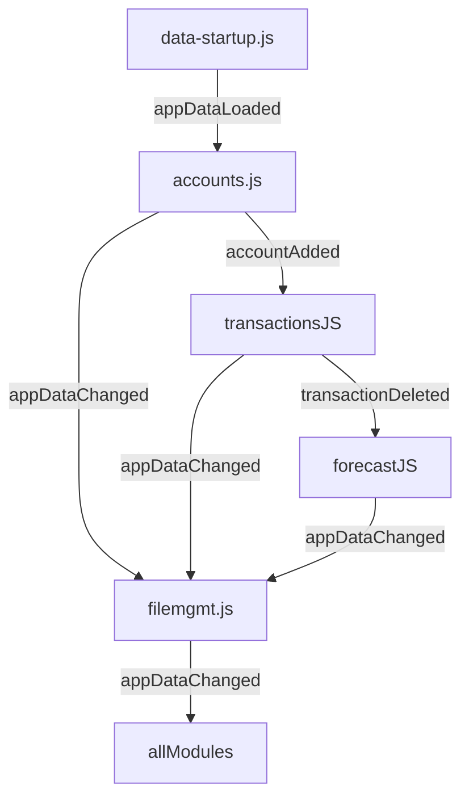

### 🔁 Copilot Prompt: Convert Codebase to Event-Driven Architecture

````
You are a code refactoring assistant. Your goal is to convert this HTML/CSS/JS project into a modular, event-driven architecture using custom events.

🎯 Objective:
Decouple direct module interactions and global state dependencies. Use custom DOM events (`CustomEvent`) to signal when data or state changes occur, allowing other modules to react.

🧭 Refactor Plan:

1. **Define Events**
   - Create a shared list of events with names and payloads, e.g.:
     - `appDataLoaded`, `appDataChanged`
     - `accountAdded`, `transactionUpdated`, `forecastRun`, etc.

2. **Data Load**
   - In `data-startup.js`: After loading, dispatch `appDataLoaded`.
   - Remove direct calls to module functions after load.

3. **Module Initialization**
   - In each module (`accounts.js`, `transactions.js`, etc.):
     - If data is ready, initialize directly.
     - Else, listen for `appDataLoaded` to begin initialization.
     - Remove any direct startup listeners like `DOMContentLoaded`.

4. **On Data Change**
   - When data changes:
     - Save via `filemgmt.saveAppDataToFile`.
     - Dispatch event: `appDataChanged`, `accountAdded`, etc.

5. **UI Updates**
   - Replace direct UI update calls with event listeners.
   - Example: Accounts table listens for `appDataChanged` to refresh itself.

6. **Remove Cross-Module Dependencies**
   - Eliminate direct imports between modules where possible.
   - Use events instead (e.g. `transactions.js` listens for `accountAdded`).

7. **Documentation**
   - Create a list of all custom events with:
     - Event name
     - Payload structure
     - Which modules dispatch and listen to them

8. **Testing**
   - Test all user flows (add/edit/delete entities, run forecasts).
   - Ensure modules react correctly to dispatched events.

🧪 Event Dispatch Syntax:
```js
document.dispatchEvent(new CustomEvent('eventName', { detail: payload }));
````

🧩 Event Listener Syntax:

```js
document.addEventListener('eventName', (e) => { ... });
```

📊 Example Mermaid Diagram:



Start by identifying and defining the core events and then proceed module-by-module.

```


```
