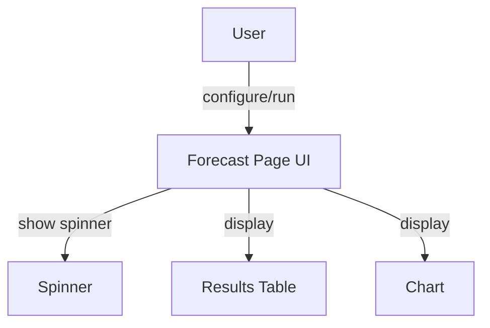
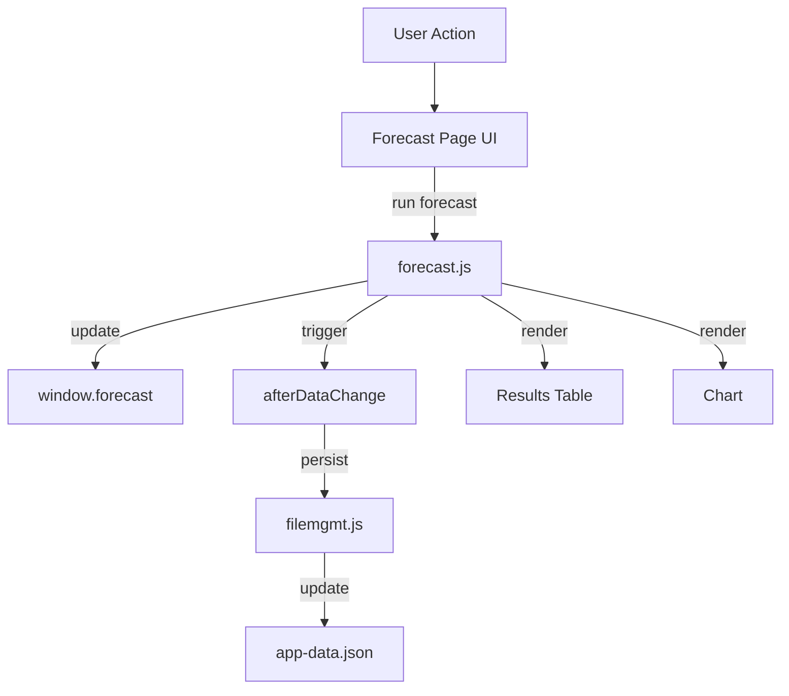

# forecast.md

## Summary
This document describes the Financial Forecast page, where users can configure and run forecasts, and view results in tables and charts. It covers both the user experience and the technical implementation, including settings, results, and data flow.

## UX/UI

### User Experience Overview
- The Forecast page allows users to select forecast mode, date range, period count, and period type.
- Results are displayed in a table and as a chart (using Plotly.js).
- All changes are saved automatically and immediately, with spinners and logging for feedback.
- The interface is organized into settings, results, and chart sections.

### Available Functions and UI Elements
- Form elements for forecast configuration
- Results table for account balances
- Chart for visualizing balances over time
- Spinners for feedback during forecast calculation

### Usage Example
- Configure forecast settings and click the run button to generate results.
- View forecasted balances in the table and chart.

### UI Diagram


---

## Technical Overview

### Internal Functions and Data Flow
- The Forecast page reads and writes forecast data to the global state (`window.forecast`).
- Triggers `afterDataChange` to save all app data and update the UI.
- Interacts with `accounts.js` and `transactions.js` for data.
- Uses Plotly.js for chart rendering.

### Data Flow Diagram


### Variable Scope
- **Global:** `window.forecast`, `appData`
- **Module:** forecast.js functions
- **Function:** Local variables within event handlers and forecast calculations

### Key Code Snippet
```js
// Example forecast run handler
function runForecast(settings) {
  const results = calculateForecast(settings, window.accounts, window.transactions);
  window.forecast = results;
  afterDataChange();
}
```

---
