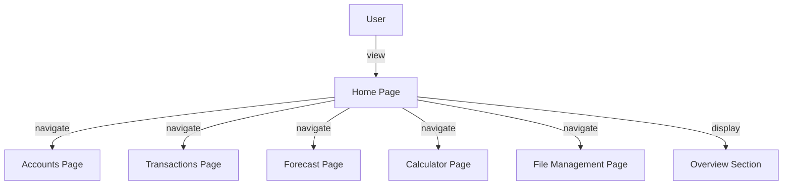
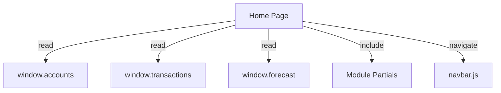

# home.md

## Summary
This document describes the Home (Overview) page, which provides a dashboard summary and navigation entry point for all modules in the app. It covers both the user experience and the technical implementation, including overview data, navigation, and state reading.

## UX/UI

### User Experience Overview
- The Home page displays summary counts for accounts, transactions, and forecast periods.
- Provides navigation links to all major modules via the navbar.
- Includes partials for all modules for a modular or SPA-like experience.

### Available Functions and UI Elements
- Overview section with summary data
- Navigation links to accounts, transactions, forecast, calculator, and file management
- Shared navbar for consistent navigation

### Usage Example
- View the dashboard to see a summary of your financial data.
- Click a navigation link to access a specific module.

### UI Diagram


---

## Technical Overview

### Internal Functions and Data Flow
- The Home page reads global state (accounts, transactions, forecast) to display summary data.
- Includes partials for all other modules for modularity.
- Uses `navbar.js` for navigation.

### Data Flow Diagram


### Variable Scope
- **Global:** `window.accounts`, `window.transactions`, `window.forecast`
- **Module:** home.js functions
- **Function:** Local variables within event handlers and summary calculations

### Key Code Snippet
```js
// Example summary calculation
function getSummary() {
  return {
    accounts: window.accounts.length,
    transactions: window.transactions.length,
    forecastPeriods: window.forecast.length
  };
}
```

---
