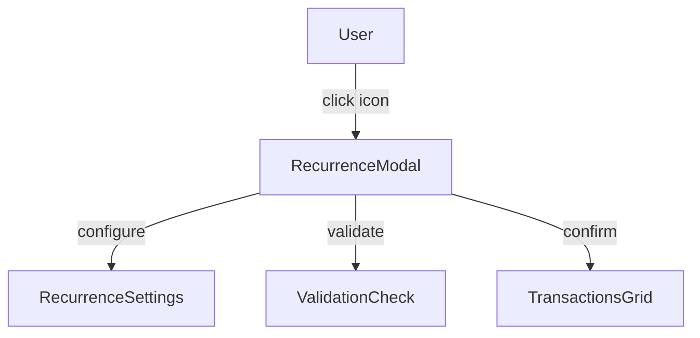
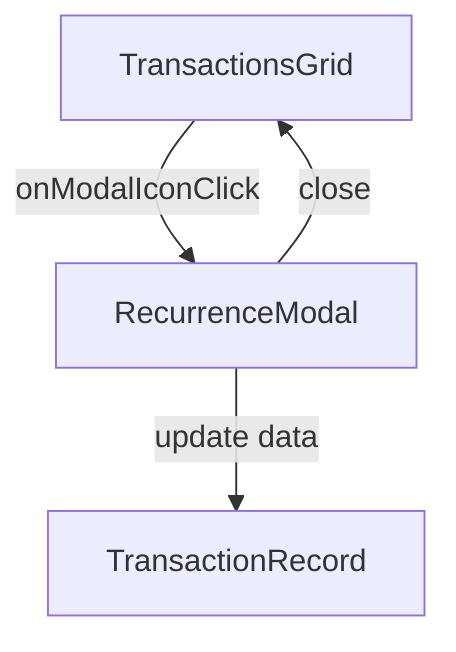

# modal-recurrence.md

## Summary
This document describes the Recurrence Modal, a specialized component for editing transaction recurrence patterns. It covers both the user experience and the technical implementation, including modal usage, recurrence configuration, and grid integration.

## UX/UI

### User Experience Overview
- The Recurrence Modal allows users to define complex recurring schedules for transactions.
- Users can select frequency, specify day-of-month, and set end dates.
- The modal provides validation to ensure valid recurrence configurations.
- The modal is accessed via a modal icon in the transactions grid.

### Available Functions and UI Elements
- Modal dialog for recurrence configuration
- Dropdown for frequency selection
- Input field for day specification
- Date picker for end date
- Validation feedback
- Modal icon in the grid for quick access

### Usage Example
- Click the modal icon in the recurrence column to open the modal.
- Select frequency, enter day of month if applicable, and set an end date.
- Save to apply the recurrence pattern.

### UI Diagram


---

## Technical Overview

### Internal Functions and Data Flow
- The modal is implemented as a reusable JS module in `modal-recurrence.js`.
- Triggered from the EditableGrid via a modal icon and callback.
- Works with recurrence objects containing frequency, dayOfMonth, and endDate.
- Updates the transaction's recurrence field and triggers a grid update.

### Data Flow Diagram


### Variable Scope
- **Global:** None - modal state is local
- **Module:** RecurrenceModal instance, configuration object
- **Function:** Local variables for modal state and validation

### Data Structure
The modal works with recurrence objects having:
- `frequency`: 'monthly', 'weekly', 'daily', 'yearly'
- `dayOfMonth`: Number from 1-31 for monthly frequency
- `endDate`: ISO date string or empty for indefinite recurrence

### Key Code Snippet
```javascript
// Example modal trigger in EditableGrid
{
  field: 'recurrence',
  header: 'Recurrence',
  modalIcon: '<svg>...</svg>',
  onModalIconClick: ({ idx }) => RecurrenceModal.show(...)
}
```

---
