# Code Documentation

**Version**: 1.0.0  
**Last Updated**: January 11, 2026  
**Purpose**: Complete developer reference for all JavaScript modules

---

## 1. main.js
**Path:** /Users/jay/GIT-Repos-Personal/ftrack/main.js  
**Purpose:** Main process for Electron application. Handles app initialization, window creation, and first-run data setup.

### Functions

**initializeUserData()**
- Parameters: None
- Returns: Promise<void>
- Description: Initializes user data directory on first run by copying bundled app-data.sample.json to writable userData location

**createWindow()**
- Parameters: None
- Returns: void
- Description: Creates the main BrowserWindow with specified dimensions and web preferences

---

## 2. preload.js
**Path:** /Users/jay/GIT-Repos-Personal/ftrack/preload.js  
**Purpose:** Preload script for Electron. Minimal implementation as app uses nodeIntegration: true.

### Functions

**DOMContentLoaded event listener**
- Parameters: None
- Returns: void
- Description: Logs when preload script is ready

---

## 3. accounts.js
**Path:** /Users/jay/GIT-Repos-Personal/ftrack/js/accounts.js  
**Purpose:** Manages the Accounts page, rendering and managing the accounts table using EditableGrid module.

### Functions

**buildGridContainer()**
- Parameters: None
- Returns: HTMLElement - The table container element
- Description: Builds the accordion-style container structure for the accounts grid with header and foldable content

**onSave(updatedAccounts)**
- Parameters: updatedAccounts (Array) - Updated array of account objects
- Returns: Promise<void>
- Description: Saves updated accounts to disk via DataManager for the selected scenario

**onDelete(accountId)**
- Parameters: accountId (number) - ID of account to delete
- Returns: Promise<void>
- Description: Deletes an account from the selected scenario via DataManager

**createGridSchema(tableElement, onSave, onDelete)**
- Parameters: 
  - tableElement (HTMLElement) - Container element for the grid
  - onSave (Function) - Callback function for save operations
  - onDelete (Function) - Callback function for delete operations
- Returns: Promise<Object|null> - Grid configuration object or null on error
- Description: Loads accounts-grid.json schema and current scenario's accounts data

**loadTable(tableData)**
- Parameters: tableData (Object) - Grid configuration object
- Returns: void
- Description: Instantiates and renders an EditableGrid with the provided configuration

---

## 4. app-paths.js
**Path:** /Users/jay/GIT-Repos-Personal/ftrack/js/app-paths.js  
**Purpose:** Provides consistent path resolution for data and configuration files across development and production environments.

### Functions

**getAppDataPath()**
- Parameters: None
- Returns: string - Full path to user's app-data.json file
- Description: Returns path to writable user data file in userData directory

**getSchemaPath(schemaName)**
- Parameters: schemaName (string) - Name of schema file (e.g., 'accounts-grid-unified.json')
- Returns: string - Full path to schema file
- Description: Returns path to read-only schema file in bundled assets directory

---

## 5. calculation-utils.js
**Path:** /Users/jay/GIT-Repos-Personal/ftrack/js/calculation-utils.js  
**Purpose:** Utility functions for recurrence date generation and periodic change calculations (interest, growth, fixed amounts).

### Functions

**getNthWeekdayOfMonth(date, weekday, n)**
- Parameters: 
  - date (Date) - The month/year to search in
  - weekday (number) - Day of week (0=Sunday, 6=Saturday)
  - n (number) - Which occurrence (1-4, or -1 for last)
- Returns: Date - The date of the Nth weekday
- Description: Finds the Nth occurrence of a specific weekday in a month (e.g., "2nd Tuesday")

**getQuartersBetween(start, end)**
- Parameters: 
  - start (Date) - Start date
  - end (Date) - End date
- Returns: number - Number of quarters (0 if end is before start)
- Description: Calculates the number of quarters between two dates

**getPeriodsBetween(start, end, frequency)**
- Parameters: 
  - start (Date) - Start date
  - end (Date) - End date
  - frequency (string) - Frequency type (Daily, Weekly, Monthly, Quarterly, Yearly)
- Returns: number - Number of periods
- Description: Calculates the number of periods between two dates based on frequency type

**generateRecurrenceDates(recurrence, projectionStart, projectionEnd)**
- Parameters: 
  - recurrence (Object) - Recurrence configuration object
  - projectionStart (Date) - Start date for projections
  - projectionEnd (Date) - End date for projections
- Returns: Date[] - Array of dates when transaction should occur
- Description: Generates all occurrence dates for a recurrence rule within the projection window. Supports 8 recurrence types: One Time, Daily, Weekly, Monthly - Day of Month, Monthly - Week of Month, Quarterly, Yearly, Custom Dates

**calculatePeriodicChange(principal, periodicChange, periods)**
- Parameters: 
  - principal (number) - Starting amount
  - periodicChange (Object) - Change configuration {changeMode, changeType, value, period, ratePeriod, frequency}
  - periods (number) - Time period in years
- Returns: number - Future value after periodic change
- Description: Calculates future value with periodic changes. Supports two change modes: Percentage Rate (with multiple compounding options) and Fixed Amount (e.g., +$10 per month)

---

## 6. config.js
**Path:** /Users/jay/GIT-Repos-Personal/ftrack/js/config.js  
**Purpose:** Configuration management for keyboard shortcuts and selected scenario persistence.

### Functions

**loadConfig()**
- Parameters: None
- Returns: Promise<void>
- Description: Loads shortcuts from shortcuts.json and selected scenario ID from localStorage

**getSelectedScenarioId()**
- Parameters: None
- Returns: number - Currently selected scenario ID
- Description: Returns the currently selected scenario ID

**setSelectedScenarioId(scenarioId)**
- Parameters: scenarioId (number) - Scenario ID to set as selected
- Returns: void
- Description: Sets the selected scenario ID and persists to localStorage

**getShortcut(module, action)**
- Parameters: 
  - module (string) - Module name
  - action (string) - Action name
- Returns: string|null - Shortcut string or null if not found
- Description: Retrieves a keyboard shortcut for a specific module and action

**getAllShortcuts()**
- Parameters: None
- Returns: Object - All shortcuts configuration
- Description: Returns the complete shortcuts configuration object

**matchShortcut(event, shortcut)**
- Parameters: 
  - event (KeyboardEvent) - Keyboard event to match
  - shortcut (string) - Shortcut string (e.g., 'Meta+Shift+A')
- Returns: boolean - True if event matches shortcut
- Description: Checks if a keyboard event matches a shortcut string

---

## 7. data-manager.js
**Path:** /Users/jay/GIT-Repos-Personal/ftrack/js/data-manager.js  
**Purpose:** Centralized data management for scenario-centric architecture. All operations read/write from app-data.json.

### Functions

**readAppData()**
- Parameters: None
- Returns: Promise<Object> - The app data object
- Description: Reads the entire app-data.json file from disk

**writeAppData(data)**
- Parameters: data (Object) - The data to write
- Returns: Promise<void>
- Description: Writes data to app-data.json file

**getScenarios()**
- Parameters: None
- Returns: Promise<Array> - Array of scenarios
- Description: Retrieves all scenarios from app data

**getScenario(scenarioId)**
- Parameters: scenarioId (number) - The scenario ID
- Returns: Promise<Object|null> - The scenario object or null
- Description: Retrieves a specific scenario by ID

**createScenario(scenarioData)**
- Parameters: scenarioData (Object) - The scenario data
- Returns: Promise<Object> - The created scenario with ID
- Description: Creates a new scenario with auto-generated ID and default nested arrays

**updateScenario(scenarioId, updates)**
- Parameters: 
  - scenarioId (number) - The scenario ID
  - updates (Object) - The fields to update
- Returns: Promise<Object> - The updated scenario
- Description: Updates an existing scenario with partial updates

**deleteScenario(scenarioId)**
- Parameters: scenarioId (number) - The scenario ID
- Returns: Promise<void>
- Description: Deletes a scenario and all its associated data

**duplicateScenario(scenarioId, newName)**
- Parameters: 
  - scenarioId (number) - The scenario ID to duplicate
  - newName (string) - Name for the duplicated scenario
- Returns: Promise<Object> - The new scenario
- Description: Creates a deep copy of a scenario with a new ID and name

**getAccounts(scenarioId)**
- Parameters: scenarioId (number) - The scenario ID
- Returns: Promise<Array> - Array of accounts
- Description: Retrieves all accounts for a scenario

**createAccount(scenarioId, accountData)**
- Parameters: 
  - scenarioId (number) - The scenario ID
  - accountData (Object) - The account data
- Returns: Promise<Object> - The created account
- Description: Creates a new account in a scenario with auto-generated ID

**updateAccount(scenarioId, accountId, updates)**
- Parameters: 
  - scenarioId (number) - The scenario ID
  - accountId (number) - The account ID
  - updates (Object) - The fields to update
- Returns: Promise<Object> - The updated account
- Description: Updates an account in a scenario

**deleteAccount(scenarioId, accountId)**
- Parameters: 
  - scenarioId (number) - The scenario ID
  - accountId (number) - The account ID
- Returns: Promise<void>
- Description: Deletes an account and cascades deletion to all planned transactions referencing it

**saveAccounts(scenarioId, accounts)**
- Parameters: 
  - scenarioId (number) - The scenario ID
  - accounts (Array) - Array of accounts
- Returns: Promise<void>
- Description: Bulk update/replace all accounts for a scenario

**getPlannedTransactions(scenarioId)**
- Parameters: scenarioId (number) - The scenario ID
- Returns: Promise<Array> - Array of planned transactions
- Description: Retrieves all planned transactions for a scenario

**createPlannedTransaction(scenarioId, transactionData)**
- Parameters: 
  - scenarioId (number) - The scenario ID
  - transactionData (Object) - The transaction data
- Returns: Promise<Object> - The created transaction
- Description: Creates a new planned transaction with auto-generated ID

**updatePlannedTransaction(scenarioId, transactionId, updates)**
- Parameters: 
  - scenarioId (number) - The scenario ID
  - transactionId (number) - The transaction ID
  - updates (Object) - The fields to update
- Returns: Promise<Object> - The updated transaction
- Description: Updates a planned transaction

**deletePlannedTransaction(scenarioId, transactionId)**
- Parameters: 
  - scenarioId (number) - The scenario ID
  - transactionId (number) - The transaction ID
- Returns: Promise<void>
- Description: Deletes a planned transaction

**savePlannedTransactions(scenarioId, transactions)**
- Parameters: 
  - scenarioId (number) - The scenario ID
  - transactions (Array) - Array of transactions
- Returns: Promise<void>
- Description: Bulk update/replace all planned transactions, ensuring all have unique IDs

**getActualTransactions(scenarioId)**
- Parameters: scenarioId (number) - The scenario ID
- Returns: Promise<Array> - Array of actual transactions
- Description: Retrieves all actual transactions for a scenario

**createActualTransaction(scenarioId, transactionData)**
- Parameters: 
  - scenarioId (number) - The scenario ID
  - transactionData (Object) - The transaction data
- Returns: Promise<Object> - The created transaction
- Description: Creates a new actual transaction with auto-generated ID

**updateActualTransaction(scenarioId, transactionId, updates)**
- Parameters: 
  - scenarioId (number) - The scenario ID
  - transactionId (number) - The transaction ID
  - updates (Object) - The fields to update
- Returns: Promise<Object> - The updated transaction
- Description: Updates an actual transaction

**deleteActualTransaction(scenarioId, transactionId)**
- Parameters: 
  - scenarioId (number) - The scenario ID
  - transactionId (number) - The transaction ID
- Returns: Promise<void>
- Description: Deletes an actual transaction

**saveActualTransactions(scenarioId, transactions)**
- Parameters: 
  - scenarioId (number) - The scenario ID
  - transactions (Array) - Array of transactions
- Returns: Promise<void>
- Description: Bulk update/replace all actual transactions, ensuring all have unique IDs

**getProjections(scenarioId)**
- Parameters: scenarioId (number) - The scenario ID
- Returns: Promise<Array> - Array of projections
- Description: Retrieves all projections for a scenario

**saveProjections(scenarioId, projections)**
- Parameters: 
  - scenarioId (number) - The scenario ID
  - projections (Array) - Array of projection records
- Returns: Promise<void>
- Description: Replaces all projections for a scenario

**clearProjections(scenarioId)**
- Parameters: scenarioId (number) - The scenario ID
- Returns: Promise<void>
- Description: Clears all projections for a scenario

**getScenarioPeriods(scenarioId)**
- Parameters: scenarioId (number) - The scenario ID
- Returns: Promise<Array> - Array of period objects with id, label, startDate, endDate
- Description: Calculates all periods for a scenario based on start/end dates and period type

**getPlannedTransactionsForPeriod(scenarioId, periodId)**
- Parameters: 
  - scenarioId (number) - The scenario ID
  - periodId (string) - The period ID (e.g., '2026-01')
- Returns: Promise<Array> - Array of planned transaction instances for the period
- Description: Generates all planned transaction occurrences within a specific period

**calculateOccurrencesInPeriod(recurrence, period)**
- Parameters: 
  - recurrence (Object) - The recurrence rule
  - period (Object) - The period object with startDate and endDate
- Returns: Date[] - Array of dates when transaction occurs
- Description: Internal helper to calculate transaction occurrences in a period

**getActualTransactionsForPeriod(scenarioId, periodId)**
- Parameters: 
  - scenarioId (number) - The scenario ID
  - periodId (string) - The period ID
- Returns: Promise<Array> - Array of actual transactions for the period
- Description: Retrieves actual transactions filtered by period ID

**saveActualTransaction(scenarioId, actualTransaction)**
- Parameters: 
  - scenarioId (number) - The scenario ID
  - actualTransaction (Object) - The actual transaction data
- Returns: Promise<Object> - The saved actual transaction
- Description: Creates or updates an actual transaction

---

## 8. editable-grid.js
**Path:** /Users/jay/GIT-Repos-Personal/ftrack/js/editable-grid.js  
**Purpose:** Comprehensive grid component for rendering and editing tabular data with support for multiple column types, modals, conditional visibility, and keyboard shortcuts.

### Classes

**EditableGrid**

Constructor: `new EditableGrid(options)`
- Parameters:
  - options.targetElement (HTMLElement) - Container element for the grid
  - options.tableHeader (string) - Header text for the table
  - options.schema (Object) - Grid schema definition
  - options.data (Array) - Initial data array
  - options.onSave (Function) - Save callback function
  - options.onDelete (Function) - Optional delete callback function
  - options.onRowClick (Function) - Optional row click callback
  - options.parentRowId (number) - Optional parent row ID for nested grids
  - options.parentField (string) - Optional parent field name for nested grids
  - options.scenarioContext (Object) - Optional scenario context for conditional visibility

Methods:

**prepareModals()**
- Parameters: None
- Returns: void
- Description: Initializes modal configurations from schema, creating modal instances for each modal column type

**prepareSelectOptions()**
- Parameters: None
- Returns: void
- Description: Extracts and stores select options from schema for all select and addSelect column types

**render()**
- Parameters: None
- Returns: Promise<void>
- Description: Renders the complete grid including headers, data rows, and action buttons. Syncs header visibility with cell visibility

**createHeader()**
- Parameters: None
- Returns: HTMLElement - Table header element
- Description: Creates table headers from schema definition, including optional selector column and action column

**createTableRows()**
- Parameters: None
- Returns: HTMLElement - Table body element
- Description: Creates all data rows with appropriate input types based on column type. Supports: text, number, currency, select, addSelect, modal, tags, checkbox, exclusive, date

**createTotalsRow()**
- Parameters: None
- Returns: HTMLElement|null - Totals row element or null
- Description: Creates totals row for transaction grids showing total debits, credits, and net balance

**syncHeaderVisibility(table)**
- Parameters: table (HTMLElement) - The table element
- Returns: void
- Description: Shows/hides header columns based on cell visibility and updates context-sensitive headers (e.g., "Value" → "Rate (%)")

**handleSave(row, rowId, field)**
- Parameters: 
  - row (HTMLElement) - The table row element
  - rowId (number) - Optional parent row ID for modal grids
  - field (string) - Optional field name for modal grids
- Returns: Promise<void>
- Description: Extracts data from row, updates working data, and calls onSave callback. Filters incomplete rows for main grid saves

**handleAdd()**
- Parameters: None
- Returns: void
- Description: Adds a new row with default values and re-renders the grid

**onModalSave(rowId, field, updatedModalData)**
- Parameters: 
  - rowId (number) - ID of parent row
  - field (string) - Field in parent row to update
  - updatedModalData (Array) - New data for the field
- Returns: void
- Description: Updates parent row data when modal grid is saved

**handleDelete(row)**
- Parameters: row (HTMLElement) - The table row element
- Returns: void
- Description: Removes row from working data and calls onSave to persist changes

**getNestedValue(obj, path)**
- Parameters: 
  - obj (Object) - The object to search
  - path (string) - Dot-separated path (e.g., "scenario.type.name")
- Returns: any - The value at the path, or undefined
- Description: Retrieves nested property values using dot notation

**setNestedValue(obj, path, value)**
- Parameters: 
  - obj (Object) - The object to modify
  - path (string) - Dot-separated path
  - value (any) - Value to set
- Returns: void
- Description: Sets nested property values using dot notation

**evaluateVisibleWhen(expression, rowData)**
- Parameters: 
  - expression (string) - Expression like "scenario.type.name == 'Budget'"
  - rowData (Object) - Current row data
- Returns: boolean - True if column should be visible
- Description: Evaluates conditional visibility expressions. Supports operators: ==, !=, IN, NOT IN

**isColumnVisible(col, rowData)**
- Parameters: 
  - col (Object) - Column definition
  - rowData (Object) - Current row data
- Returns: boolean - True if column should be visible
- Description: Checks if a column should be visible based on visibleWhen conditions

---

## 9. forecast.js
**Path:** /Users/jay/GIT-Repos-Personal/ftrack/js/forecast.js  
**Purpose:** Manages the Forecast page with scenario-centric model. Displays accounts, planned transactions, actual transactions, and projections based on scenario type.

### Functions

**buildGridContainer()**
- Parameters: None
- Returns: Object - Object containing references to all container elements
- Description: Builds the main UI structure with independent accordion sections for scenarios, accounts, planned transactions, actual transactions, and projections

**buildScenarioGrid(container)**
- Parameters: container (HTMLElement) - Container element for the scenario selector
- Returns: Promise<void>
- Description: Renders the scenario selection and management grid. Loads all scenarios and handles scenario creation, editing, and selection

**loadScenarioTypes()**
- Parameters: None
- Returns: Promise<void>
- Description: Loads scenario type configuration from scenario-types.json

**getScenarioTypeConfig()**
- Parameters: None
- Returns: Object|null - Scenario type configuration or null
- Description: Returns configuration for the current scenario type

**transformPlannedTxForUI(plannedTxs, selectedAccountId)**
- Parameters: 
  - plannedTxs (Array) - Array of planned transactions
  - selectedAccountId (number) - ID of selected account
- Returns: Array - Transformed transactions
- Description: Transforms transactions from backend format (debitAccount/creditAccount) to UI format (transactionType/secondaryAccount) filtered by selected account

**transformPlannedTxForBackend(tx, selectedAccountId)**
- Parameters: 
  - tx (Object) - Transaction in UI format
  - selectedAccountId (number) - ID of selected account
- Returns: Promise<Object|null> - Transaction in backend format or null
- Description: Transforms transaction from UI format back to backend format. Creates new accounts if needed

**transformActualTxForUI(actualTxs, selectedAccountId)**
- Parameters: 
  - actualTxs (Array) - Array of actual transactions
  - selectedAccountId (number) - ID of selected account
- Returns: Array - Transformed transactions
- Description: Transforms actual transactions for UI display (same as planned transactions)

**transformActualTxForBackend(tx, selectedAccountId)**
- Parameters: 
  - tx (Object) - Transaction in UI format
  - selectedAccountId (number) - ID of selected account
- Returns: Promise<Object|null> - Transaction in backend format or null
- Description: Transforms actual transaction from UI format back to backend format

**loadAccountsGrid(container)**
- Parameters: container (HTMLElement) - Container element for accounts grid
- Returns: Promise<void>
- Description: Loads and renders the accounts grid for the current scenario. Handles row selection for filtering transaction views

**loadPlannedTransactionsGrid(container)**
- Parameters: container (HTMLElement) - Container element for planned transactions grid
- Returns: Promise<void>
- Description: Loads and renders planned transactions filtered by selected account. Transforms data for UI display

**loadActualTransactionsGrid(container)**
- Parameters: container (HTMLElement) - Container element for actual transactions grid
- Returns: Promise<void>
- Description: Loads and renders actual transactions filtered by selected account

**initializePeriodSelector()**
- Parameters: None
- Returns: Promise<void>
- Description: Initializes period selectors and attaches navigation event listeners for both planned and actual transaction views

**switchPlannedView(view)**
- Parameters: view (string) - View type ('master' or period ID)
- Returns: Promise<void>
- Description: Switches planned transactions view between master list and period-specific view

**navigatePlannedPeriod(direction)**
- Parameters: direction (number) - Direction to navigate (-1 for previous, 1 for next)
- Returns: void
- Description: Navigates to previous or next period in planned transactions view

**navigateActualPeriod(direction)**
- Parameters: direction (number) - Direction to navigate (-1 for previous, 1 for next)
- Returns: void
- Description: Navigates to previous or next period in actual transactions view

**loadPlannedTransactionsForPeriodView(container, periodId)**
- Parameters: 
  - container (HTMLElement) - Container element
  - periodId (string) - Period ID (e.g., '2026-01')
- Returns: Promise<void>
- Description: Loads planned transactions for a specific period showing calculated instances with dates

**loadActualTransactionsForPeriod(periodId)**
- Parameters: periodId (string) - Period ID
- Returns: Promise<void>
- Description: Loads combined view of planned and actual transactions for a period with variance tracking

**buildPeriodGridData(plannedTransactions, actualTransactions)**
- Parameters: 
  - plannedTransactions (Array) - Planned transaction instances for the period
  - actualTransactions (Array) - Actual transactions for the period
- Returns: Array - Combined grid data rows
- Description: Builds grid data combining planned and actual transactions, calculating variances

**savePeriodActuals(periodId, rows)**
- Parameters: 
  - periodId (string) - Period ID
  - rows (Array) - Grid rows with actual data
- Returns: Promise<void>
- Description: Saves or deletes actual transactions based on executed flag and user edits

**formatDate(date)**
- Parameters: date (Date|string) - Date to format
- Returns: string - Formatted date (e.g., "Jan 15")
- Description: Formats date for display in grid

**loadProjectionsSection(container)**
- Parameters: container (HTMLElement) - Container element for projections section
- Returns: Promise<void>
- Description: Loads projections section with generate/clear buttons and filtered projections grid

**loadProjectionsGrid(container)**
- Parameters: container (HTMLElement) - Container element for projections grid
- Returns: Promise<void>
- Description: Loads and renders projections grid filtered by selected account

**loadScenarioData()**
- Parameters: None
- Returns: Promise<void>
- Description: Loads all data for current scenario and shows/hides sections based on scenario type configuration

**init()**
- Parameters: None
- Returns: Promise<void>
- Description: Initializes the page, loading globals, scenario types, and building the initial UI

---

## 10. global-app.js
**Path:** /Users/jay/GIT-Repos-Personal/ftrack/js/global-app.js  
**Purpose:** Provides global helper functions for DOM manipulation and UI interactions.

### Functions

**loadGlobals()**
- Parameters: None
- Returns: void
- Description: Adds global helper functions to window object: getEl (get element by ID), add (append child), toggleAccordion (toggle element display)

---

## 11. modal.js
**Path:** /Users/jay/GIT-Repos-Personal/ftrack/js/modal.js  
**Purpose:** Modal dialog component that wraps EditableGrid for editing nested data structures.

### Classes

**Modal**

Constructor: `new Modal(options)`
- Parameters:
  - options.targetElement (HTMLElement) - Optional container element (defaults to document.body)
  - options.tableHeader (string) - Modal title
  - options.schema (Object) - Grid schema for modal content
  - options.data (Array) - Data array for grid
  - options.onSave (Function) - Save callback
  - options.onDelete (Function) - Optional delete callback
  - options.parentRowId (number) - Parent row ID for nested grid
  - options.parentField (string) - Parent field name for nested grid

Methods:

**render()**
- Parameters: None
- Returns: void
- Description: Renders modal overlay with EditableGrid inside. Includes close button and modal header

---

## 12. navbar.js
**Path:** /Users/jay/GIT-Repos-Personal/ftrack/js/navbar.js  
**Purpose:** Unified navigation bar injected into every page with automatic active link highlighting.

### Functions

**IIFE (Immediately Invoked Function Expression)**
- Parameters: None
- Returns: void
- Description: Self-executing function that injects navbar HTML into #main-navbar element and highlights the active page link based on current URL

**getPage()**
- Parameters: None
- Returns: string - Current page filename
- Description: Extracts current page filename from URL path

**highlightActive()**
- Parameters: None
- Returns: void
- Description: Adds 'active' class to the current page's navigation link

---

## 13. projection-engine.js
**Path:** /Users/jay/GIT-Repos-Personal/ftrack/js/projection-engine.js  
**Purpose:** Generates financial projections for scenarios based on accounts, planned transactions, and periodic changes.

### Functions

**generateProjections(scenarioId, options)**
- Parameters: 
  - scenarioId (number) - The scenario ID to generate projections for
  - options (Object) - Generation options (e.g., {periodicity: 'monthly'})
- Returns: Promise<Array> - Array of projection records
- Description: Generates complete financial projections including account balances, income, expenses, and net changes for each period. Applies account interest/growth and processes all planned transaction occurrences

**generatePeriods(start, end, periodicity)**
- Parameters: 
  - start (Date) - Start date
  - end (Date) - End date
  - periodicity (string) - Periodicity type (daily, weekly, monthly, quarterly, yearly)
- Returns: Array - Array of {start, end} period objects
- Description: Generates period boundaries based on periodicity type

**formatDate(date)**
- Parameters: date (Date) - Date to format
- Returns: string - Formatted date string (YYYY-MM-DD)
- Description: Formats date as ISO string

**clearProjections(scenarioId)**
- Parameters: scenarioId (number) - The scenario ID
- Returns: Promise<void>
- Description: Clears all projections for a scenario

---

## 14. transactions.js
**Path:** /Users/jay/GIT-Repos-Personal/ftrack/js/transactions.js  
**Purpose:** Manages the Transactions page, rendering and managing the planned transactions table using EditableGrid.

### Functions

**buildGridContainer()**
- Parameters: None
- Returns: HTMLElement - The table container element
- Description: Builds the accordion-style container structure for the transactions grid

**onSave(updatedTransactions)**
- Parameters: updatedTransactions (Array) - Updated array of transaction objects
- Returns: Promise<void>
- Description: Saves updated planned transactions to disk via DataManager for the selected scenario

**onDelete(transactionId)**
- Parameters: transactionId (number) - ID of transaction to delete
- Returns: Promise<void>
- Description: Deletes a planned transaction from the selected scenario via DataManager

**createGridSchema(tableElement, onSave, onDelete)**
- Parameters: 
  - tableElement (HTMLElement) - Container element for the grid
  - onSave (Function) - Callback function for save operations
  - onDelete (Function) - Callback function for delete operations
- Returns: Promise<Object|null> - Grid configuration object or null on error
- Description: Loads planned-transactions-grid.json schema, current scenario's planned transactions, and injects account data as options

**loadTable(tableData)**
- Parameters: tableData (Object) - Grid configuration object
- Returns: void
- Description: Instantiates and renders an EditableGrid with the provided configuration

---

## 15. Data Flow Architecture

### Overview

FTrack follows a unidirectional data flow pattern from persistent storage through the application and back. All data operations are centralized through the data-manager module, ensuring consistency and preventing data corruption.

### Complete Data Flow Diagram

```mermaid
flowchart TB
    subgraph Storage["Persistent Storage"]
        AppData[("app-data.json<br/>userData/assets/")]
        Schemas[("Schema Files<br/>*.json")]
    end
    
    subgraph Main["Main Process - main.js"]
        Init["Initialize App"]
        FirstRun{"First Run?"}
        CopySample["Copy app-data.sample.json<br/>to app-data.json"]
        CreateWindow["Create Browser Window"]
    end
    
    subgraph Renderer["Renderer Process"]
        subgraph PathResolution["Path Resolution - app-paths.js"]
            GetAppPath["getAppDataPath"]
            GetSchemaPath["getSchemaPath"]
        end
        
        subgraph DataLayer["Data Manager - data-manager.js"]
            ReadData["readAppData"]
            WriteData["writeAppData"]
            ScenarioOps["Scenario CRUD"]
            AccountOps["Account CRUD"]
            TxnOps["Transaction CRUD"]
            ProjectionOps["Projection Ops"]
        end
        
        subgraph Pages["Page Controllers"]
            ForecastPage["forecast.js"]
            AccountsPage["accounts.js"]
            TxnsPage["transactions.js"]
        end
        
        subgraph UI["UI Components"]
            EditableGrid["EditableGrid"]
            Modal["Modal"]
            Inputs["User Inputs"]
        end
        
        subgraph Calc["Calculation Engine"]
            CalcUtils["calculation-utils.js"]
            ProjEngine["projection-engine.js"]
        end
    end
    
    subgraph UserActions["User Interactions"]
        ViewData["View Data"]
        EditData["Edit in Grid"]
        OpenModal["Open Modal"]
        SaveAction["Click Save"]
        DeleteAction["Click Delete"]
        GenProj["Generate Projections"]
        SelectScen["Select Scenario"]
    end
    
    %% Initial Flow
    Init --> FirstRun
    FirstRun -->|Yes| CopySample
    FirstRun -->|No| CreateWindow
    CopySample --> CreateWindow
    CreateWindow --> ForecastPage
    
    %% Data Loading Flow
    ForecastPage --> GetAppPath
    AccountsPage --> GetAppPath
    TxnsPage --> GetAppPath
    GetAppPath --> ReadData
    Schemas --> GetSchemaPath
    GetSchemaPath --> EditableGrid
    
    AppData --> ReadData
    ReadData --> ScenarioOps
    ReadData --> AccountOps
    ReadData --> TxnOps
    ReadData --> ProjectionOps
    
    ScenarioOps --> ForecastPage
    AccountOps --> ForecastPage
    AccountOps --> AccountsPage
    TxnOps --> ForecastPage
    TxnOps --> TxnsPage
    ProjectionOps --> ForecastPage
    
    ForecastPage --> EditableGrid
    AccountsPage --> EditableGrid
    TxnsPage --> EditableGrid
    
    EditableGrid --> ViewData
    
    %% User Interaction Flow
    ViewData --> SelectScen
    ViewData --> EditData
    ViewData --> OpenModal
    ViewData --> GenProj
    
    SelectScen --> ForecastPage
    EditData --> Inputs
    OpenModal --> Modal
    Modal --> EditableGrid
    
    Inputs --> SaveAction
    Inputs --> DeleteAction
    SaveAction --> EditableGrid
    DeleteAction --> EditableGrid
    
    %% Save Flow
    EditableGrid -->|onSave callback| ForecastPage
    EditableGrid -->|onSave callback| AccountsPage
    EditableGrid -->|onSave callback| TxnsPage
    
    ForecastPage -->|saveAccounts| AccountOps
    ForecastPage -->|savePlannedTxns| TxnOps
    ForecastPage -->|saveActualTxns| TxnOps
    AccountsPage -->|saveAccounts| AccountOps
    TxnsPage -->|savePlannedTxns| TxnOps
    
    %% Delete Flow
    EditableGrid -->|onDelete callback| AccountsPage
    AccountsPage -->|deleteAccount| AccountOps
    
    %% Projection Generation Flow
    GenProj --> ProjEngine
    ProjEngine --> CalcUtils
    CalcUtils -->|generateRecurrenceDates| ProjEngine
    CalcUtils -->|calculatePeriodicChange| ProjEngine
    ProjEngine -->|saveProjections| ProjectionOps
    
    %% Write to Disk
    ScenarioOps --> WriteData
    AccountOps --> WriteData
    TxnOps --> WriteData
    ProjectionOps --> WriteData
    WriteData --> AppData
    
    %% Refresh after save
    WriteData -.->|Data Updated| ReadData
    
    style AppData fill:#e1f5ff,stroke:#0066cc,stroke-width:3px
    style Schemas fill:#fff3cd,stroke:#856404,stroke-width:2px
    style EditableGrid fill:#d4edda,stroke:#155724,stroke-width:2px
    style WriteData fill:#f8d7da,stroke:#721c24,stroke-width:2px
    style ReadData fill:#d1ecf1,stroke:#0c5460,stroke-width:2px
    style Inputs fill:#fff3cd,stroke:#856404,stroke-width:2px
    style ProjEngine fill:#e7e7ff,stroke:#4a4a9e,stroke-width:2px
```

### Data Flow Stages

#### 1. Application Initialization
- Main process checks if userData directory exists
- If first run: copies `app-data.sample.json` → `app-data.json`
- Creates browser window and loads forecast page

#### 2. Data Loading
- Page controllers request data paths from `app-paths.js`
- `data-manager.js` reads `app-data.json` via `readAppData()`
- Data parsed into JavaScript objects
- Page controllers request specific data (scenarios, accounts, transactions)
- EditableGrid receives data and schema for rendering

#### 3. User Interaction
- User views data in grids
- User can:
  - Select scenarios (updates entire page view)
  - Edit data directly in grid cells
  - Open modals for complex nested data
  - Click generate to create projections
  - Click delete to remove records

#### 4. Data Modification
- User edits trigger input updates in EditableGrid
- Changes stored in `workingData` array
- Save button or auto-save triggers `handleSave()`
- EditableGrid calls `onSave` callback with updated data

#### 5. Data Persistence
- Page controllers receive updated data from callbacks
- Controllers call appropriate data-manager functions:
  - `saveAccounts(scenarioId, accounts)`
  - `savePlannedTransactions(scenarioId, transactions)`
  - `saveActualTransactions(scenarioId, transactions)`
  - `saveProjections(scenarioId, projections)`
- Data-manager calls `writeAppData()` to persist to disk
- `app-data.json` updated with formatted JSON

#### 6. Projection Generation
- User clicks "Generate Projections"
- `projection-engine.js` loads scenario data
- Uses `calculation-utils.js` to:
  - Generate recurrence dates
  - Calculate periodic changes (interest/growth)
- Creates projection records for each account/period
- Saves projections via data-manager
- Grid refreshes to show new projections

#### 7. Data Synchronization
- After write operations, data automatically refreshes
- EditableGrid re-renders with updated data
- UI reflects changes immediately
- No manual refresh required

### Key Principles

1. **Single Source of Truth**: All data flows through `data-manager.js`
2. **Unidirectional Flow**: Data flows one way - never backwards through the chain
3. **Separation of Concerns**: 
   - Path resolution: `app-paths.js`
   - Data operations: `data-manager.js`
   - UI rendering: `editable-grid.js`
   - Business logic: Page controllers
4. **Callback Pattern**: UI components use callbacks to trigger data operations
5. **Immutability**: EditableGrid works with copies (`workingData`) not original data
6. **Schema-Driven**: All grids configured via JSON schemas loaded from bundled assets

---

**Applied Rules**: 1.0, 1.1, 1.2, 1.3, 1.4, 2.1, 5.5, 6.1, 6.2
