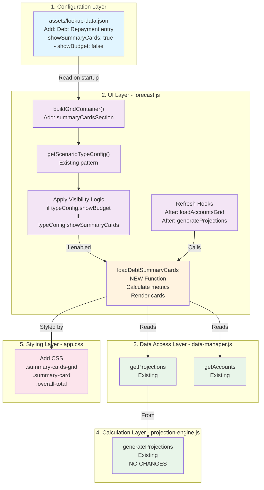
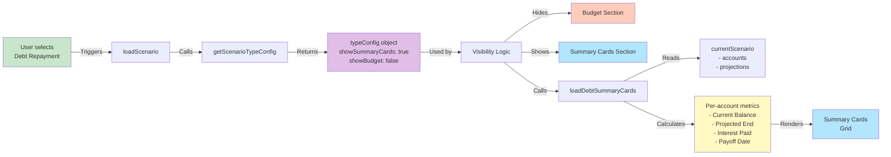
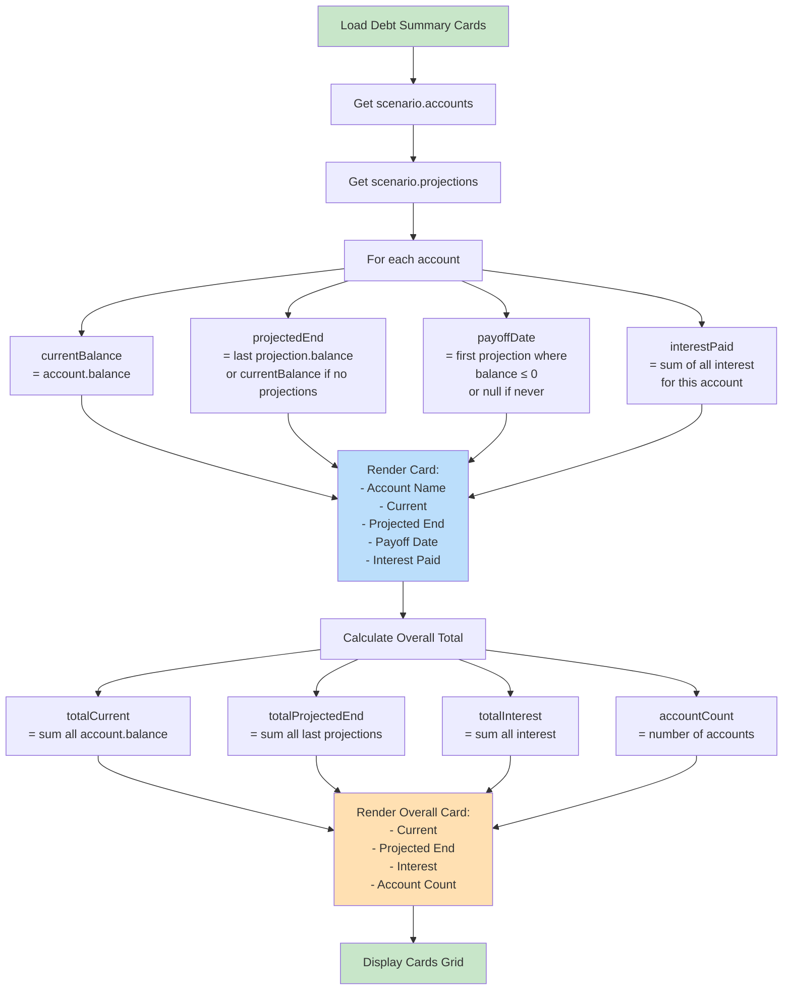

# Debt Repayment - Architecture Diagram

## Implementation Flow Within Current Architecture



## Data Flow: Scenario Selection to Card Rendering



## Code Modification Summary

```
┌─────────────────────────────────────────────────────────────┐
│ EXISTING PATTERN (Already in place)                         │
│                                                              │
│ typeConfig = getScenarioTypeConfig()                        │
│ if (typeConfig.showAccounts)                                │
│   accountsSection.classList.remove('hidden')               │
│ if (typeConfig.showProjections)                             │
│   projectionsSection.classList.remove('hidden')            │
└─────────────────────────────────────────────────────────────┘
                            ↓
┌─────────────────────────────────────────────────────────────┐
│ MINIMAL EXTENSIONS (What we add)                            │
│                                                              │
│ 1. lookup-data.json:                                        │
│    Add entry with showSummaryCards: true                    │
│                                                              │
│ 2. forecast.js - Add 2 lines to existing visibility block:  │
│    if (typeConfig.showBudget !== false)                     │
│      budgetSection.classList.remove('hidden')              │
│    if (typeConfig.showSummaryCards)                         │
│      summaryCardsSection.classList.remove('hidden')        │
│                                                              │
│ 3. forecast.js - buildGridContainer():                      │
│    Insert summaryCardsSection before accounts section       │
│                                                              │
│ 4. forecast.js - New function:                              │
│    loadDebtSummaryCards(container) - ~50 lines              │
│                                                              │
│ 5. forecast.js - Refresh hooks:                             │
│    Call loadDebtSummaryCards() after data changes           │
│                                                              │
│ 6. app.css - Add CSS:                                       │
│    .summary-cards-grid { display: grid; ... }              │
│    .summary-card { ... }                                    │
│    .overall-total { ... }                                   │
└─────────────────────────────────────────────────────────────┘
```

## Section Visibility Matrix

```
                 Budget | General | Funds | Debt Repayment
────────────────────────────────────────────────────────────
Scenarios           ✓      ✓        ✓         ✓
Summary Cards       ✗      ✗        ✗         ✓ (NEW)
Accounts            ✓      ✓        ✓         ✓
Planned Tx          ✓      ✓        ✓         ✓
Actual Tx           ✓      ✗        ✗         ✗
Budget              ✓      ✗        ✗         ✗ (NEW: hidden)
Projections         ✓      ✓        ✓         ✓
```

## Summary Card Calculation Engine



## No Changes Required In

```
✅ data-manager.js - Uses existing getProjections, getAccounts
✅ projection-engine.js - Calculation logic stays same
✅ Account manager - No changes
✅ Transaction manager - No changes
✅ Budget manager - No changes
✅ Modal files - No changes
✅ Grid factory - No changes
✅ Data store - No changes
✅ Data model - No schema changes
```

