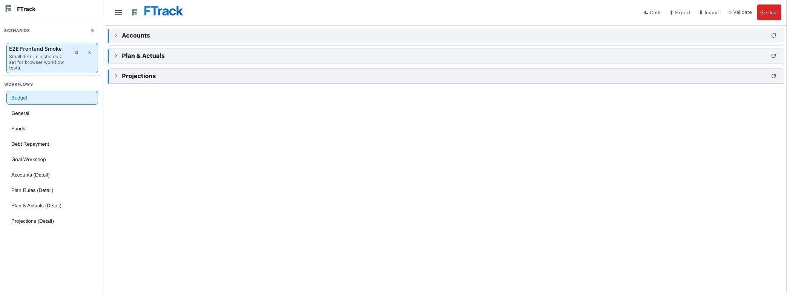
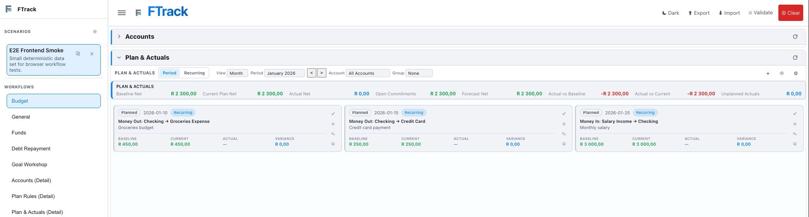
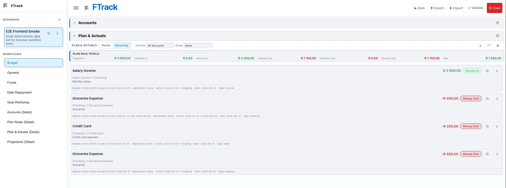
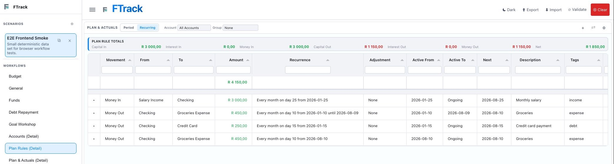
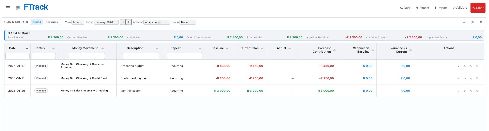
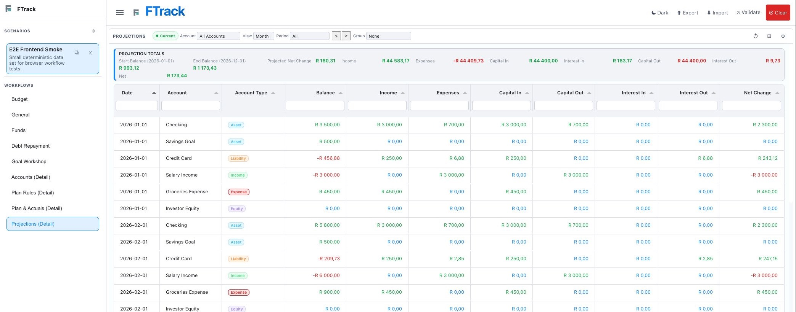
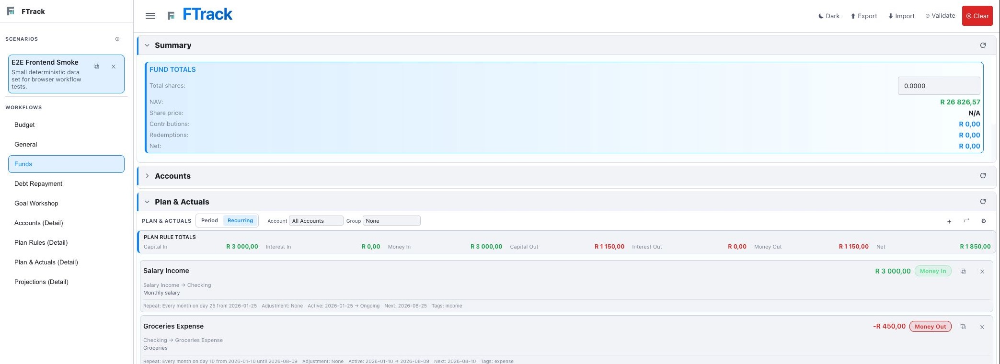
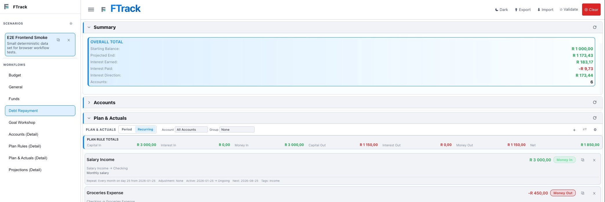
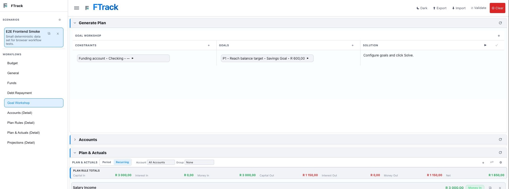

# Interface Guide: Controls, Tables, and Editing

## 1.0 Use This Guide by Screen

This guide answers: **What does this control do, and how should I interact
with this screen?**

The **Workflow Guide: Plan, Track, and Project** explains which workflow to
choose. This guide explains the shared interface after you arrive there.

## 2.0 Page Anatomy

The Forecast page has four main areas:

- The left sidebar contains scenarios and workflow navigation.
- The top bar contains Menu, theme, Export, Import, Validate, and Clear.
- The main area contains workflow cards or a detail table.
- Each workflow card has a header, an expand/collapse control, and its own
  refresh action.

On a narrow screen, use **Menu** to show or hide the sidebar. On a wide screen,
the sidebar can remain visible while you work.

## 3.0 Scenario and Top-Bar Interactions

### 3.1 Scenarios

- Click a scenario card to make it active.
- Use the plus action beside Scenarios to create one.
- Use the duplicate action on a scenario to make an independent copy.
- Use the remove action only when the scenario is no longer needed.

Each scenario keeps its own accounts, rules, occurrences, baselines, actuals,
projection configuration, and goal-planning data.

### 3.2 Top Bar

- **Dark** switches the theme.
- **Export** downloads the current application data.
- **Import** loads a supported FTrack export.
- **Validate** checks stored data and reports issues.
- **Clear** removes application data; export first if you may need it again.

## 4.0 Cards and Refresh

Click a card header to expand or collapse it. The arrow at the left shows its
state. The refresh action at the right rebuilds that card from the selected
scenario.

Refreshing a card does not create a second dataset. For example, refreshing
Plan & Actuals re-renders the same rules and occurrences used by Projections.

## 5.0 Plan & Actuals Tabs

Plan & Actuals has two modes:

- **Period** shows dated occurrences and actual tracking.
- **Recurring** shows the reusable rule segments that produce occurrences.

The selected tab is highlighted. Switching tabs changes the working view; it
does not move or convert data.

Both modes keep primary actions in the header and place Account, Group By,
and specialized split filters inside the single **Filters** panel. This avoids
showing the same selectors in both the header and the open panel.

## 6.0 Period Controls

The consolidated top toolbar keeps the frequent actions together:

- **Previous**, **Period**, and **Next** navigate the selected time grain.
- **Add item** creates a one-time planned or actual movement.
- **Freeze baseline** preserves the predicted budget for comparison.
- **Filters** opens the remaining view and organization settings. Its number
  indicates active Account or Group filters.

Inside Filters:

- **Period Type** changes the time grain: Day, Week, Month, Quarter, or Year.
- **Account** limits results to one account perspective.
- **Group By** organizes items by Status, Movement, or Repeat.

Changing the time grain can change which Period choices are available. Account
and Group change presentation only; they do not change the stored plan.

## 7.0 Reading a Period Item

Each summary card contains:

- Status, effective date, and whether it came from a recurring rule.
- A direction-aware money movement.
- The description on a separate line under the movement.
- Baseline, Current, Actual, and Variance amounts.
- Row actions at the right.

For **Money In**, the movement reads source → receiving account. In the guide
example, Salary Income → Checking means money enters Checking.

For **Money Out**, the movement reads source → receiving account. In the guide
example, Checking → Groceries Expense means money leaves Checking.

The direction label and color are meaningful. Do not infer direction only
from the account order.

## 8.0 Period Summary Metrics

- **Baseline Net** is the frozen predicted amount for the period.
- **Current Plan Net** reflects later plan adjustments.
- **Actual Net** includes results recorded so far.
- **Open Commitments** includes planned items still unresolved.
- **Forecast Net** combines actuals with open commitments.
- **Actual vs Baseline** compares reality with the original prediction.
- **Actual vs Current** compares reality with the adjusted plan.
- **Unplanned Actuals** totals actual items that had no planned amount.

Use item-level variance to find the cause of a summary-level difference.

## 9.0 Period Row Actions

The available actions depend on the item's status and origin:

- **Mark actual** records a planned item as completed.
- **Skip occurrence** excludes a planned occurrence that will not happen.
- **Edit item** opens the occurrence editor.
- **Duplicate item** creates a separate one-time planned copy.
- **Restore to planned** becomes available when editing a skipped item.
- **Repeat going forward** can promote a manual item into a future recurring
  rule.

If the actual amount or date differs, use Edit instead of marking the item
actual without correction.

## 10.0 Edit Scope

When editing an occurrence linked to a recurring rule, choose scope
deliberately:

- **This occurrence only** changes only the selected occurrence.
- **This and future** creates a new segment beginning at this occurrence.
- **Entire series** revises the current and future segments.

Changing a repeat pattern requires a future-capable scope. Existing actuals,
skips, and frozen history remain protected.

Use **This and future** for a price increase that begins now. Use **This
occurrence only** for an exceptional charge. Use **Entire series** to correct
a rule that was consistently defined incorrectly.

## 11.0 Recurring Controls and Rule Cards

The Recurring toolbar includes:

- **Account** to limit the rule list.
- **Group** to organize by movement, primary or secondary account, recurring
  split, split role, or split account group.
- **Add rule** to create a one-time or recurring rule.
- **Split** to build or manage linked split components.
- **Filters** for additional rule filtering.

Each rule card shows the movement, description, repeat schedule, adjustment,
active range, next date, and tags. Its actions allow duplication or ending the
series. Select a rule to edit its definition and choose the required scope.

## 12.0 Detail Tables

Detail shortcuts use full tables for scanning, sorting, filtering, and
auditing.

### 12.1 Plan Rules Detail

Use column headers and filter fields to narrow the rule list. Row actions use
the same scoped safety rules as the summary interface.

### 12.2 Plan & Actuals Detail

This table is intentionally different from the summary card view. Use it to
compare dates, status, movement, description, baseline, current plan, actual,
forecast contribution, variance, and actions across many occurrences.

Switching this component to Recurring changes it to the Plan Rules detail
table rather than displaying the summary cards.

### 12.3 Projections Detail

The Projections toolbar includes:

- **Current**, **Stale · refreshing**, or **Pending** calculation status.
- Account, time View, Period, previous/next, and Group controls.
- Refresh projections now.
- Expand or display controls where available.
- Filters.

The table exposes Date, Account, Account Type, Balance, Income, Expenses,
Capital In, Capital Out, Interest In, Interest Out, and Net Change.

## 13.0 Funds, Debt, and Goal-Specific Controls

### 13.1 Funds

Enter or review total shares in the fund summary. NAV, share price,
contributions, redemptions, and net movement update from the scenario data.

### 13.2 Debt Repayment

Use Filters to narrow debt-summary results. Review liability zero dates after
changing payment rules, rates, actuals, or skipped payments.

### 13.3 Goal Workshop

- Use plus in **Constraints** to add funding or solution limits.
- Use plus in **Goals** to add an outcome and priority.
- Expand a constraint or goal to edit it.
- Use **Solve** to calculate a proposal.
- Review the Solution before using **Apply**.

Applying a solution creates or updates plan rules. Continue editing and
tracking them through Plan & Actuals.

## 14.0 Safe Interaction Checklist

Before saving a change:

1. Confirm the active scenario.
2. Confirm Period versus Recurring.
3. Confirm Money In versus Money Out and the source/receiving accounts.
4. Confirm planned versus actual status.
5. Confirm the edit scope.
6. Recheck the comparison totals.
7. Wait for Projections to return to Current.
