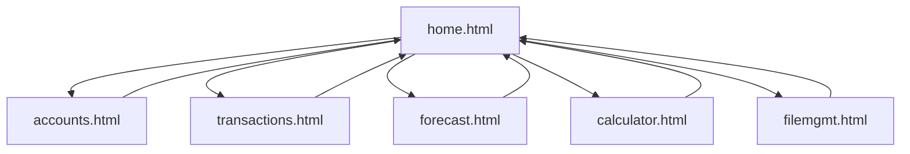
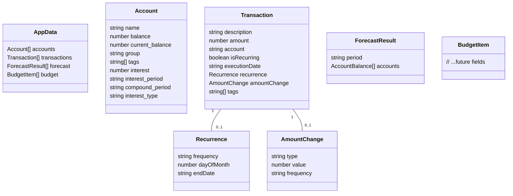

# PROJECT_OVERVIEW.md

> **Update Note:**
> As of the latest update, all data persistence is handled via disk using Electron/Node.js. The app no longer uses localStorage for any data operations. All changes in accounts, transactions, and other modules are immediately saved to a unified JSON file on disk via `filemgmt.js`. The grid system (EditableGrid) now uses a callback-driven, always-in-sync save flow, with spinners and logging for user feedback and traceability.

## Project Title
**Account & Transaction Financial Forecast Web App**

## Description
This project is a modular, browser-based financial forecasting tool. It allows users to manage multiple accounts, track transactions, run forecasts, and perform financial calculations. Data is persisted in a unified JSON file on disk (via `filemgmt.js`). The app is structured with separate HTML pages for each major module, and uses JavaScript for all business logic and UI updates.

## Navigation Flow

- The main navigation is via the navbar, present on all pages.
- Each page is a standalone HTML file, but the home page includes partials for all modules.

## Data Flow

- **Unified JSON File**:  
  - On startup, the app loads data from a single JSON file (via `filemgmt.js`).
  - On any data change (accounts, transactions, forecast, budget), the new state is serialized and saved back to the JSON file **on disk** (Electron/Node.js only).
- **Import/Export**:  
  - Users can import/export their entire dataset as a JSON file via the File Management page.
  - Importing replaces the current state; exporting downloads the current state.
- **APIs**:  
  - No external APIs are used for data persistence; all data is local to the browser or disk. **Note:** In Electron/Node.js, all persistence is to disk; localStorage is not used.
- **Data Sharing**:  
  - All modules (accounts, transactions, forecast, budget) share a single global state object, which is updated and saved on every change.
- **Component Modals**:  
  - Modals (such as the interest settings modal) are now implemented as reusable JS modules (e.g., `modal-interest.js`) and injected dynamically, following a component-based approach similar to React.

## JSON Schema

> **Update Note:** The Account and Transaction schemas have been significantly updated to support new features like transaction recurrence, dynamic amount changes, and better account organization.

The main data object (persisted in the unified JSON file and used for import/export) has the following structure:

