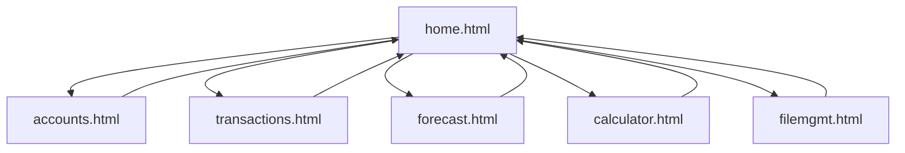
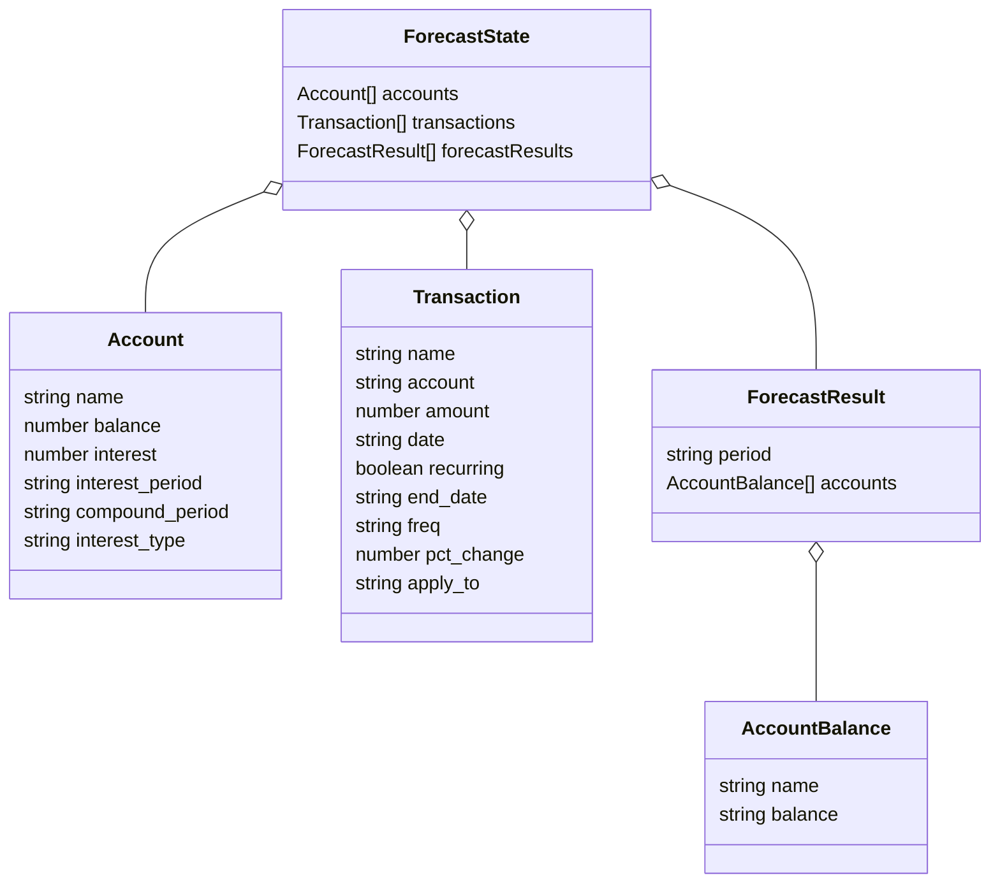

# PROJECT_OVERVIEW.md

## Project Title
**Account & Transaction Financial Forecast Web App**

## Description
This project is a modular, browser-based financial forecasting tool. It allows users to manage multiple accounts, track transactions, run forecasts, and perform financial calculations. Data is persisted in the browser using `localStorage` and can be imported/exported as JSON. The app is structured with separate HTML pages for each major module, and uses JavaScript for all business logic and UI updates.

## Navigation Flow

- The main navigation is via the navbar, present on all pages.
- Each page is a standalone HTML file, but the home page includes partials for all modules.

## Data Flow

- **localStorage**:  
  - On startup, the app loads data from `localStorage` (if present) or from default JS objects.
  - On any data change (accounts, transactions, forecast), the new state is serialized and saved back to `localStorage`.
- **Import/Export**:  
  - Users can import/export their entire dataset as a JSON file via the File Management page.
  - Importing replaces the current state; exporting downloads the current state.
- **APIs**:  
  - No external APIs are used for data persistence; all data is local to the browser.
- **Data Sharing**:  
  - All modules (accounts, transactions, forecast) share a single global state object, which is updated and saved on every change.
- **Component Modals**:  
  - Modals (such as the interest settings modal) are now implemented as reusable JS modules (e.g., `modal-interest.js`) and injected dynamically, following a component-based approach similar to React.

## JSON Schema

The main data object (persisted in `localStorage` and used for import/export) has the following structure:

- **accounts**: List of user accounts, each with balance and interest settings.
- **transactions**: List of transactions, each linked to an account and supporting recurrence and percentage changes.
- **forecastResults**: List of forecasted periods, each with account balances for that period.
- **modals**: Modal UI is now managed by reusable JS modules, not static HTML.
