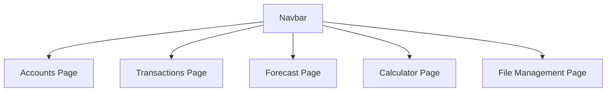
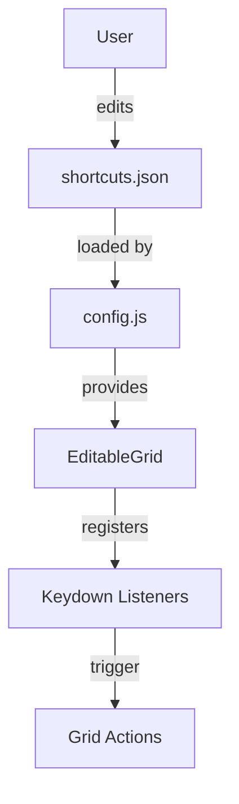

# PROJECT_OVERVIEW.md

## Summary
This document provides a comprehensive overview of the Account & Transaction Financial Forecast Web App, including both user experience (UX/UI) and technical architecture. It covers navigation, data flow, variable scopes, and the structure of all major modules.

## UX/UI

### User Experience Overview
- The app is a modular, browser-based financial forecasting tool.
- Users can manage multiple accounts, track transactions, run forecasts, and perform financial calculations.
- Navigation is via a persistent navbar, with each module accessible as a standalone HTML page.
- All data changes are saved automatically and immediately, with spinners and logging for feedback.
- Modals are used for complex data entry (e.g., interest settings, recurrence patterns).

### Available Features
- **Accounts Management**: Add, edit, and delete accounts with interest and grouping options.
- **Transactions**: Add, edit, and delete transactions, including recurring and dynamic amount changes.
- **Forecast**: Run and view financial forecasts based on current data.
- **Calculator**: Perform financial calculations.
- **File Management**: Import/export/reset all data as JSON.

### Usage Examples
- Adding a new account or transaction via the grid interface.
- Editing interest settings using a modal dialog.
- Importing a dataset and seeing the app update instantly.

### UI Diagrams


---

## Technical Overview

### Architecture
- All data is persisted in a unified JSON file on disk (Electron/Node.js) via `filemgmt.js`.
- The global state object (`appData`) contains all accounts, transactions, forecast, and budget data.
- Each module (accounts, transactions, etc.) reads from and writes to this global state.
- EditableGrid is the exclusive editing interface for accounts and transactions, using callback-driven persistence.
- Modals are implemented as reusable JS modules and injected dynamically.

### Variable Scopes
```mermaid
flowchart TD
  subgraph Global Scope
    appData[appData (global)]
    windowAccounts[window.accounts]
    windowTransactions[window.transactions]
  end
  subgraph Module Scope
    accountsModule[accounts.js]
    transactionsModule[transactions.js]
    forecastModule[forecast.js]
    filemgmtModule[filemgmt.js]
    editableGridModule[editable-grid.js]
  end
  subgraph Function Scope
    localVars[Local Variables]
  end
  appData --> accountsModule
  appData --> transactionsModule
  appData --> forecastModule
  appData --> filemgmtModule
  accountsModule --> windowAccounts
  transactionsModule --> windowTransactions
  accountsModule --> editableGridModule
  transactionsModule --> editableGridModule
  editableGridModule --> localVars
  filemgmtModule --> appData
```
**Legend:**
- Blue: Global state
- Green: Module state
- Gray: Function/local variables

### Data Flow
```mermaid
flowchart TD
  Filemgmt[filemgmt.js] -->|load| AppData[appData (global)]
  AppData -->|modify| Filemgmt
  AppData -->|UI update| EditableGrid[EditableGrid Component]
  EditableGrid -->|user action| ModalsSystem[Modal System]
  ModalsSystem -->|data update| AppData
  EditableGrid -->|inline edit| AppData
  ModalsSystem -->|complex edit| AppData
```

### JSON Schema

> **Update Note:** The Account and Transaction schemas have been significantly updated to support new features like transaction recurrence, dynamic amount changes, and better account organization.

The main data object (persisted in the unified JSON file and used for import/export) has the following structure:


---

## Keyboard Shortcut System (July 2025)

A global, user-editable keyboard shortcut system is now implemented:
- All shortcut definitions are centralized in `assets/shortcuts.json`.
- The config is loaded at runtime by `js/config.js`, which provides `getShortcut`, `getAllShortcuts`, and `matchShortcut` utilities.
- Feature modules (such as `EditableGrid`) query this config for their keybindings and register listeners accordingly.
- Users can edit the JSON config to change shortcuts globally.



See `Documentation/keyboard-shortcuts.md` for details and usage examples.
