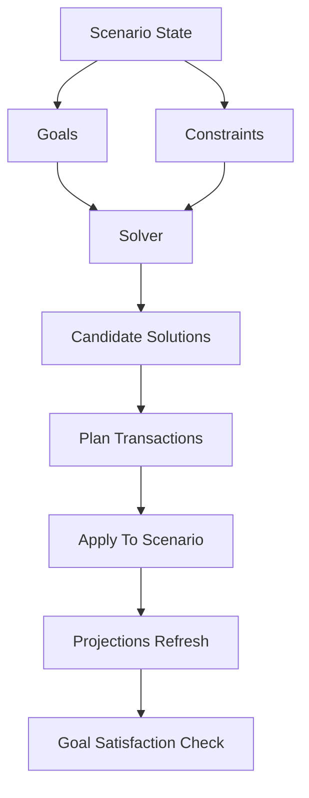

# Advanced Goal Solver Scenario Concept Design

1.0 Purpose
1.1 Advanced Goal Solver is a scenario type for goal-based planning that solves multiple goals under multiple constraints.
1.2 It produces one or more candidate “plan transactions” that can be applied to the scenario, then validated via projections.
1.3 It is an extension of the existing Goal-Based scenario concept, not a replacement.

2.0 Core Idea
2.1 A Goal is a target condition on an account at or by a date.
2.2 A Constraint limits what plan transactions are allowed to do.
2.3 A Solution is a set of suggested transactions and parameter values that satisfy constraints and best achieve goals.

3.0 Goals
3.1 Goal Types
3.1.1 Reach balance target
3.1.1.1 Example: Asset account balance >= 150000 by 2027-06-01.
3.1.2 Pay down balance target
3.1.2.1 Example: Liability account balance <= 0 by 2026-12-01.
3.1.3 Increase by delta
3.1.3.1 Example: Investment account increases by 50000 over 18 months.
3.1.4 Maintain floor
3.1.4.1 Example: Emergency fund account balance >= 20000 at all times.

3.2 Goal Metadata
3.2.1 Priority
3.2.1.1 Goals are ordered (Priority 1, Priority 2, etc) to support “must do first” workflows.
3.2.2 Deadline
3.2.2.1 Goals can be “by date” or “as soon as possible within max horizon”.
3.2.3 Measurement
3.2.3.1 Evaluation uses projections on the scenario timeline, not a separate calculator.

4.0 Constraints
4.1 Funding and Cashflow Constraints
4.1.1 Max outflow per period
4.1.1.1 Example: Total planned contributions <= 8000 per month.
4.1.2 Income allocation
4.1.2.1 Example: Only allocate from specific income accounts.

4.2 Account Movement Constraints
4.2.1 Max movement per account per period
4.2.1.1 Example: Savings account net contribution <= 3000 per month.
4.2.2 Min balance floor
4.2.2.1 Example: Checking account balance >= 1000 at all times.
4.2.3 Locked accounts
4.2.3.1 Example: Do not suggest transactions touching Retirement account.

4.3 Transaction Shape Constraints
4.3.1 Allowed contribution frequencies
4.3.1.1 Example: Weekly or Monthly only.
4.3.2 Max number of suggested transactions
4.3.2.1 Example: At most 3 recurring transactions and 1 one-time transaction.
4.3.3 Allowed transfer routes
4.3.3.1 Example: Only transfer from Checking to target accounts.

5.0 Decision Variables
5.1 Contribution amounts
5.1.1 Per goal or per target account.
5.2 Contribution frequency
5.2.1 Weekly, Monthly, Quarterly, Yearly.
5.3 Start date and end date
5.3.1 For one-time and recurring suggestions.
5.4 Routing
5.4.1 Which source accounts fund which goals.

6.0 Optimization Modes
6.1 Solve for time
6.1.1 Objective: minimize date when all Priority 1 goals are satisfied, then Priority 2, etc.
6.2 Solve for lowest required contribution
6.2.1 Objective: satisfy goals by deadlines while minimizing total outflow.
6.3 Solve for max investment subject to constraints
6.3.1 Objective: after meeting required goals, maximize contributions to selected investment accounts.

6.4 Multi Objective Policy
6.4.1 Default policy is lexicographic.
6.4.1.1 Step 1: satisfy all Priority 1 goals if feasible.
6.4.1.2 Step 2: optimize for the selected mode within the feasible set.
6.4.1.3 Step 3: if multiple solutions tie, prefer fewer transactions.

7.0 Solver Output
7.1 Candidate solutions
7.1.1 Return multiple solutions when tradeoffs exist.
7.1.1.1 Example: fastest solution and lowest monthly payment solution.
7.2 Plan transaction suggestions
7.2.1 Suggested transactions must be representable using the existing transactions model.
7.2.2 Suggestions should be idempotent.
7.2.2.1 Applying the same solution twice should not duplicate transactions.
7.3 Explanation
7.3.1 Each solution should include a short explanation.
7.3.1.1 What goals it satisfies, when, and what constraints are binding.

8.0 Recalculation and Invalidation
8.1 Recalculate summary and solution feasibility when any of these change:
8.1.1 Goal parameters
8.1.2 Accounts and balances
8.1.3 Transactions and amounts
8.1.4 Recurrence frequency and start dates
8.1.5 Periodic changes affecting incomes or expenses
8.2 Previously generated solutions become “stale” when inputs change.

9.0 UI Concept and Reuse
9.1 Reuse the existing Generate Plan section pattern.
9.2 Extend it to support:
9.2.1 Multiple goals selection
9.2.2 Constraint inputs
9.2.3 A solution list with a clear apply action
9.3 Keep all changes in the existing forecast page flow.

10.0 Use Cases to Cover
10.1 Quickest down payment with guardrails
10.1.1 Goals
10.1.1.1 Save 200000 in House Deposit account.
10.1.2 Constraints
10.1.2.1 Checking balance >= 5000 at all times.
10.1.2.2 Max total outflow <= 12000 per month.
10.1.3 Mode
10.1.3.1 Solve for time.

10.2 Lowest monthly payment debt payoff
10.2.1 Goals
10.2.1.1 Credit Card account balance <= 0 by 2026-12-01.
10.2.2 Constraints
10.2.2.1 Max outflow <= 4000 per month.
10.2.3 Mode
10.2.3.1 Solve for lowest required contribution.

10.3 Emergency fund first, then invest
10.3.1 Goals
10.3.1.1 Emergency Fund balance >= 30000 by 2026-08-01.
10.3.1.2 Investment account increases by 60000 by 2027-12-01.
10.3.2 Constraints
10.3.2.1 Emergency Fund balance >= 10000 at all times.
10.3.3 Mode
10.3.3.1 Lexicographic priorities with maximize investment after required goals.

10.4 Multiple accounts required
10.4.1 Goals
10.4.1.1 Pay Car Loan to 0.
10.4.1.2 Maintain Checking floor.
10.4.1.3 Save for Vacation.
10.4.2 Constraints
10.4.2.1 Only fund goals from Checking and Salary.
10.4.2.2 Max movement per target account.
10.4.3 Mode
10.4.3.1 Return at least two solutions.

10.5 Account max movement bound
10.5.1 Goals
10.5.1.1 Increase Retirement account by 100000.
10.5.2 Constraints
10.5.2.1 Retirement contribution <= 2000 per month.
10.5.2.2 Total outflow <= 8000 per month.
10.5.3 Mode
10.5.3.1 Solve for time with bounded contributions.

11.0 Conceptual Flow

12.0 Invariants and Guardrails
12.1 No hidden money creation.
12.1.1 Suggested transfers must preserve net cashflow across accounts.
12.2 Respect transaction semantics.
12.2.1 Do not invert Money In and Money Out meanings.
12.3 Clear infeasible reporting.
12.3.1 If goals are impossible under constraints, show the first binding constraint or missing requirement.

13.0 Open Questions
13.1 How should interest and growth be modeled for investments in the solver.
13.2 Should constraints be per account type or per specific account.
13.3 Should the solver create one transaction per goal or consolidate where possible.
13.4 How should “account max movement” interact with variable frequencies.
