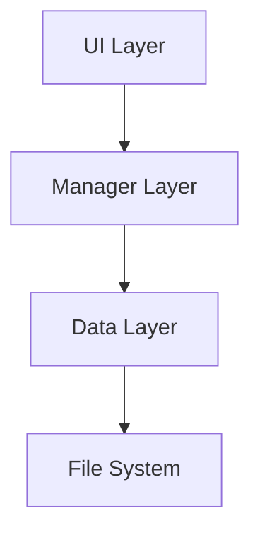

# Technical Architecture

## 1.0 Architectural Pattern
The application follows a **Layered Architecture** designed to separate concerns between the user interface, business logic, and data storage. This ensures maintainability and testability.

### 1.1 Diagram

## 2.0 Layers

### 2.1 UI Layer (View & Controller)
- **Location**: `js/*.js` (Root JS files), `pages/*.html`
- **Responsibility**: 
  - DOM manipulation
  - Event Listeners (Clicks, Input changes)
  - Grid Rendering (Tabulator)
  - **Does NOT** manipulate data directly. It delegates to Managers.
- **Key Files**:
  - `forecast.js`: Main controller for the Forecast/Projection view.
  - `navbar.js`: Handles navigation and global UI state.
  - `global-app.js`: Application bootstrap.

### 2.2 Manager Layer (Business Logic)
- **Location**: `js/managers/*.js`
- **Responsibility**:
  - Bridge between UI and DataStore.
  - Business rules validation.
  - Data transformation for UI consumption.
- **Key Components**:
  - `TransactionManager`: Handles adding/editing/calculating transactions.
  - `AccountManager`: Manages account filtering and balances.
  - `ScenarioManager`: Manages active scenario state.

### 2.3 Data Layer (Persistence)
- **Location**: `js/core/data-store.js`
- **Responsibility**:
  - Single Source of Truth (Singleton pattern).
  - In-memory state management (`_data` property).
  - File I/O (Read/Write JSON to disk).
- **Behavior**:
  - All writes are atomic (State update -> Write to Disk).
  - Loads data once on startup.

## 3.0 Calculation Engine

### 3.1 Financial Strategy
The application uses the **financejs** library for core financial mathematics to ensure accuracy and reduce maintenance control.
- **Core Logic**: `js/financial-utils.js` acts as a wrapper around the `financejs` library (FV, PV, Compound Interest).
- **Recurrence Logic**: `js/calculation-utils.js` handles date generation (e.g., "3rd Friday of Month").

### 3.2 Projection Engine
The forecasting logic is centralized in `js/projection-engine.js`.
- **Process**: It performs a time-step simulation (Daily/Monthly).
- **Inputs**: Takes `PlannedTransactions` and `Account` attributes (Interest Rates).
- **Outputs**: Generates a `projections` array used by the UI.

## 4.0 Infrastructure
- **Configuration**: `js/app-paths.js` manages file paths and environment constants.
