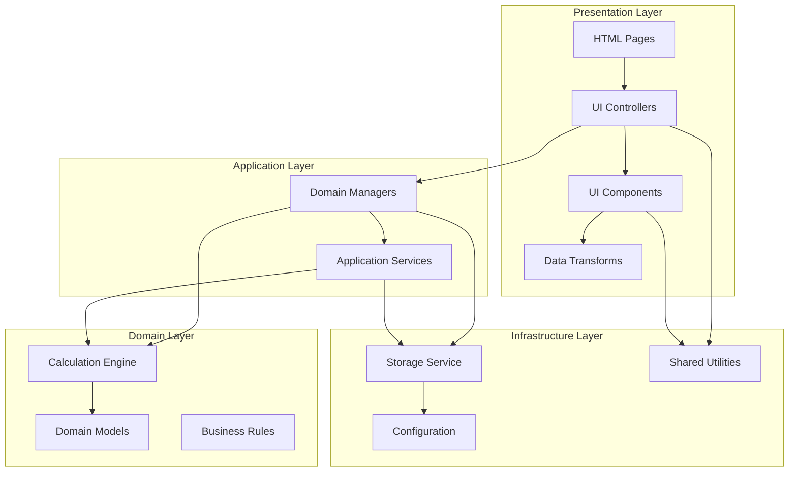
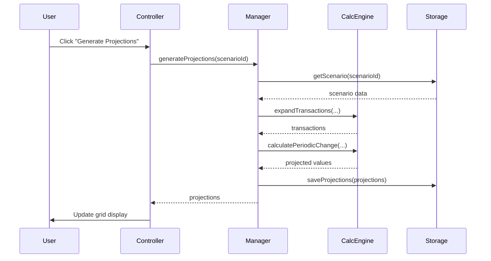

# Technical Architecture

## 1.0 Architectural Pattern

FTrack follows a **Clean Layered Architecture** that separates concerns between presentation, application logic, domain calculations, and infrastructure. This architecture ensures maintainability, testability, and clear separation of responsibilities.

### 1.1 Architecture Diagram



## 2.0 Layer Definitions

### 2.1 Presentation Layer

The presentation layer handles all user interactions and visual rendering.

**Location**: `js/ui/`, `pages/`

**Responsibilities**:
- DOM manipulation and rendering
- User input handling
- Grid visualization (Tabulator)
- Modal dialogs
- Navigation and routing

**Components**:

#### 2.1.1 UI Controllers
- **Location**: `js/ui/controllers/`
- **Purpose**: Coordinate user actions with application layer
- **Key Files**:
  - `forecast-controller.js` - Main forecast page orchestration
  - `navbar-controller.js` - Navigation and global actions
  - `doc-panel-controller.js` - Documentation panel management

#### 2.1.2 UI Components
- **Location**: `js/ui/components/`
- **Purpose**: Reusable visual components
- **Structure**:
  - `grids/` - Grid components (accounts, transactions, budget, projections)
  - `modals/` - Modal dialogs (periodic change, recurrence, text input)
  - `widgets/` - Small reusable widgets (toolbar totals, summary cards)

#### 2.1.3 Data Transforms
- **Location**: `js/ui/transforms/`
- **Purpose**: Transform domain data for UI display
- **Key Files**:
  - `transaction-row-transformer.js` - Transform transactions for grid display
  - `data-aggregators.js` - Calculate totals and aggregates for UI

### 2.2 Application Layer

The application layer contains business logic and coordinates between UI and domain.

**Location**: `js/app/`

**Responsibilities**:
- Business process orchestration
- Data validation
- Service coordination
- State management

**Components**:

#### 2.2.1 Domain Managers
- **Location**: `js/app/managers/`
- **Purpose**: Manage domain entities and business rules
- **Key Files**:
  - `scenario-manager.js` - Scenario lifecycle and state
  - `account-manager.js` - Account operations and filtering
  - `transaction-manager.js` - Transaction CRUD and validation
  - `budget-manager.js` - Budget management

#### 2.2.2 Application Services
- **Location**: `js/app/services/`
- **Purpose**: Infrastructure and cross-cutting concerns
- **Key Files**:
  - `storage-service.js` - Data persistence (localStorage)
  - `export-service.js` - Data import/export
  - `lookup-service.js` - Lookup data management
  - `migration-service.js` - Deprecated (runtime does not migrate; kept for reference)

**Schema migration (QC-only)**:
- `QC/migrate-app-data-to-schema43.js` - Standalone legacy → schemaVersion 43 converter

### 2.3 Domain Layer

The domain layer contains pure business logic and calculations.

**Location**: `js/domain/`

**Responsibilities**:
- Financial calculations
- Business rules
- Domain models
- Pure functions (no side effects)

**Components**:

#### 2.3.1 Calculation Engine
- **Location**: `js/domain/calculations/`
- **Purpose**: All mathematical and financial calculations
- **Architecture**: Facade pattern with specialized modules
- **Key Files**:
  - `calculation-engine.js` - Unified API facade
  - `financial-calculations.js` - Financial math (FV, PV, compound interest, periodic changes)
  - `recurrence-calculations.js` - Date generation and recurrence patterns
  - `goal-calculations.js` - Goal-based scenario calculations
  - `transaction-expander.js` - Transaction expansion logic

**Calculation Engine API**:
```javascript
import * as Calc from './domain/calculations/calculation-engine.js';

// Financial calculations
Calc.calculateFutureValue(rate, nper, pmt, pv);
Calc.calculatePresentValue(rate, nper, pmt, fv);
Calc.calculateCompoundInterest(principal, rate, periods, frequency);
Calc.calculatePeriodicChange(value, periodicChange, periods);

// Recurrence calculations
Calc.generateRecurrenceDates(recurrence, start, end);
Calc.getNthWeekdayOfMonth(date, weekday, n);

// Goal calculations
Calc.calculateContributionAmount(pv, fv, months, rate);
Calc.calculateMonthsToGoal(pv, fv, contribution, rate);

// Transaction expansion
Calc.expandTransactions(transactions, startDate, endDate, accounts);
```

#### 2.3.2 Domain Models
- **Location**: `js/domain/models/`
- **Purpose**: Define domain entity structures (optional, for type safety)
- **Files**: `scenario.js`, `account.js`, `transaction.js`

#### 2.3.3 Business Rules
- **Location**: `js/domain/validators/`
- **Purpose**: Domain validation and business constraints
- **Files**: `data-validators.js`

### 2.4 Infrastructure Layer

The infrastructure layer provides technical capabilities.

**Location**: `js/shared/`, `js/config.js`

**Responsibilities**:
- Utility functions
- Configuration management
- Logging and monitoring
- Cross-cutting concerns

**Components**:
- `date-utils.js` - Date parsing and formatting
- `format-utils.js` - Currency and number formatting

### 2.4.1 Date Handling Convention

All dates in this application are **date-only strings** (`YYYY-MM-DD`). There are no timestamps, no timezones, and no UTC conversions anywhere in the codebase.

- Always use `parseDateOnly(str)` to convert a date string to a `Date` object.
- Always use `formatDateOnly(date)` to convert back to a string.
- Never use `new Date(str)` on a date string — this parses as UTC midnight and causes day-shift bugs in non-UTC timezones.
- Never use `.toISOString()`, `.toUTCString()`, or any UTC/timezone-aware method.
- `logger.js` - Logging infrastructure
- `notifications.js` - User notifications
- `keyboard-shortcuts.js` - Keyboard handling
- `config.js` - Application configuration

## 3.0 Key Design Patterns

### 3.1 Facade Pattern (Calculation Engine)

The Calculation Engine uses a facade pattern to provide a unified API:

```javascript
// Instead of multiple imports:
import { calculatePeriodicChange } from './financial-calculations.js';
import { generateRecurrenceDates } from './recurrence-calculations.js';
import { expandTransactions } from './transaction-expander.js';

// Single import:
import * as Calc from './domain/calculations/calculation-engine.js';
```

### 3.2 Service Pattern (Application Services)

Services encapsulate infrastructure concerns:

```javascript
// Storage Service
StorageService.read()           // Read app data
StorageService.write(data)      // Write app data
StorageService.backup()         // Create backup
StorageService.getStorageUsage() // Check quota
```

### 3.3 Manager Pattern (Business Logic)

Managers orchestrate business operations:

```javascript
// Managers coordinate between layers
ScenarioManager.createScenario(data)     // Validates → Stores → Returns
AccountManager.getFilteredAccounts()     // Retrieves → Filters → Returns
TransactionManager.saveTransaction(tx)   // Validates → Calculates → Stores
```

## 4.0 Data Flow

### 4.1 User Action Flow



### 4.2 Calculation Flow

All calculations flow through the Calculation Engine:

```
UI Component → Manager → Calculation Engine → Pure Functions → Result → Manager → UI
```

No business logic or calculations exist outside the domain layer.

## 5.0 Directory Structure

```
js/
├── config.js                          # Application configuration
├── main.js                            # Application bootstrap
│
├── app/                               # Application Layer
│   ├── managers/                      # Domain managers
│   │   ├── scenario-manager.js
│   │   ├── account-manager.js
│   │   ├── transaction-manager.js
│   │   └── budget-manager.js
│   │
│   └── services/                      # Application services
│       ├── storage-service.js
│       ├── export-service.js
│       ├── lookup-service.js
│       └── migration-service.js       # Deprecated (runtime does not migrate)
│
├── domain/                            # Domain Layer
│   ├── calculations/                  # Calculation engine
│   │   ├── calculation-engine.js      # Facade
│   │   ├── financial-calculations.js
│   │   ├── recurrence-calculations.js
│   │   ├── goal-calculations.js
│   │   └── transaction-expander.js
│   │
│   ├── models/                        # Domain models (optional)
│   │   ├── scenario.js
│   │   ├── account.js
│   │   └── transaction.js
│   │
│   └── validators/                    # Business rules
│       └── data-validators.js
│
├── ui/                                # Presentation Layer
│   ├── controllers/                   # UI controllers
│   │   ├── forecast-controller.js
│   │   ├── navbar-controller.js
│   │   └── doc-panel-controller.js
│   │
│   ├── components/                    # UI components
│   │   ├── grids/
│   │   │   ├── grid-factory.js
│   │   │   ├── grid-state.js
│   │   │   ├── accounts-grid.js
│   │   │   ├── transactions-grid.js
│   │   │   ├── budget-grid.js
│   │   │   └── projections-grid.js
│   │   │
│   │   ├── modals/
│   │   │   ├── modal-factory.js
│   │   │   ├── periodic-change-modal.js
│   │   │   ├── recurrence-modal.js
│   │   │   └── text-input-modal.js
│   │   │
│   │   └── widgets/
│   │       ├── toolbar-totals.js
│   │       └── summary-cards.js
│   │
│   └── transforms/                    # Data transforms
│       ├── transaction-row-transformer.js
│       └── data-aggregators.js
│
└── shared/                            # Infrastructure Layer
    ├── date-utils.js
    ├── format-utils.js
    ├── logger.js
    ├── notifications.js
    └── keyboard-shortcuts.js
```

## 6.0 Technology Stack

### 6.1 Runtime
- **Platform**: Web browser (Chrome, Firefox, Safari, Edge)
- **JavaScript**: ES6 modules (native browser support)
- **Storage**: localStorage API

### 6.2 Dependencies
- **Tabulator Tables** (6.3+) - Grid visualization
- **javascript-lp-solver** (0.4+) - Linear programming for goal solver

### 6.3 No External Libraries For
- Financial calculations (pure JavaScript math)
- Date manipulation (native Date API)
- Storage (localStorage API)
- State management (simple in-memory objects)

## 7.0 Design Principles

### 7.1 Separation of Concerns
- UI code never contains business logic
- Calculations are pure functions
- Storage is abstracted behind services

### 7.2 Single Responsibility
- Each module has one clear purpose
- Calculation engine is only place for math
- Storage service is only place for persistence

### 7.3 Dependency Direction
```
UI → Application → Domain → Infrastructure
```
Dependencies always point inward. Domain layer has no knowledge of UI.

### 7.4 Pure Functions
All calculations in the domain layer are pure functions:
- No side effects
- Same input always produces same output
- No external state dependencies
- Easily testable

## 8.0 Testing Strategy

### 8.1 Unit Tests
- **Target**: Domain layer (calculations)
- **Tool**: Node.js test runner
- **Location**: `QC/tests/`
- **Coverage**: All calculation functions

### 8.2 Integration Tests
- **Target**: Data flow through layers
- **Location**: `QC/tests/projection-engine.test.js`
- **Validates**: End-to-end calculation accuracy

### 8.3 QC Verification
- **Tool**: `npm run qc:full`
- **Purpose**: Validate all scenarios and calculations
- **Report**: `QC/reports/qc-report-YYYY-MM-DD.md`
