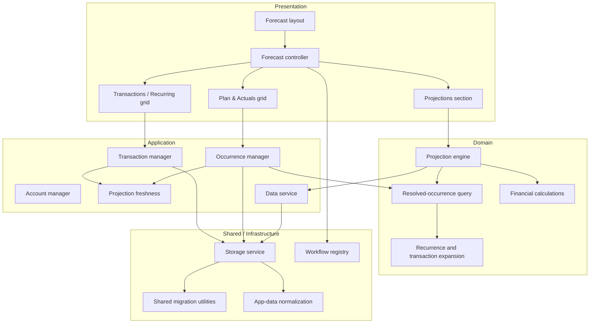
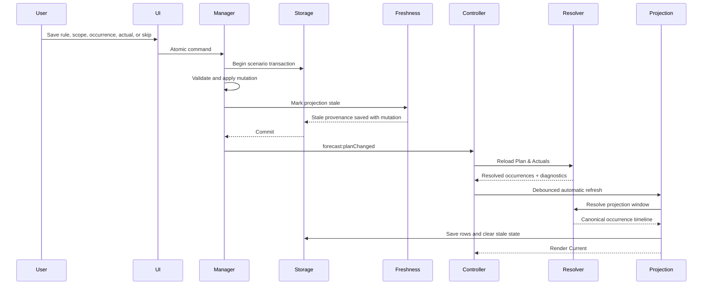

# Technical Architecture

## 1.0 Architectural Pattern

FTrack is a browser application organized into presentation, application,
domain, and infrastructure/shared layers. The central planning contract is:

```text
Transaction rules + stored occurrence state
                  ↓
      resolveScenarioOccurrences()
                  ↓
 Plan & Actuals views and projection engine
```

SchemaVersion 44 has one rule/occurrence plan and one resolved projection
source.

### 1.1 Layer Diagram


```mermaid
graph TB
    subgraph "Presentation"
        Layout["Forecast layout"]
        Controller["Forecast controller"]
        RuleGrid["Transactions / Recurring grid"]
        OccurrenceGrid["Plan & Actuals grid"]
        ProjectionSection["Projections section"]
    end

    subgraph "Application"
        RuleManager["Transaction manager"]
        OccurrenceManager["Occurrence manager"]
        AccountManager["Account manager"]
        Freshness["Projection freshness"]
        DataService["Data service"]
    end

    subgraph "Domain"
        Resolver["Resolved-occurrence query"]
        ProjectionEngine["Projection engine"]
        Recurrence["Recurrence and transaction expansion"]
        Financial["Financial calculations"]
    end

    subgraph "Shared / Infrastructure"
        Storage["Storage service"]
        Migration["Shared migration utilities"]
        Schema["App-data normalization"]
        Registry["Workflow registry"]
    end

    Layout --> Controller
    Controller --> RuleGrid
    Controller --> OccurrenceGrid
    Controller --> ProjectionSection
    RuleGrid --> RuleManager
    OccurrenceGrid --> OccurrenceManager
    ProjectionSection --> ProjectionEngine
    RuleManager --> Freshness
    OccurrenceManager --> Freshness
    RuleManager --> Storage
    OccurrenceManager --> Storage
    OccurrenceManager --> Resolver
    ProjectionEngine --> Resolver
    Resolver --> Recurrence
    ProjectionEngine --> Financial
    ProjectionEngine --> DataService
    DataService --> Storage
    Storage --> Schema
    Storage --> Migration
    Controller --> Registry
```

## 2.0 Layer Definitions

### 2.1 Presentation Layer

**Location**: `js/ui/`, `pages/`

The presentation layer renders the app and translates user intent into
application commands.

Key modules:

- `js/ui/controllers/forecast-controller.js` coordinates workflow visibility,
  card loading, refresh events, and automatic projection regeneration.
- `js/ui/components/forecast/forecast-layout.js` constructs the responsive
  Forecast shell and cards.
- `js/ui/components/grids/transactions-grid.js` renders transaction rules. In
  Budget it is reused for Plan & Actuals Recurring mode.
- `js/ui/components/grids/plan-actuals-grid.js` renders resolved Period
  occurrences, totals, baseline controls, actuals, skips, and edit scopes.
- `js/ui/components/forecast/forecast-projections-section.js` renders
  projection filters, freshness state, and the immediate refresh action.
- `js/ui/components/grids/accounts-grid.js` renders account editing and
  account-group interactions.

Presentation code may format and aggregate display data. Persistent business
mutations belong in managers, and financial/occurrence resolution belongs in
domain modules.

### 2.2 Application Layer

**Location**: `js/app/`

The application layer owns atomic commands, validation coordination,
persistence transactions, and cross-cutting state changes.

#### 2.2.1 Managers

- `scenario-manager.js`: scenario lifecycle, duplication, version, and lineage.
- `account-manager.js`: account and account-group commands.
- `transaction-manager.js`: rule CRUD and creation/upsert of split transaction
  sets.
- `occurrence-manager.js`: occurrence-only edits, recurring-series revisions,
  atomic scoped split-series revisions, manual occurrences, actuals, skips,
  baseline freeze, duplication, and promotion to recurring.
- `projection-freshness.js`: marks a projection stale inside a plan mutation
  and dispatches the post-persistence `forecast:planChanged` event.
- `ui-state-manager.js`: selected workflow, active scenario, per-card period
  views, and filter state.

#### 2.2.2 Services

- `data-service.js`: scenario-oriented read/write operations and projection
  bundle persistence.
- `storage-service.js`: normalized localStorage reads, atomic transactions, and
  backups.
- `export-service.js`: whole-app export/import.
- `validation-service.js`: app-data validation.
- `lookup-service.js`: lookup-data access.

Runtime migration is not a separate application service. Startup, import, and
QC use the shared migration module:

- `js/shared/migration-utils.js`
- `QC/migrate-app-data-to-schema44.js` (standalone wrapper)

### 2.3 Domain Layer

**Location**: `js/domain/`

The domain layer contains reusable financial calculations and the canonical
resolved-plan query.

#### 2.3.1 Occurrence Resolution

`js/domain/queries/resolve-scenario-occurrences.js` is the single query used to
combine:

- one-time and recurring transaction rules;
- rule revision boundaries;
- occurrence-only plan overrides;
- manual planned and actual items;
- actual replacements;
- skipped items;
- frozen baseline values and movement perspective; and
- split/group metadata.

The resolver is pure: it does not mutate or persist scenario data. It returns
resolved occurrences plus diagnostics. Plan & Actuals and projections must not
reimplement this merge independently.

Stable linked keys use the source rule, immutable scheduled date, and split
role. A rescheduled actual therefore still replaces its matching plan.

#### 2.3.2 Projection Engine

`js/domain/calculations/projection-engine.js`:

1. reads the selected scenario and projection config;
2. calls `resolveScenarioOccurrences()`;
3. applies resolved movements and account periodic changes;
4. produces per-account projection rows;
5. persists the completed projection bundle; and
6. clears stale provenance only after successful generation.

Stored stale rows are not treated as current results.

#### 2.3.3 Supporting Calculations

- `calculation-engine.js`: financial/recurrence facade.
- `financial-calculations.js`: future/present value and periodic math.
- `recurrence-calculations.js`: recurrence date generation.
- `transaction-expander.js`: expands rule schedules.
- `period-utils.js`: display/calculation period boundaries.
- `periodic-change-utils.js`: normalizes periodic-change application.
- `goal-calculations.js`: Goal Workshop calculations.
- `loan-allocation-utils.js`: loan split/allocation support.

### 2.4 Shared and Infrastructure Layer

**Location**: `js/shared/`, `js/config.js`

Important modules:

- `app-data-utils.js`: schemaVersion 44 defaults, normalization, snapshot
  materialization, and ID allocation.
- `migration-utils.js`: browser-safe legacy-to-schema44 migration and recovery
  reports.
- `workflow-registry.js`: code-defined workflow/card visibility.
- `date-utils.js`: date-only parsing and formatting.
- `period-window-utils.js`: period selection helpers.
- `format-utils.js`: display formatting.
- `logger.js`: logging.
- `notifications.js`: user notifications.

## 3.0 Core Data Model

A scenario owns:

```text
accounts[]
transactions[]                 transaction rules / rule segments
transactionOccurrences[]       durable dated exceptions and history
baselinePeriods[]              frozen period markers
projection                     config, rows, and freshness provenance
planning                       Goal Workshop configuration
```

The legacy `budgets[]`, `budgetWindow`, transaction-status actuals, and
`projection.config.source` are not valid schemaVersion 44 state.

### 3.1 Rules and Rule Segments

`transactions[]` holds one-time or recurring plan rules. Future-scoped changes
create linked segments using:

- `seriesRootId`;
- `supersedesTransactionId`;
- `activeFrom` / `activeTo`; and
- `promotedFromOccurrenceKey` where applicable.

Past actual, skipped, or baseline history protects the source rule from
destructive removal.

### 3.2 Stored Occurrences

`transactionOccurrences[]` stores only dated state that must survive
re-resolution:

- occurrence-only plan/date changes;
- actual amount/date and metadata snapshots;
- skips;
- manual planned/actual items;
- baseline amount and movement snapshots; and
- explicit override intent.

Untouched generated future occurrences need not be persisted.

### 3.3 Baseline and Actual Snapshots

Freezing a period stores `baselineAmount` plus baseline primary account,
secondary account, transaction type, and snapshot version on each applicable
occurrence.

Marking an actual stores actual amount/date and a full metadata snapshot on
the occurrence, including accounts, type, description, tags, grouping, split,
recurrence, and periodic-change fields. `actualSnapshotVersion` marks the
metadata as authoritative so later rule edits cannot rewrite history.

## 4.0 Command and Refresh Flows

### 4.1 Rule or Occurrence Mutation


```mermaid
sequenceDiagram
    participant User
    participant UI
    participant Manager
    participant Storage
    participant Freshness
    participant Controller
    participant Resolver
    participant Projection

    User->>UI: Save rule, scope, occurrence, actual, or skip
    UI->>Manager: Atomic command
    Manager->>Storage: Begin scenario transaction
    Manager->>Manager: Validate and apply mutation
    Manager->>Freshness: Mark projection stale
    Freshness-->>Storage: Stale provenance saved with mutation
    Storage-->>Manager: Commit
    Manager->>Controller: forecast:planChanged
    Controller->>Resolver: Reload Plan & Actuals
    Resolver-->>Controller: Resolved occurrences + diagnostics
    Controller->>Projection: Debounced automatic refresh
    Projection->>Resolver: Resolve projection window
    Resolver-->>Projection: Canonical occurrence timeline
    Projection->>Storage: Save rows and clear stale state
    Projection-->>Controller: Render Current
```

The UI event is dispatched only after persistence succeeds. A failed command
does not emit a misleading refresh.

### 4.2 Baseline Freeze

`OccurrenceManager.freezePeriodBaseline()`:

1. normalizes the selected period;
2. resolves every occurrence in that period;
3. rejects unresolved diagnostics that would make the freeze ambiguous;
4. stores baseline amounts and movement snapshots;
5. records the period in `baselinePeriods`;
6. marks projections stale; and
7. commits all changes atomically.

`markActual()` invokes the same freeze operation first when the occurrence's
period is not already frozen.

### 4.3 Projection Freshness

Any rule, occurrence, account, or projection-policy mutation records:

- `stale = true`;
- `staleAt`; and
- `staleReason`.

A successful projection refresh replaces rows, sets `generatedAt`, and clears
the stale fields. Migration clears legacy projection rows and marks the bundle
stale because their source provenance cannot be guaranteed.

## 5.0 Directory Structure

```text
js/
├── app/
│   ├── managers/
│   │   ├── account-manager.js
│   │   ├── occurrence-manager.js
│   │   ├── projection-freshness.js
│   │   ├── scenario-manager.js
│   │   ├── transaction-manager.js
│   │   └── ui-state-manager.js
│   └── services/
│       ├── data-service.js
│       ├── export-service.js
│       ├── lookup-service.js
│       ├── storage-service.js
│       └── validation-service.js
├── domain/
│   ├── calculations/
│   │   ├── calculation-engine.js
│   │   ├── financial-calculations.js
│   │   ├── goal-calculations.js
│   │   ├── loan-allocation-utils.js
│   │   ├── period-utils.js
│   │   ├── periodic-change-utils.js
│   │   ├── projection-engine.js
│   │   ├── recurrence-calculations.js
│   │   ├── recurrence-utils.js
│   │   └── transaction-expander.js
│   ├── queries/
│   │   └── resolve-scenario-occurrences.js
│   └── utils/
│       ├── account-group-utils.js
│       ├── advanced-goal-solver.js
│       └── fund-utils.js
├── shared/
│   ├── app-data-utils.js
│   ├── date-utils.js
│   ├── migration-utils.js
│   ├── period-window-utils.js
│   └── workflow-registry.js
└── ui/
    ├── components/
    │   ├── forecast/
    │   │   ├── forecast-generate-plan.js
    │   │   ├── forecast-layout.js
    │   │   └── forecast-projections-section.js
    │   ├── grids/
    │   │   ├── accounts-grid.js
    │   │   ├── grid-factory.js
    │   │   ├── plan-actuals-grid.js
    │   │   └── transactions-grid.js
    │   └── modals/
    ├── controllers/
    │   ├── doc-panel-controller.js
    │   └── forecast-controller.js
    └── transforms/
```

## 6.0 Date Handling

Domain dates are date-only strings in `YYYY-MM-DD` form.

- Use `parseDateOnly()` and `formatDateOnly()`.
- Do not parse date-only values with `new Date("YYYY-MM-DD")`; that introduces
  UTC day shifts.
- Do not serialize domain dates with `toISOString()`.
- ISO timestamps are used only for metadata such as `createdAt`, `updatedAt`,
  `frozenAt`, `generatedAt`, and stale/migration audit times.

## 7.0 Dependency Direction and Design Rules

Preferred dependency flow:

```text
Presentation → Application → Domain / Infrastructure
```

Rules:

1. UI components call application commands for persistent mutations.
2. Managers group related data changes in one storage transaction.
3. The occurrence resolver remains pure and canonical.
4. Projections consume resolved occurrences rather than raw rules or a
   separate budget source.
5. Stale provenance is written atomically with the plan change.
6. Actual and baseline snapshots protect historical meaning.
7. Schema migration behavior is shared by startup, import, and QC.

## 8.0 Testing Strategy

### 8.1 Unit and Integration Tests

**Location**: `tests/unit/`

Relevant suites include:

- `occurrence-manager.test.mjs`
- `resolve-scenario-occurrences.test.mjs`
- `projection-engine.test.mjs`
- `schema44-migration.test.mjs`
- `manager-data-integrity.test.mjs`

### 8.2 Browser Acceptance Tests

**Location**: `e2e/specs/`

`plan-actuals.spec.js` covers the unified Budget workflow, while the broader
suite verifies workflows, edit paths, import/export, detail views,
functionality, performance, documentation, and visual regressions.

### 8.3 Verification Commands

```bash
npm test
npm run docs:manifest
npx playwright test --project=chromium
```

Use the narrower relevant suite during iteration and the full configured test
matrix before release.
