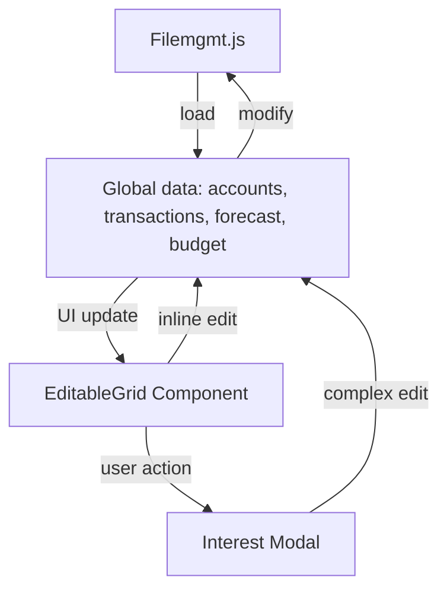

# accounts.md

> **Update Note:** The Accounts page now uses a modal icon in the interest column to trigger the interest modal directly from the grid.

## Purpose
Defines the Accounts page, where users can add, edit, and delete financial accounts, including setting interest rates and compounding options. Now uses the reusable EditableGrid component for inline editing and the modal component system for interest settings. All data is loaded from and saved to a unified JSON file on disk via `filemgmt.js`.

## Key Elements
- **EditableGrid**: Uses the same reusable grid component as transactions for consistent inline editing
- **Interest Modal**: Managed by `modal-interest.js` as a reusable component for complex interest configurations, now accessible via a modal icon in the grid
- **Quick Add Button**: Allows rapid addition of new accounts directly in the grid
- **Enhanced Data Structure**: Supports new fields like group, tags, and current_balance

## Components Used
- **EditableGrid** (`js/editable-grid.js`): Provides inline editing capabilities
- **InterestModal** (`js/modal-interest.js`): Handles complex interest rate configurations

## Interactions
- Reads and writes account data to the global state (`window.accounts`) with enhanced data structure
- Triggers `afterDataChange` to save all app data to the unified JSON file via `filemgmt.js`
- Interacts with `transactions.js` for account dropdowns
- Uses the same grid system as transactions for consistent user experience

## Data Flow Diagram

- The main account form includes an **Add/Edit Interest** button, allowing you to set interest details for a new account before adding it. This opens the same reusable interest modal used for editing existing accounts.
- The interest column in the grid now includes a modal icon for direct access to the interest modal.

## Interest Settings Behavior (Editing vs. Creating)

- When **creating a new account**, clicking the Add/Edit Interest button opens the interest modal. Any settings you enter are saved to the new account when you submit the form.
- When **editing an existing account**, the Add/Edit Interest button and the interest modal in the table both pre-fill with the current account's interest settings. Any changes you make are saved to the account when you save the modal or the main form.
- If you edit an account and do not open the interest modal, the existing interest settings are preserved.
- All interest settings are always preserved unless explicitly changed.
