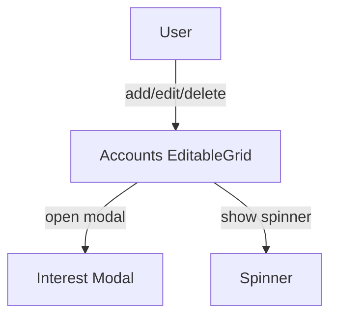
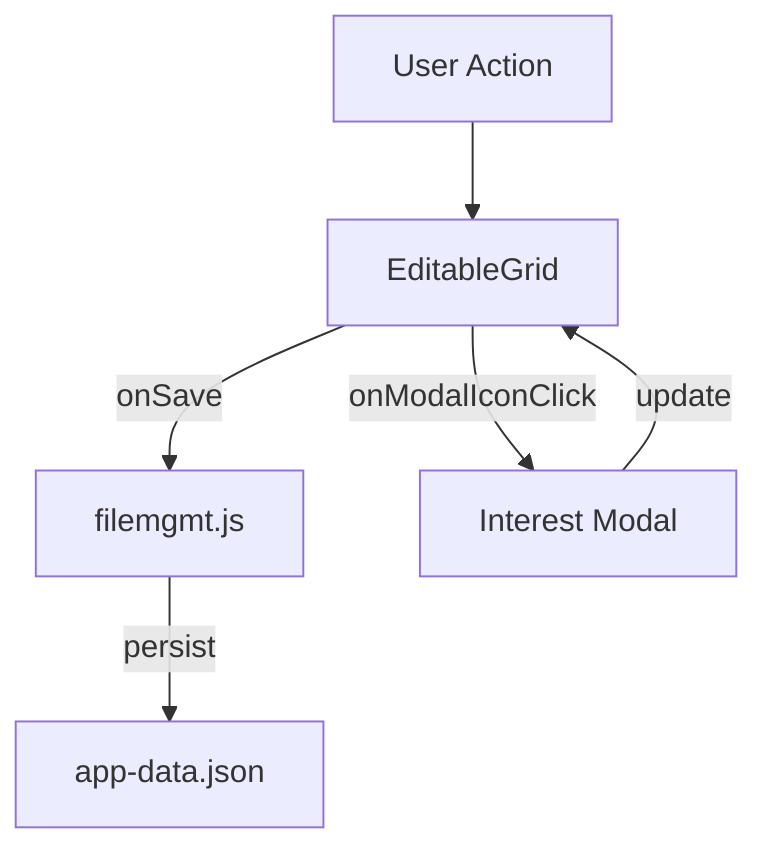

# accounts.md

## Summary
This document describes the Accounts page, where users manage financial accounts with interest and grouping options. It covers both the user experience and the technical implementation, including grid editing, modal integration, and data flow.

## UX/UI

### User Experience Overview
- The Accounts page allows users to add, edit, and delete accounts using an inline-editable grid.
- Interest settings are managed via a modal dialog, accessible from a modal icon in the grid.
- The add (quick add) button is a centered icon below the grid.
- All changes are saved automatically and immediately, with spinners and logging for feedback.
- Grid inputs are sized to fit their cells for a clean UI.

### Available Functions and UI Elements
- Inline grid editing for all account fields
- Add, edit, and delete account actions
- Modal icon in the interest column for advanced settings
- Spinners for save feedback
- Consistent grid system shared with transactions

### Usage Example
- Add a new account by clicking the add icon and filling in the grid row.
- Edit interest settings by clicking the modal icon in the interest column.
- Delete an account using the delete action in the grid.

### UI Diagram


---

## Technical Overview

### Internal Functions and Data Flow
- The Accounts page uses EditableGrid for all editing, with a configuration object specifying columns, data, and callbacks.
- The interest modal is managed by `modal-interest.js` and updates the account's interest fields.
- All edits trigger the `onSave` callback, which updates `window.accounts` and persists to disk via `filemgmt.js`.
- The page triggers `afterDataChange` to ensure all app data is saved.

### Data Flow Diagram


### Variable Scope
- **Global:** `window.accounts`, `appData`
- **Module:** EditableGrid instance, configuration object
- **Function:** Local variables within event handlers and callbacks

### Key Code Snippet
```js
// Example onSave callback for accounts
function onSave(idx, data) {
  window.accounts[idx] = data;
  filemgmt.saveAppDataToFile(window.appData);
}
```

---
