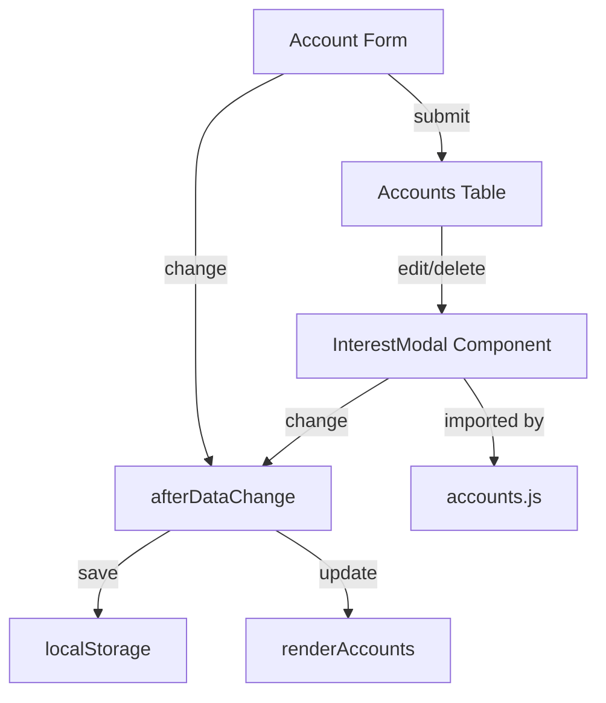

# accounts.md

## Purpose
Defines the Accounts page, where users can add, edit, and delete financial accounts, including setting interest rates and compounding options. Now uses a reusable modal component for interest settings.

## Key Elements
- **Form**: For adding/updating account name and starting balance.
- **Table**: Lists all accounts with their balances and interest settings.
- **Interest Modal**: Now managed by `modal-interest.js` as a reusable component.
- **Script Includes**: Loads all required JS for data, logic, and UI.

## Interactions
- Reads and writes account data to the global state (window.accounts).
- Triggers `afterDataChange` to save to localStorage and update the UI.
- Interacts with `transactions.js` for account dropdowns.
- Uses `forecast-storage.js`, `default-data.js`, and `data-startup.js` for data persistence and initialization.
- Imports and uses `InterestModal` from `modal-interest.js` for interest editing.

## Diagrams

- The main account form now includes an **Add/Edit Interest** button, allowing you to set interest details for a new account before adding it. This opens the same reusable interest modal used for editing existing accounts.

## Interest Settings Behavior (Editing vs. Creating)

- When **creating a new account**, clicking the Add/Edit Interest button opens the interest modal. Any settings you enter are saved to the new account when you submit the form.
- When **editing an existing account**, the Add/Edit Interest button and the interest modal in the table both pre-fill with the current account's interest settings. Any changes you make are saved to the account when you save the modal or the main form.
- If you edit an account and do not open the interest modal, the existing interest settings are preserved.
- All interest settings are always preserved unless explicitly changed.
