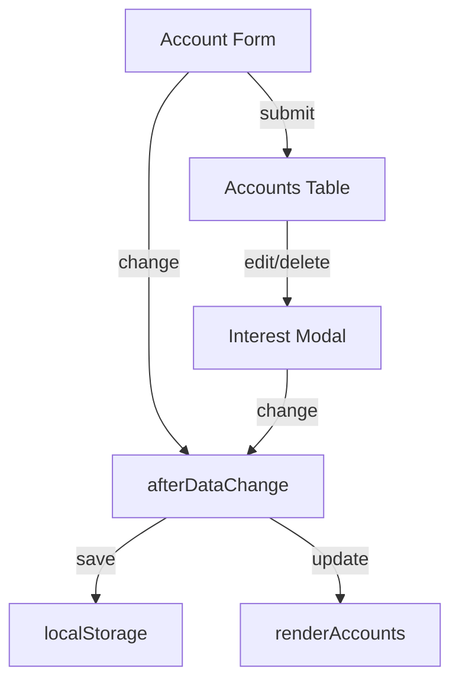

# accounts.md

## Purpose
Defines the Accounts page, where users can add, edit, and delete financial accounts, including setting interest rates and compounding options.

## Key Elements
- **Form**: For adding/updating account name and starting balance.
- **Table**: Lists all accounts with their balances and interest settings.
- **Interest Modal**: Allows editing of interest rate, period, compounding, and type.
- **Script Includes**: Loads all required JS for data, logic, and UI.

## Interactions
- Reads and writes account data to the global state (window.accounts).
- Triggers `afterDataChange` to save to localStorage and update the UI.
- Interacts with `transactions.js` for account dropdowns.
- Uses `forecast-storage.js`, `default-data.js`, and `data-startup.js` for data persistence and initialization.

## Diagrams

