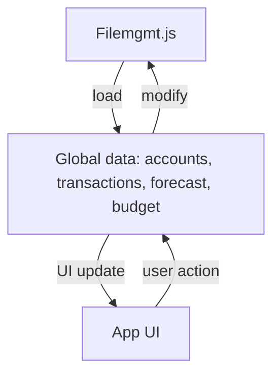

# Data Storage Refactor Plan

## Goal
Refactor the app to use a single JSON file on disk for all data: accounts, transactions, forecast, and (empty) budget. Remove all localStorage and default-data logic. All data loading and saving should be handled by `filemgmt.js` and called from other modules.

---

## Step-by-Step Plan

### 1. Create/Update the Data File
- Use `assets/simulation_data_with_accounts.json` as the default data file, or create a new one if needed (e.g., `assets/app-data.json`).
- Ensure it contains an object with these arrays:
  - `accounts`: array of account objects
  - `transactions`: array of transaction objects
  - `forecast`: array of forecast objects
  - `budget`: empty array for now
- Example:
```json
{
  "accounts": [ /* ... */ ],
  "transactions": [ /* ... */ ],
  "forecast": [ /* ... */ ],
  "budget": []
}
```

### 2. Update `filemgmt.js`
- Add functions:
  - `loadAppDataFromFile()`: Loads and parses the JSON file, returns the full data object.
  - `saveAppDataToFile(data)`: Serializes and writes the full data object to the JSON file.
- Add error handling for file read/write operations.

### 3. Refactor Data Initialization
- In `data-startup.js` (or equivalent), remove all logic that loads from localStorage or default-data.
- Replace with a call to `filemgmt.loadAppDataFromFile()` to initialize the global `accounts`, `transactions`, `forecast`, and `budget` arrays.

### 4. Refactor Data Saving
- In all modules that modify accounts, transactions, or forecast (e.g., `accounts.js`, `transactions.js`, `forecast.js`):
  - Remove any code that saves to localStorage.
  - After any change to the data arrays, call `filemgmt.saveAppDataToFile({ accounts, transactions, forecast, budget })`.

### 5. Remove Default Data Imports
- Remove any imports or references to `default-data.js` for account, transaction, or forecast data.
- Ensure all data comes from the JSON file via `filemgmt.js`.

### 6. Update `afterDataChange` Logic
- Refactor the global `afterDataChange` function:
  - Remove localStorage logic.
  - Ensure it calls `filemgmt.saveAppDataToFile({ accounts, transactions, forecast, budget })` before updating the UI.

### 7. Update Documentation
- Update `Documentation/accounts.md` and any other relevant docs:
  - Describe the new file-based data flow for all data types.
  - Remove references to localStorage and default-data.
  - Add a diagram if needed.

### 8. Test Thoroughly
- Test all CRUD operations (add, edit, delete) for accounts, transactions, and forecast to ensure data is loaded and saved correctly.
- Test app startup and reload to confirm persistence.

---

## Notes
- All file operations should be asynchronous if possible.
- If running in a browser-only environment, file operations may need to be simulated or use a backend API.
- Keep all error handling robust to avoid data loss.

---

## Example Data Flow Diagram

