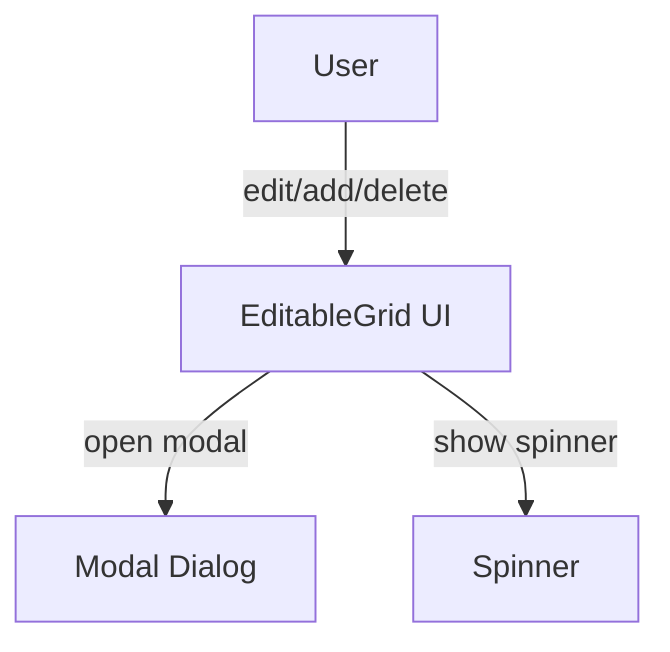
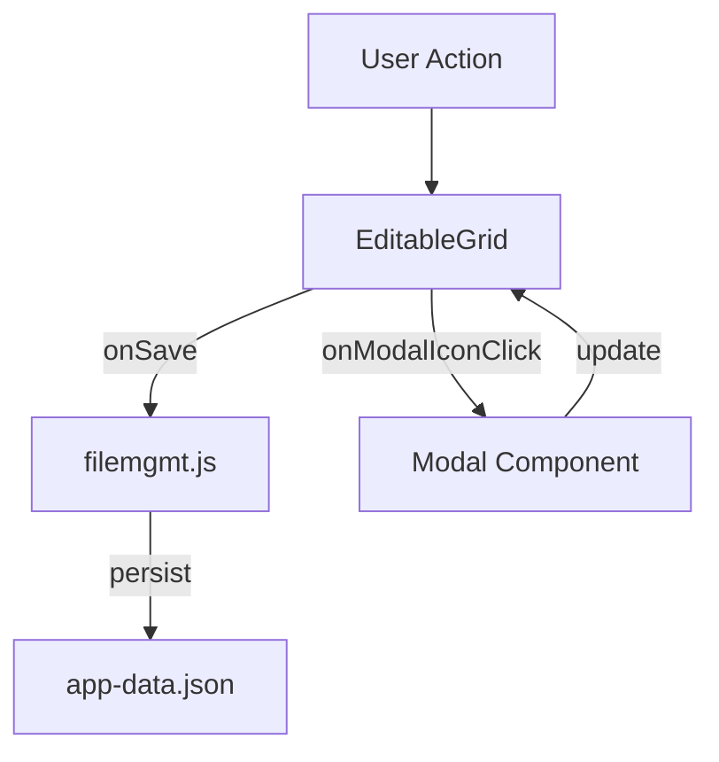

# editable-grid.md

## Summary
This document describes the EditableGrid component, which provides a flexible, inline-editable grid for managing tabular data in the app. It covers both the user experience and the technical implementation, including configuration, callbacks, and data flow.

## UX/UI

### User Experience Overview
- EditableGrid is the exclusive interface for editing accounts and transactions.
- Users can add, edit, and delete rows directly in the grid.
- Inline editing is available for text, number, select, checkbox, and date fields.
- Spinners and console logging provide feedback during save operations.
- Modal icons in cells allow for advanced editing (e.g., interest settings, recurrence).
- The add (quick add) button is an icon centered below the grid.

### Available Functions and UI Elements
- Inline cell editing (double-click or edit icon)
- Add, edit, and delete row actions
- Modal icons for advanced settings
- Spinners for save feedback
- Configurable columns and actions per grid instance

### Usage Example
```javascript
const grid = new EditableGrid({
    targetElement: document.getElementById('myTable'),
    columns: [
        { field: 'name', header: 'Name', editable: true, type: 'text' },
        { field: 'active', header: 'Active', editable: true, type: 'checkbox' },
        { field: 'category', header: 'Category', editable: (row) => row.type === 'custom', type: 'select', options: [...] },
        { field: 'modal', header: 'Modal', render: () => 'Open', modalIcon: '<svg>...</svg>', onModalIconClick: ({ idx }) => alert('Modal for row ' + idx) }
    ],
    data: myDataArray,
    onSave: (idx, data) => { /* handle save */ },
    onDelete: (idx) => { /* handle delete */ },
    actions: { add: true, edit: false, delete: true }
});
```

### UI Diagram


---

## Technical Overview

### Internal Functions and Data Flow
- EditableGrid is initialized with a configuration object specifying columns, data, and callbacks.
- All edits trigger the `onSave` callback, which persists changes to disk via `filemgmt.js`.
- The grid manages its own state and updates the global state as needed.
- Modal icons and callbacks allow for advanced, per-cell editing.

### Data Flow Diagram


### Variable Scope
- **Global:** `window.accounts`, `window.transactions`, `appData`
- **Module:** EditableGrid instance, configuration object
- **Function:** Local variables within event handlers and callbacks

### Key Code Snippet
```js
// Example onSave callback
function onSave(idx, data) {
  window.accounts[idx] = data;
  filemgmt.saveAppDataToFile(window.appData);
}
```

---
