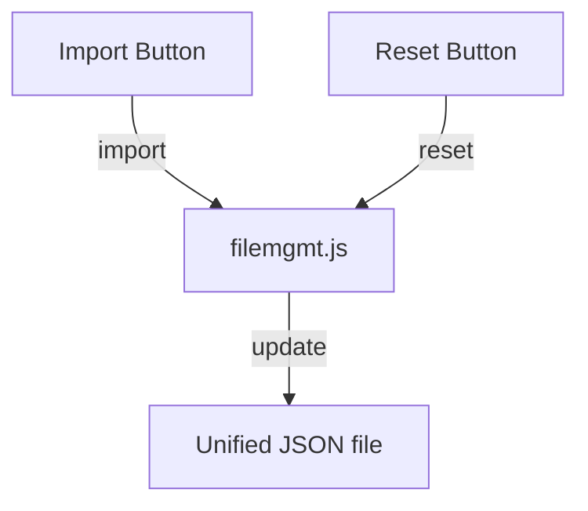

# filemgmt.md

## Purpose
Defines the File Management page, allowing users to import/export their financial data as JSON and reset to the default dataset. All data is loaded from and saved to a unified JSON file on disk via `filemgmt.js`.

## Key Elements
- **Import Button**: Opens file picker to import a JSON file.
- **Reset Button**: Resets all data to the default dataset.
- **Script Includes**: Loads file management logic and shared navbar.

## Interactions
- Uses `filemgmt.js` for import/export/reset logic.
- Reads/writes the global state and persists to the unified JSON file.
- Uses `navbar.js` for navigation.

## Data Flow Diagram

