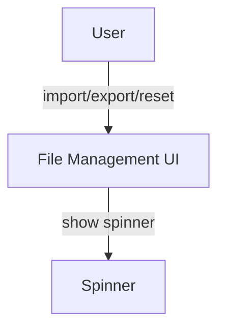

# filemgmt.md

## Summary
This document describes the File Management page, where users can import, export, and reset all app data. It covers both the user experience and the technical implementation, including file operations, state updates, and data flow.

## UX/UI

### User Experience Overview
- The File Management page allows users to import/export their entire dataset as a JSON file.
- Users can reset all data to the default dataset with a single click.
- All changes are saved automatically and immediately, with spinners and logging for feedback.
- The interface is simple, with clear buttons for each action.

### Available Functions and UI Elements
- Import button (opens file picker)
- Export button (downloads current state as JSON)
- Reset button (restores default data)
- Spinners for feedback during file operations

### Usage Example
- Import a dataset by clicking the import button and selecting a JSON file.
- Export the current dataset by clicking the export button.
- Reset all data by clicking the reset button and confirming the action.

### UI Diagram


---

## Technical Overview

### Internal Functions and Data Flow
- The File Management page uses `filemgmt.js` for all import, export, and reset logic.
- All actions update the global state (`appData`) and persist changes to disk.
- Import replaces the current state; export downloads the current state; reset restores the default dataset.
- The page triggers `afterDataChange` to ensure all app data is saved.

### Data Flow Diagram
```mermaid
flowchart TD
  User[User Action] --> FileMgmtUI[File Management UI]
  FileMgmtUI -->|import/export/reset| Filemgmt[filemgmt.js]
  Filemgmt -->|update| AppData[appData (global)]
  Filemgmt -->|persist| Disk[app-data.json]
```

### Variable Scope
- **Global:** `appData`
- **Module:** filemgmt.js functions
- **Function:** Local variables within event handlers and callbacks

### Key Code Snippet
```js
// Example import handler
function handleImport(file) {
  const data = JSON.parse(file);
  window.appData = data;
  filemgmt.saveAppDataToFile(window.appData);
}
```

---
