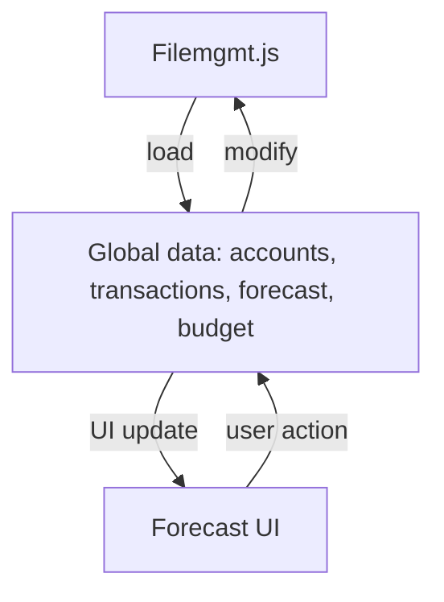

# forecast.md

## Purpose
This file defines the Financial Forecast page of the application. It allows users to configure forecast settings, run a financial forecast, and view results in both tabular and chart form. All data is loaded from and saved to a unified JSON file on disk via `filemgmt.js`.

## Key Elements
- **HTML Structure**: Contains sections for forecast settings, results table, and a chart.
- **Form Elements**: Users can select forecast mode, date range, period count, and period type.
- **Results Table**: Displays forecasted account balances for each period.
- **Chart**: Visualizes account balances over time using Plotly.js.
- **Script Includes**: Loads all required JavaScript modules for data, logic, and UI.

## Interactions
- Reads and writes forecast data to the global state (`window.forecast`).
- Triggers `afterDataChange` to save all app data (accounts, transactions, forecast, budget) to the unified JSON file via `filemgmt.js` and update the UI.
- Interacts with `accounts.js` and `transactions.js` for data.

## Data Flow Diagram

