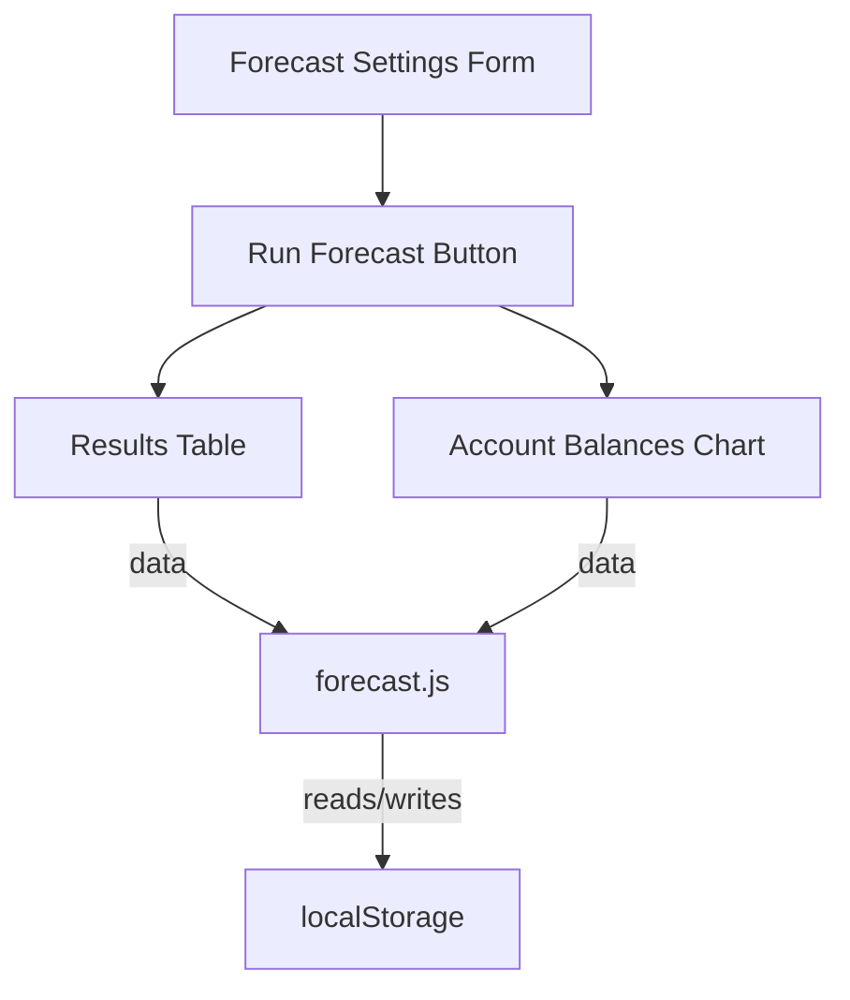

# forecast.md

## Purpose
This file defines the Financial Forecast page of the application. It allows users to configure forecast settings, run a financial forecast, and view results in both tabular and chart form.

## Key Elements
- **HTML Structure**: Contains sections for forecast settings, results table, and a chart.
- **Form Elements**: Users can select forecast mode, date range, period count, and period type.
- **Results Table**: Displays forecasted account balances for each period.
- **Chart**: Visualizes account balances over time using Plotly.js.
- **Script Includes**: Loads all required JavaScript modules for data, logic, and UI.

## Interactions
- Loads and saves data via `forecast-storage.js`, `default-data.js`, and `data-startup.js`.
- UI logic and rendering handled by `forecast.js`.
- Navigation and shared UI handled by `navbar.js`.
- Interacts with global state (accounts, transactions, forecastResults) for data.

## Diagrams

