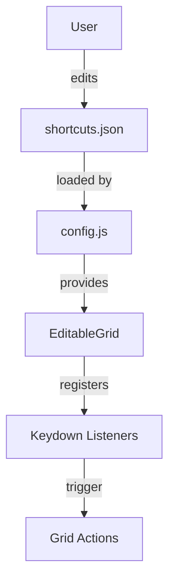

# Keyboard Shortcut System

## Overview
A global, user-editable keyboard shortcut system is now implemented. All shortcut definitions are centralized in a JSON config (`assets/shortcuts.json`), and loaded at runtime by a new config module (`js/config.js`). Feature modules (such as `EditableGrid`) query this config for their keybindings and register listeners accordingly.

## How It Works
- **Config File:** `assets/shortcuts.json` defines all keybindings for the app, grouped by module.
- **Config Module:** `js/config.js` loads the config and provides `getShortcut`, `getAllShortcuts`, and `matchShortcut` utilities.
- **Integration:** `EditableGrid` and other modules use these utilities to register and handle keyboard shortcuts for actions like save, delete, and add row.
- **User Customization:** The JSON config can be edited directly (or via a future UI) to change shortcuts globally.

## Example Keymap (assets/shortcuts.json)
```json
{
  "EditableGrid": {
    "saveRow": "Enter",
    "deleteRow": "Delete",
    "addRow": "Meta+Shift+A"
  },
  "Global": {
    "openSettings": "Meta+,"
  }
}
```

## Technical Diagram


## Developer Notes
- To add or change a shortcut, update `assets/shortcuts.json`.
- To use a shortcut in a new module, call `getShortcut('ModuleName', 'action')` and use `matchShortcut(event, shortcut)` in your event handlers.
- The config is loaded asynchronously on first use.

---

> **Update Note:**
> July 2025: Added global keyboard shortcut config system, config.js module, and EditableGrid integration. All grid actions now use config-defined shortcuts.
