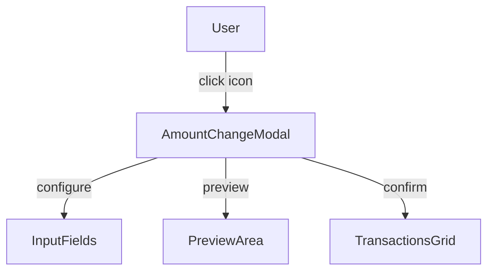
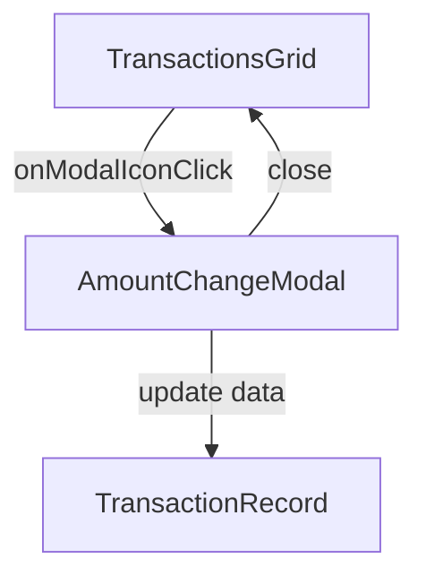

# modal-amount-change.md

## Summary
This document describes the Amount Change Modal, a specialized component for defining how transaction amounts change over time. It covers both the user experience and the technical implementation, including modal usage, grid integration, and data flow.

## UX/UI

### User Experience Overview
- The Amount Change Modal allows users to define percentage or fixed amount changes for transactions.
- Users can select the change type, enter a value, and choose the frequency.
- A preview shows how the change will affect future transaction amounts.
- The modal is accessed via a modal icon in the transactions grid.

### Available Functions and UI Elements
- Modal dialog for amount change configuration
- Input fields for type, value, and frequency
- Preview area for future amounts
- Modal icon in the grid for quick access

### Usage Example
- Click the modal icon in the amount change column to open the modal.
- Select 'percentage' or 'fixed', enter a value, and choose a frequency.
- View the preview and confirm to apply the change.

### UI Diagram


---

## Technical Overview

### Internal Functions and Data Flow
- The modal is implemented as a reusable JS module in `modal-amount-change.js`.
- Triggered from the EditableGrid via a modal icon and callback.
- Works with amountChange objects containing type, value, and frequency.
- Updates the transaction's amountChange field and triggers a grid update.

### Data Flow Diagram


### Variable Scope
- **Global:** None - modal state is local
- **Module:** AmountChangeModal instance, configuration object
- **Function:** Local variables for modal state and preview calculations

### Data Structure
The modal works with amountChange objects having:
- `type`: 'percentage' or 'fixed'
- `value`: Numeric value for percentage or fixed amount
- `frequency`: 'period', 'year', 'transaction'

### Key Code Snippet
```javascript
// Example modal trigger in EditableGrid
{
  field: 'amountChange',
  header: 'Amount Change',
  modalIcon: '<svg>...</svg>',
  onModalIconClick: ({ idx }) => AmountChangeModal.show(...)
}
```

---
