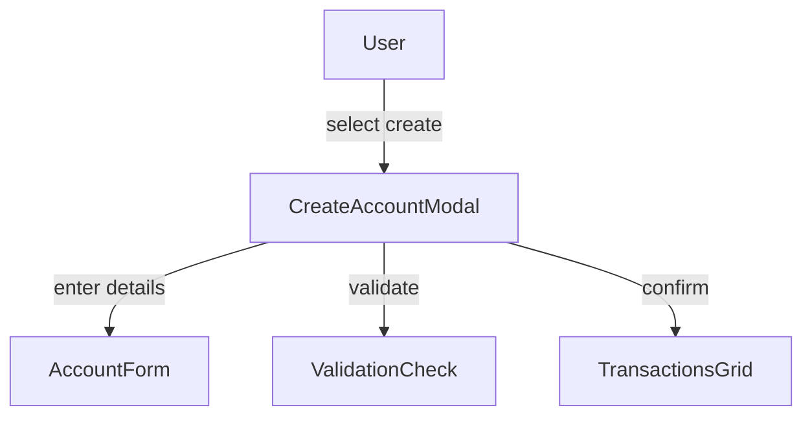
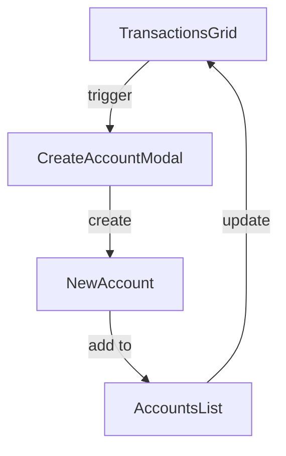

# modal-create-account.md

## Summary
This document describes the Create Account Modal, a simplified component for creating new accounts directly from the transactions grid. It covers both the user experience and the technical implementation, including modal usage, account creation, and workflow integration.

## UX/UI

### User Experience Overview
- The Create Account Modal provides a streamlined interface for quickly adding accounts without leaving the transaction editing workflow.
- Users can enter an account name and starting balance.
- Default values are automatically set for new accounts.
- The modal includes validation to ensure required fields are completed.

### Available Functions and UI Elements
- Modal dialog for account creation
- Text field for account name
- Numeric input for starting balance
- Validation feedback
- Create and cancel buttons

### Usage Example
- Select "Create New Account" from the account dropdown in the transactions grid.
- Enter the account name and starting balance.
- Click create to add the account and return to the transaction.

### UI Diagram


---

## Technical Overview

### Internal Functions and Data Flow
- The modal is implemented as a reusable JS module in `modal-create-account.js`.
- Triggered from the EditableGrid when users select "Create New Account" from dropdown.
- Creates account with default structure and user-provided values.
- Updates the account dropdown and sets the new account as selected.

### Data Flow Diagram


### Variable Scope
- **Global:** `window.accounts` - updated with new account
- **Module:** CreateAccountModal instance, form data
- **Function:** Local variables for validation and account creation

### Default Account Structure
New accounts are created with:
- `name`: User-provided name
- `balance` and `current_balance`: User-provided starting balance
- `group`: "Expense" as default
- `tags`: Empty array
- `interest`: 0
- `interest_period`: 'year'
- `compound_period`: 'none'
- `interest_type`: 'simple'

### Key Code Snippet
```javascript
// Example account creation
function createAccount(name, balance) {
  const newAccount = {
    name,
    balance,
    current_balance: balance,
    group: "Expense",
    tags: [],
    interest: 0,
    interest_period: 'year',
    compound_period: 'none',
    interest_type: 'simple'
  };
  window.accounts.push(newAccount);
  return newAccount;
}
```

---
