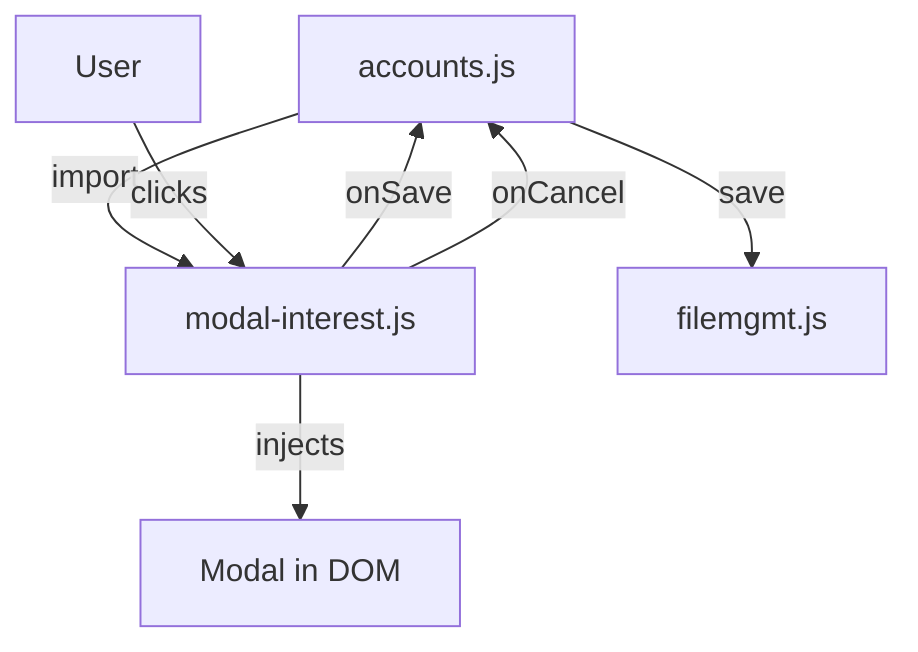

# modal-interest.md

## Purpose
Defines a reusable JavaScript object for displaying and managing the Interest Settings modal for accounts. This allows the modal to be used as a component, similar to React-style code management.

## Key Elements
- **InterestModal Object**: Provides `show`, `hide`, and `create` methods for modal lifecycle.
- **Dynamic Injection**: Modal HTML is injected into the DOM only when needed.
- **Event Handling**: Handles save and cancel actions, passing data back to the caller.

## Interactions
- Used by `accounts.js` to open the modal and update account interest settings.
- Can be reused by other modules for similar modal needs.
- All data changes are persisted to the unified JSON file via `filemgmt.js` and `afterDataChange`.

## Data Flow Diagram

