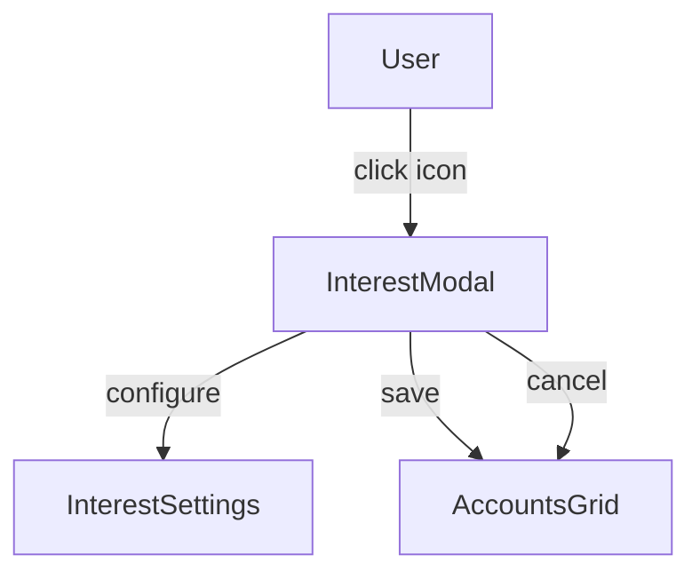
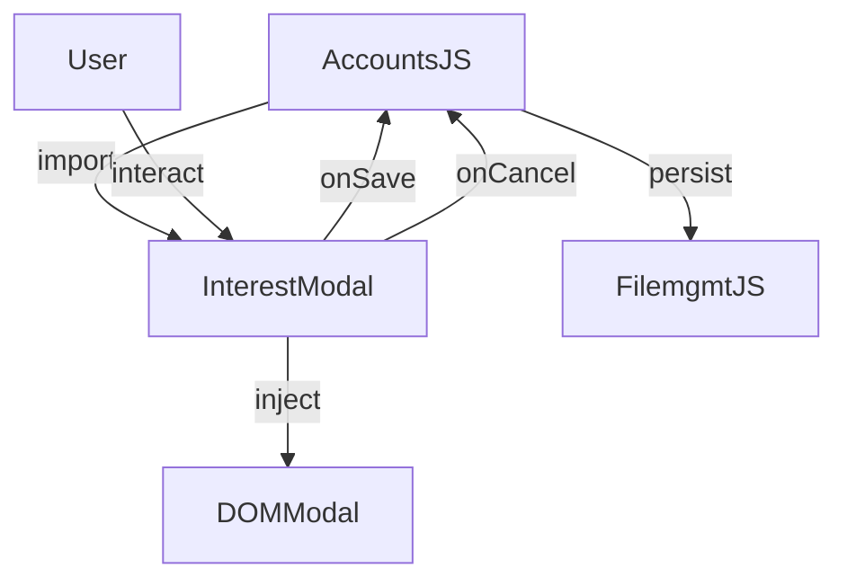

# modal-interest.md

## Summary
This document describes the Interest Modal, a reusable component for displaying and managing interest settings for accounts. It covers both the user experience and the technical implementation, including modal usage, data handling, and integration patterns.

## UX/UI

### User Experience Overview
- The Interest Modal allows users to configure complex interest settings for accounts.
- Users can set interest rates, compounding periods, and interest types.
- The modal provides a clean interface for advanced account configuration.
- Changes are saved automatically when confirmed.

### Available Functions and UI Elements
- Modal dialog for interest configuration
- Input fields for interest rate, periods, and types
- Dropdown menus for compounding options
- Save and cancel buttons
- Modal icon in the grid for quick access

### Usage Example
- Click the modal icon in the interest column to open the modal.
- Configure interest rate, period, and compounding settings.
- Save to apply changes or cancel to discard.

### UI Diagram


---

## Technical Overview

### Internal Functions and Data Flow
- The modal is implemented as a reusable JavaScript object in `modal-interest.js`.
- Provides show, hide, and create methods for modal lifecycle management.
- Modal HTML is dynamically injected into the DOM when needed.
- Handles save and cancel actions, passing data back to the caller.

### Data Flow Diagram


### Variable Scope
- **Global:** None - modal state is encapsulated
- **Module:** InterestModal object, modal configuration
- **Function:** Local variables for form data and event handling

### Key Code Snippet
```javascript
// Example modal usage
InterestModal.show(accountData, (updatedData) => {
  // Handle save
  updateAccount(updatedData);
  saveToFile();
});
```

---
