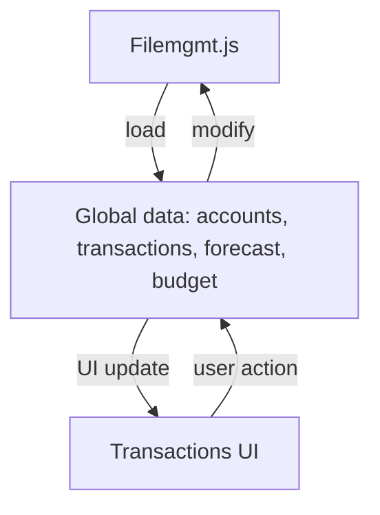

# transactions.md

## Purpose
Defines the Transactions page, where users can add, edit, and delete financial transactions that affect accounts. Supports recurring transactions and percentage changes. All data is loaded from and saved to a unified JSON file on disk via `filemgmt.js`.

## Key Elements
- **Form**: For adding/updating transactions (name, account, amount, date, recurrence, etc.).
- **Table**: Lists all transactions with their details and actions.
- **Script Includes**: Loads all required JS for data, logic, and UI.

## Interactions
- Reads and writes transaction data to the global state (`window.transactions`).
- Triggers `afterDataChange` to save all app data (accounts, transactions, forecast, budget) to the unified JSON file via `filemgmt.js` and update the UI.
- Interacts with `accounts.js` for account selection.

## Data Flow Diagram

