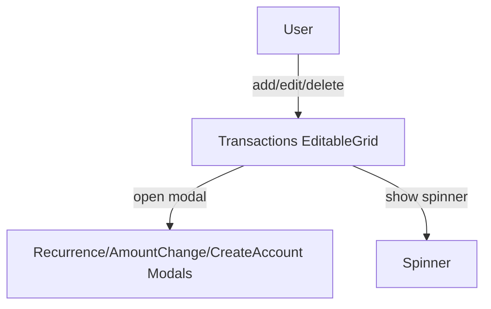
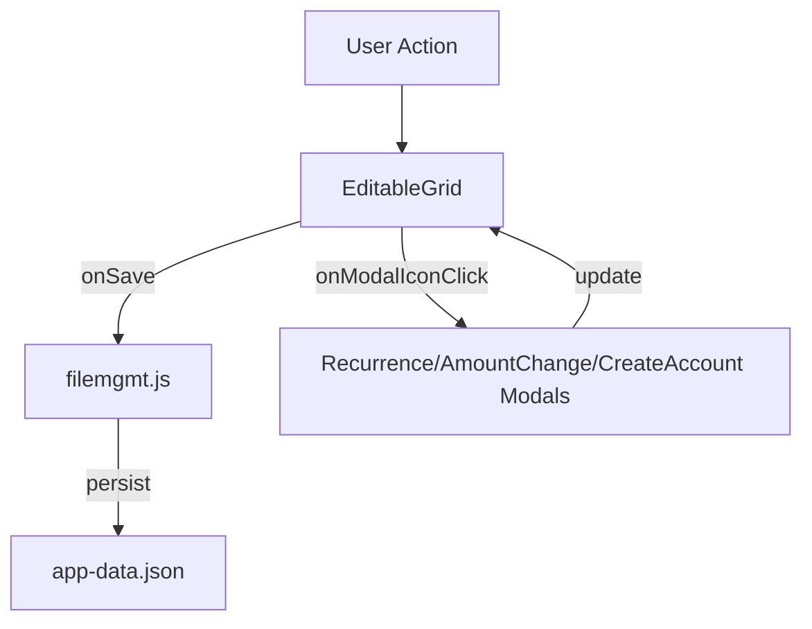

# transactions.md

## Summary
This document describes the Transactions page, where users manage financial transactions with support for recurrence and dynamic amount changes. It covers both the user experience and the technical implementation, including grid editing, modal dialogs, and data flow.

## UX/UI

### User Experience Overview
- The Transactions page allows users to add, edit, and delete transactions using an inline-editable grid.
- Recurring transactions and dynamic amount changes are managed via modal dialogs.
- The add (quick add) button is available for rapid entry.
- All changes are saved automatically and immediately, with spinners and logging for feedback.
- Account dropdowns update dynamically when new accounts are created.

### Available Functions and UI Elements
- Inline grid editing for all transaction fields
- Add, edit, and delete transaction actions
- Modal dialogs for recurrence, amount change, and account creation
- Spinners for save feedback
- Conditional rendering for recurring vs one-time transactions

### Usage Example
- Add a new transaction by clicking the add icon and filling in the grid row.
- Edit recurrence by clicking the recurrence modal icon in the grid.
- Create a new account from within the transactions grid using the create account modal.

### UI Diagram


---

## Technical Overview

### Internal Functions and Data Flow
- The Transactions page uses EditableGrid for all editing, with a configuration object specifying columns, data, and callbacks.
- Specialized modals handle recurrence, amount change, and account creation.
- All edits trigger the `onSave` callback, which updates `window.transactions` and persists to disk via `filemgmt.js`.
- The page triggers `afterDataChange` to ensure all app data is saved.
- Account dropdowns are updated dynamically when new accounts are created.

### Data Flow Diagram


### Variable Scope
- **Global:** `window.transactions`, `appData`
- **Module:** EditableGrid instance, configuration object
- **Function:** Local variables within event handlers and callbacks

### Key Code Snippet
```js
// Example onSave callback for transactions
function onSave(idx, data) {
  window.transactions[idx] = data;
  filemgmt.saveAppDataToFile(window.appData);
}
```

---
