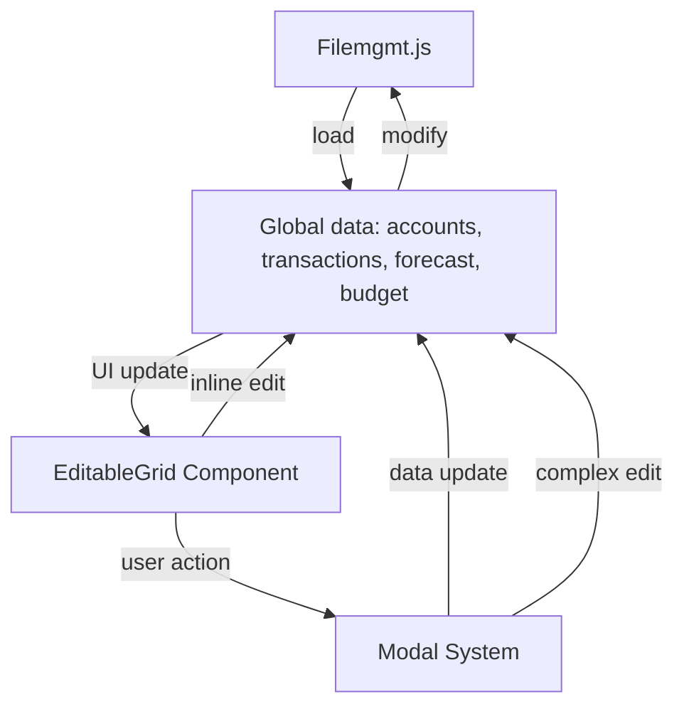

# transactions.md

> **Update Note:**
> The Transactions page now uses the EditableGrid as the exclusive editing interface. All changes are saved immediately to disk (Electron/Node.js) via callback-driven persistence to `filemgmt.js`. Spinners and logging provide user feedback and traceability. Form-based editing has been removed.

## Purpose
Defines the Transactions page, where users can add, edit, and delete financial transactions that affect accounts. Supports recurring transactions with complex recurrence patterns and dynamic amount changes over time. Features an inline-editable grid interface with modal dialogs for complex data entry. All data is loaded from and saved to a unified JSON file on disk via `filemgmt.js`.

## Key Elements
- **EditableGrid**: A reusable, configurable grid component that handles inline editing of transaction data
- **Modal Dialogs**: Specialized modals for editing complex objects (RecurrenceModal, AmountChangeModal, CreateAccountModal)
- **Dynamic UI**: Table cells become editable based on transaction properties (e.g., execution date only for non-recurring transactions)
- **Quick Add Button**: Allows rapid addition of new transactions directly in the grid

## New Components
- **EditableGrid** (`js/editable-grid.js`): Reusable grid component with support for various input types and conditional editability
- **RecurrenceModal** (`js/modal-recurrence.js`): Modal for editing transaction recurrence patterns
- **AmountChangeModal** (`js/modal-amount-change.js`): Modal for defining how transaction amounts change over time
- **CreateAccountModal** (`js/modal-create-account.js`): Modal for creating new accounts from within the transactions grid

## Interactions
- Reads and writes transaction data to the global state (`window.transactions`) with enhanced data structure
- Triggers `afterDataChange` to save all app data to the unified JSON file via `filemgmt.js` (disk persistence only)
- Dynamically updates account dropdown options when new accounts are created
- Uses conditional rendering to show/hide fields based on transaction type (recurring vs one-time)

## Data Flow Diagram

