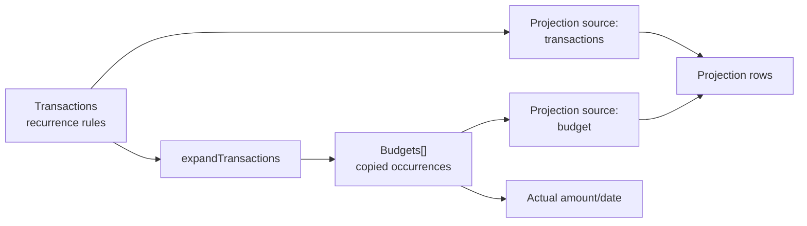
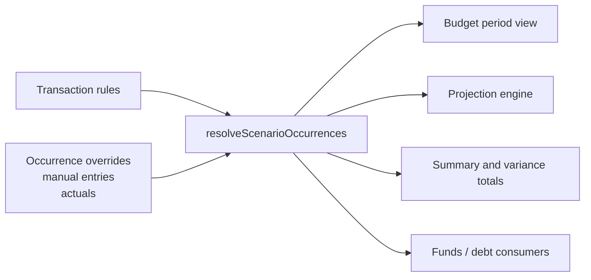

# Unified Budget, Transactions, Actuals, And Projections Workflow

Status: Implemented on `dev`
Owner: Jay
Date: 2026-08-02
Approved: 2026-08-02
Branch: `dev`
Implemented: 2026-08-02
Purpose: Approved workflow, implementation record, acceptance contract, and testing handoff for the unified Plan & Actuals workflow.

## 1. Recommendation

Replace the current user-visible separation between Transactions and Budget with one planning and tracking surface.

The unified surface should:

1. Let the user define recurring and one-time planned money movements.
2. Expand those rules into dated occurrences automatically for the selected period.
3. Let the user add unexpected planned or actual costs directly into the period.
4. Let the user turn an unexpected occurrence into a recurring rule for future periods.
5. Let the user adjust one occurrence, this and future occurrences, or an entire recurring series.
6. Track baseline plan, current plan, actual amount, variance, and remaining commitments.
7. Make projections always consume the resolved plan: actuals to date plus the latest remaining plan.

Budget should become a view and workflow over transaction rules and dated occurrences, not a separately generated working dataset.

Internally, recurring rules and dated occurrences should remain distinct concepts. Combining them into one user workflow does not require flattening them into one ambiguous record type.

## 2. Why The Current Workflow Is Difficult

The current flow is:

```text
Create recurring transactions
        ↓
Choose a separate budget window
        ↓
Generate budget occurrences
        ↓
Edit and actualize the copied budget rows
        ↓
Choose whether projections use transactions or budget
        ↓
Regenerate projections
```

This creates two editable representations of the plan:

- `scenario.transactions`: recurring and one-time source definitions
- `scenario.budgets`: copied dated occurrences with plan and actual fields

The user must decide which representation is current, keep the two synchronized, and understand two different time windows.

### 2.1 User Problems This Must Solve

- Add an extra cost in the current month or selected period without first changing a recurrence list and regenerating a budget.
- Record an unplanned actual immediately.
- Convert an unexpected cost into a recurring item after learning that it repeats.
- Adjust only the current occurrence without changing every occurrence.
- Adjust the same item from the next period forward without rebuilding the budget.
- Preserve actual history when the future plan changes.
- Compare the original plan, latest plan, actual results, and latest projected position.
- Avoid a separate “generate budget” step.

## 3. Existing Notes And Intent Recovered

### 3.1 Current Development Note

`Daniel requests.md` already records the goal of simplifying:

- projection and budget creation;
- budget adjustment and tracking;
- comparison of predicted budget, latest projections, and actuals; and
- a possible dedicated actuals workflow.

### 3.2 Historical Budget Requirements

The removed `Documentation/BUDGET_REQUIREMENTS.md` described Budget as an editable snapshot that becomes the working truth after projection generation. It required:

- occurrence-level overrides;
- actuals that survive regeneration;
- links back to source transactions;
- projection from either the budget or original transactions; and
- optional replacement of the existing budget.

That design explains the current split, but it also creates the synchronization and regeneration burden now being experienced.

### 3.3 Historical Unified Transaction Work

The January 2026 “basic combined grid” work previously merged planned and actual transactions into one `transactions` array with:

- a planned/actual status;
- actual amount and date;
- standalone actual transactions; and
- one combined Transactions grid.

Parts of that model still exist:

- `TransactionManager` normalizes and stores status, actual amount, and actual date.
- `expandTransactions()` handles planned recurring records, planned one-time records, and actual records.
- Validation still expects a transaction status object.

The current transaction UI hides those actual controls, while Budget became the visible place for actual tracking.

## 4. Current Technical Model

### 4.1 Stored Scenario Data

The relevant schemaVersion 43 fields are:

```text
scenario
├── transactions[]          recurring and one-time definitions
├── budgets[]               generated and manually edited dated occurrences
├── budgetWindow.config     separate generation window
└── projection
    ├── config
    │   ├── startDate
    │   ├── endDate
    │   ├── periodTypeId
    │   └── source          "transactions" or "budget"
    └── rows[]              last generated projection output
```

### 4.2 Current Data Flow



### 4.3 Current Code Responsibilities

| Area | Current responsibility | Main files |
|---|---|---|
| Transaction persistence | Stores canonical transaction rules and status fields | `js/app/managers/transaction-manager.js` |
| Recurrence expansion | Turns recurrence rules into dated rows | `js/domain/calculations/transaction-expander.js`, `recurrence-calculations.js` |
| Budget persistence | Stores occurrence copies and actuals | `js/app/managers/budget-manager.js` |
| Budget generation | Re-expands planned transactions over `budgetWindow` | `js/app/managers/budget-manager.js` |
| Transactions UI | Edits rules and displays period-expanded rows | `js/ui/components/grids/transactions-grid.js` |
| Budget UI | Edits generated occurrences and actuals | `js/ui/components/grids/budget-grid.js` |
| Projection generation | Switches between transaction and budget sources | `js/domain/calculations/projection-engine.js` |
| Perspective rows | Produces primary/flipped account views | `js/ui/transforms/transaction-row-transformer.js` |
| Shared display selection | Normalizes transaction-like and budget-like rows | `js/ui/queries/financial-entry-display-rows.js` |
| Totals | Calculates transaction and budget summaries separately | `js/ui/transforms/data-aggregators.js`, `widgets/toolbar-totals.js` |
| Schema and migration | Preserves both arrays and both window/source concepts | `js/shared/app-data-utils.js`, `migration-utils.js` |
| Workflow layout | Shows Transactions and Budget as separate cards | `js/shared/workflow-registry.js`, `forecast-layout.js` |

## 5. Problems Found In The Current Implementation

### 5.1 Budget Generation Is A Copy Operation

`BudgetManager.createFromProjections()` is named as though it snapshots projections, but it directly expands planned transactions over the budget window and writes copies to `scenario.budgets`.

The stored projection rows are not the real budget source.

### 5.2 Regeneration Can Replace Future Adjustments

Regeneration rebuilds planned budget occurrences from transaction rules. Actual rows are preserved, and the current uncommitted work also preserves historical planned rows before the regeneration window, but future edited planned rows can still be replaced.

This makes occurrence-level future planning fragile.

### 5.3 Two Independent Windows Add Cognitive Cost

The user must configure:

- a budget generation window; and
- a projection generation window.

The Budget view also has its own period filters. These are three date concepts for one planning task.

### 5.4 Recurring And Occurrence Editing Are Split Across Cards

Transactions can edit recurrence and periodic changes but do not offer the visible actual-tracking workflow.

Budgets can edit dated occurrences and actuals but store only a recurrence description, not a usable recurrence rule. A manually added budget cost therefore cannot naturally become recurring.

### 5.5 Period-Expanded Transaction Rows Have No Explicit Edit Scope

The Transactions view can display expanded recurring occurrences for a selected period, but an edit maps back to the canonical source transaction. The user is not asked whether the change applies to:

- this occurrence only;
- this and future occurrences; or
- the entire series.

### 5.6 Projection Source Selection Is Not A Reliable Contract

The budget-source projection path:

- filters out actual budget rows instead of using them as locked reality;
- maps `effectiveDate` from `budget.date`, while the stored schema field is `occurrenceDate`;
- does not consistently carry actual date and amount;
- does not have a clear current UI action that intentionally switches the source; and
- duplicates source-item normalization in the projection UI and engine.

The documentation promises stronger budget-based projection behavior than the current implementation provides.

### 5.7 Current Documentation Contradicts Current Code

Examples:

- The data schema says transaction actuals are not stored, while `TransactionManager`, validation, fixtures, and the expander support transaction actual status.
- UI documentation describes “Save as Budget” and “Project from Budget,” while current Budget generation expands transactions and the old project-from-budget action was removed.
- The user guide still describes a dedicated Actual Transactions section that no longer exists.
- Current and historical descriptions disagree about whether Budget is created from projection rows or directly from transactions.

### 5.8 Totals Need A Clear Comparison Model

The current Budget totals contain useful concepts—Realized Net, Open Commitments, Forecast Position, and Unbudgeted Actuals—but do not retain a clean immutable baseline for plan revision comparison.

The current `plannedNetBalance` calculation also subtracts signed open commitments from actual net. Once open commitments are already signed by money direction, the forecast calculation should be explicitly reviewed and covered by examples.

### 5.9 Logic Is Duplicated

The code independently performs variations of:

- source selection;
- recurrence expansion;
- budget normalization;
- transaction normalization;
- primary/flipped perspective generation;
- period filtering;
- actual/planned selection; and
- totals calculation.

The existing shared financial-entry query is a useful starting point but does not yet resolve rules, occurrence overrides, and actuals into one canonical timeline.

## 6. Target Conceptual Model

Use two internal concepts behind one user-facing workflow.

### 6.1 Transaction Rule

A Transaction Rule defines expected behavior:

- accounts and money direction;
- base planned amount;
- description and tags;
- recurrence;
- periodic change;
- split transaction metadata; and
- active start/end range.

This is the source for automatically generated future occurrences.

### 6.2 Transaction Occurrence

A Transaction Occurrence represents a specific dated event or exception:

- a generated occurrence linked to a rule;
- a one-time planned item;
- an occurrence-level override;
- an actual event;
- a skipped event; or
- an unplanned/manual event with no source rule.

Only exceptions, actuals, manual entries, skipped entries, and frozen comparison values need to be persisted. Untouched future occurrences can remain derived.

### 6.3 Budget

Budget becomes the period view of resolved transaction occurrences.

It is no longer:

- a generated copy;
- a second plan source; or
- a separate editable dataset.

### 6.4 Projection

Projection always consumes resolved occurrences:

```text
actual events to date
+ remaining open planned occurrences
+ future occurrences generated from active rules
- skipped occurrences
= latest forecast input
```

There is no `transactions` versus `budget` source choice.

## 7. Proposed Target Data Shape

The final field names can be refined during implementation. The important distinction is rule versus occurrence.

```typescript
type TransactionRule = {
  id: number,
  seriesRootId?: number | null,
  supersedesTransactionId?: number | null,
  primaryAccountId: number,
  secondaryAccountId: number | null,
  transactionTypeId: 1 | 2,
  amount: number,
  description: string,
  recurrence: Recurrence | null,
  periodicChange: PeriodicChange | null,
  transactionGroupId?: string | number | null,
  transactionGroupRole?: string | null,
  transactionGroupAccountGroupId?: number | null,
  tags: string[],
  activeFrom?: string | null,
  activeTo?: string | null
}

type TransactionOccurrence = {
  id: number,
  sourceTransactionId: number | null,
  occurrenceKey: string,
  scheduledDate: string,
  plannedDate?: string | null,
  actualDate?: string | null,

  baselineAmount?: number | null,
  plannedAmount?: number | null,
  actualAmount?: number | null,

  status: "planned" | "actual" | "skipped",
  origin: "generated" | "manual" | "migrated",

  primaryAccountId?: number | null,
  secondaryAccountId?: number | null,
  transactionTypeId?: 1 | 2 | null,
  description?: string | null,
  tags?: string[] | null,

  createdAt?: string | null,
  updatedAt?: string | null
}
```

### 7.1 Stable Occurrence Identity

Generated occurrences need a stable matching key, for example:

```text
<sourceTransactionId>|<scheduledDate>|<transactionGroupRole>
```

The scheduled date remains the match key even if the actual date changes.

This prevents a planned and actual version of the same event from appearing twice.

### 7.2 Override Semantics

For a generated occurrence:

- a null occurrence field inherits from the source rule;
- `plannedAmount` overrides the generated amount;
- `actualAmount` replaces planned amount when status is actual;
- `actualDate` replaces scheduled date for realized timing;
- `status = skipped` suppresses the event; and
- account, direction, description, or tag overrides are allowed when needed.

### 7.3 One-Time Entries

A manually added one-time item may be stored directly as an occurrence with no source rule.

If the user selects “Repeat going forward,” create a new Transaction Rule starting from the chosen future date and retain the current occurrence as history.

### 7.4 “This And Future” Changes

For the first implementation, avoid a complex nested revision engine.

When the user applies a change to “this and future”:

1. End the old rule immediately before the selected occurrence.
2. Clone it as a new rule starting on the selected occurrence date.
3. Apply the new amount, recurrence, accounts, or description to the new rule.
4. Link both with `seriesRootId` and `supersedesTransactionId`.
5. Preserve actuals and occurrence overrides attached to the old segment.

This keeps recurrence generation simple and makes history inspectable.

### 7.5 Baseline Semantics

To compare original plan, current plan, and actuals:

- **Baseline**: the planned value frozen for the reporting period.
- **Current plan**: the latest resolved planned value after overrides.
- **Actual**: the realized value.
- **Forecast**: actuals to date plus remaining current plan.

Recommended baseline behavior:

1. Before a period is baselined, baseline equals the current derived plan.
2. When the first actual is recorded in a period, automatically freeze baseline values for that period.
3. Also offer an explicit “Freeze baseline” action.
4. Store baseline values on materialized occurrence records.
5. Later plan adjustments change `plannedAmount`, not `baselineAmount`.
6. An unplanned occurrence has baseline zero.

This preserves comparison without requiring the user to generate and manage a second budget dataset.

### 7.6 Approved Occurrence States

| State | Meaning | Projection treatment | Baseline treatment |
|---|---|---|---|
| Planned | Expected and unresolved | Use current planned amount and effective planned date | Derived plan until frozen |
| Actual | Realized occurrence | Use actual amount and actual date | Preserve the frozen baseline |
| Skipped | Explicitly cancelled occurrence | Exclude | Preserve baseline for variance history |
| Overdue | Planned date is before the as-of date and remains unresolved | Include as an open commitment at the as-of date and flag it for resolution | Preserve baseline/current plan |
| Unbudgeted Actual | Manual actual with no matching plan | Use actual amount and date | Baseline is zero |
| Overridden | Generated occurrence with an occurrence-level plan change | Use the current overridden amount/date | Preserve the original frozen baseline |

Money movement is canonical and direction-aware:

- Money In moves from the secondary/source account to the primary/receiving account.
- Money Out moves from the primary/paying account to the secondary/destination account.

## 8. Canonical Occurrence Resolver

Create one pure domain query:

```javascript
resolveScenarioOccurrences({
  scenario,
  startDate,
  endDate,
  asOfDate
})
```

It should:

1. Normalize transaction rules and split sets.
2. Expand active recurring and one-time rules over the requested window.
3. Calculate periodic changes.
4. Assign stable occurrence keys.
5. Overlay stored occurrence overrides.
6. Include manual planned and actual occurrences.
7. Replace matched planned rows with actual amount/date.
8. Exclude skipped occurrences.
9. Preserve baseline, current-plan, and actual fields.
10. Produce canonical rows that can feed:
    - the unified period grid;
    - projections;
    - account-perspective display rows;
    - totals;
    - funds and debt calculations; and
    - QC tests.



## 9. Recommended User Workflow

### 9.1 Initial Setup

1. Open the Budget workflow.
2. Add accounts.
3. Open the unified **Plan & Actuals** card.
4. Add income and expenses directly.
5. For each entry, choose:
   - one time; or
   - repeat daily, weekly, monthly, quarterly, yearly, or custom.
6. The selected period populates automatically.
7. Projections calculate from the same resolved plan.

There is no “Generate Budget” step.

### 9.2 Adding An Extra Cost In The Current Period

1. Select the current period.
2. Click **Add item**.
3. Enter date, amount, accounts, and description.
4. Choose:
   - **Planned** if it is expected but has not happened; or
   - **Actual** if it has already happened.
5. Save.

The new item immediately affects:

- period totals;
- unbudgeted or changed-plan variance; and
- projections.

### 9.3 Turning A Learned Cost Into A Recurring Item

1. Open the occurrence.
2. Choose **Repeat going forward**.
3. Select recurrence and the first future date.
4. Save.

The current occurrence remains historical. A new recurring rule supplies future periods.

### 9.4 Adjusting A Recurring Item

When editing a generated occurrence, ask:

- **This occurrence only**
- **This and future occurrences**
- **Entire series**

Default recommendation:

- current or past period: This occurrence only;
- future period: This and future occurrences.

### 9.5 Recording Actuals

For a planned occurrence:

1. Mark it actual.
2. Default actual amount to planned amount.
3. Default actual date to the scheduled date or today, depending on the action context.
4. Let the user edit either value.
5. Preserve baseline and current planned amount for variance.

For a cost that was never planned:

1. Add it directly as Actual.
2. Store baseline as zero.
3. Show it as Unbudgeted Actual.
4. Offer **Repeat going forward**.

### 9.6 Reviewing A Period

The unified summary should show:

- Baseline Income
- Baseline Expenses
- Baseline Net
- Current Planned Income
- Current Planned Expenses
- Current Planned Net
- Actual Income
- Actual Expenses
- Actual Net
- Remaining Commitments
- Forecast Net / Closing Position
- Actual vs Baseline Variance
- Actual vs Current Plan Variance
- Unbudgeted Actuals

## 10. Recommended UI Structure

Keep the **Budget** workflow name.

Replace its separate Transactions and Budget cards with one card:

```text
Plan & Actuals
├── Period view      default in Budget workflow
├── Recurring view   manages recurring rules
└── Comparison       optional summary/detail comparison
```

### 10.1 Period View

One row per resolved occurrence:

| Field | Purpose |
|---|---|
| Date | Scheduled, planned override, or actual date |
| Description | Human-readable event |
| Movement | Source → destination |
| Repeat | Recurrence indicator or “One time” |
| Baseline | Original period plan |
| Current Plan | Latest expected amount |
| Actual | Realized amount |
| Variance | Actual minus baseline/current plan |
| Status | Planned, Actual, Skipped, Overdue |

Primary actions:

- Add item
- Mark actual
- Skip
- Edit
- Repeat going forward
- Duplicate

### 10.2 Recurring View

One row per active rule or rule segment:

- description;
- accounts and money direction;
- amount;
- recurrence;
- active start/end;
- periodic change;
- tags;
- split details; and
- next occurrence.

### 10.3 Other Workflows

General, Funds, Debt Repayment, and Goal Workshop can continue to show a Transactions-oriented configuration of the same component.

The long-term goal is one implementation with workflow-specific defaults, not separate transaction and budget grid implementations.

## 11. Projection Rules

Projection should always use the canonical occurrence resolver.

### 11.1 Amount Selection

For each resolved occurrence:

1. If actual, use actual amount.
2. Otherwise, use current planned amount.
3. If skipped, exclude it.

### 11.2 Date Selection

1. Actual: actual date.
2. Planned override: planned date if provided.
3. Otherwise: scheduled date.

### 11.3 Open Past-Due Items

An overdue planned occurrence must remain visible and require an explicit decision:

- mark actual;
- skip;
- reschedule; or
- leave open.

For the latest forecast, an overdue item left open should be included as a remaining commitment at the as-of date, not silently posted into a closed historical period.

### 11.4 Projection Refresh

Recommended behavior:

- Mark projections stale immediately after a plan or actual edit.
- Recalculate automatically with a short debounce when a valid projection window exists.
- Keep a manual Recalculate control.
- Display generated time and stale/current state.

## 12. Phased Implementation Plan

### Phase 0: Confirm Product Semantics

Decide and document:

- the unified card name;
- baseline freeze behavior;
- overdue planned-item behavior;
- default edit scope;
- whether projections auto-refresh immediately or show a stale state first; and
- whether “Entire series” may alter past non-actual occurrences.

Deliverable:

- approved target workflow and occurrence state table.

### Phase 1: Introduce A Compatibility Occurrence Resolver — Implemented 2026-08-02

Keep schemaVersion 43 temporarily.

Treat:

- `scenario.transactions` as rules; and
- `scenario.budgets` as the temporary occurrence override store.

Add:

- `resolveScenarioOccurrences`;
- stable occurrence keys;
- overlay/deduplication logic;
- actual replacement logic;
- manual occurrence support; and
- pure comparison totals.

Do not remove existing UI yet.

This creates one tested semantic core before changing persistence.

Likely files:

- new `js/domain/queries/resolve-scenario-occurrences.js`
- `js/domain/calculations/transaction-expander.js`
- `js/ui/queries/financial-entry-display-rows.js`
- `js/ui/transforms/data-aggregators.js`
- new unit tests

### Phase 2: Make Projections Use The Resolved Plan — Implemented 2026-08-02

Refactor projection generation to:

- remove the transaction/budget source branch;
- consume resolved occurrences;
- include actuals correctly;
- use actual dates and amounts;
- include manual unplanned occurrences;
- exclude skipped occurrences; and
- deduplicate actuals against their planned source.

During compatibility:

- continue reading `projection.config.source`;
- ignore it for calculation;
- persist a temporary normalized value such as `resolved-plan`; or leave it unchanged until migration.

Likely files:

- `js/domain/calculations/projection-engine.js`
- `js/ui/components/forecast/forecast-projections-section.js`
- projection unit tests
- QC workflow extraction and expected outputs

### Phase 3: Convert Budget Into A Live Period View — Implemented 2026-08-02

Change the Budget grid so it:

- queries resolved occurrences directly;
- no longer requires budget generation;
- stores only edits, actuals, skips, baseline values, and manual items;
- supports quick-add planned or actual;
- supports “Repeat going forward”; and
- supports explicit edit scope.

Remove or deprecate:

- Regenerate from Planned Transactions;
- Clear All Budgets; and
- Set Budget Window.

Use the selected period or projection window to determine what is displayed.

Likely files:

- `js/ui/components/grids/budget-grid.js`
- `js/app/managers/budget-manager.js` during compatibility
- recurrence modal integration
- toolbar totals
- budget browser tests

### Phase 4: Merge The User-Facing Cards — Implemented 2026-08-02

Create one component with:

- Period mode;
- Recurring mode; and
- shared filters, account perspective, edit forms, and actions.

Update the Budget workflow to show one card instead of separate Transactions and Budget cards.

Reuse:

- transaction recurrence and periodic-change editors;
- split-set editing;
- tags;
- budget actual controls;
- shared perspective rows; and
- period filtering.

Likely files:

- new or renamed unified grid component
- `js/ui/components/grids/transactions-grid.js`
- `js/ui/components/grids/budget-grid.js`
- `js/shared/workflow-registry.js`
- `js/ui/components/forecast/forecast-layout.js`
- `js/ui/controllers/forecast-controller.js`
- styles and responsive tests

### Phase 5: Add Series Scope Commands — Implemented 2026-08-02

Implement application commands rather than embedding persistence logic in the grid:

- `updateOccurrenceOnly`
- `updateThisAndFuture`
- `updateEntireSeries`
- `updateSplitSeries`
- `markActual`
- `markSkipped`
- `rescheduleOccurrence`
- `createManualOccurrence`
- `promoteOccurrenceToRecurring`
- `freezePeriodBaseline`

Likely files:

- new `js/app/managers/occurrence-manager.js`
- `transaction-manager.js`
- recurrence helpers
- command-level unit tests

### Phase 6: Migrate To The Clean Schema — Implemented 2026-08-02

Introduce the next schema version.

Recommended changes:

- rename `budgets` to `transactionOccurrences`;
- remove `budgetWindow`;
- remove `projection.config.source`;
- preserve `transactions` as rule definitions;
- add stable occurrence keys and baseline/current/actual fields;
- retain source links and split metadata; and
- clear or regenerate stored projection rows.

Migration rules:

1. Convert every existing budget row into a transaction occurrence.
2. Preserve actual amount, actual date, occurrence date, description, accounts, tags, and source transaction ID.
3. Set migrated baseline and planned values from the existing budget planned amount.
4. Treat source-less budget rows as manual occurrences.
5. Convert actual-status transaction records into occurrences if they are not already represented.
6. Deduplicate by source transaction, scheduled date, and split role.
7. Preserve all ambiguous rows rather than deleting data.
8. Produce a migration report for orphaned source IDs, duplicate matches, and invalid dates.
9. Clear generated projection rows and regenerate from the resolved plan after migration.

Likely files:

- `js/shared/app-data-utils.js`
- `js/shared/migration-utils.js`
- new standalone QC migration script
- `js/app/services/validation-service.js`
- import/export tests and fixtures
- schema documentation

### Phase 7: Remove Compatibility Code And Update Documentation — Implemented 2026-08-02

Remove:

- old BudgetManager generation code;
- budget source branches;
- budget window helpers;
- duplicate grid code;
- stale terminology; and
- obsolete tests.

Update official documentation only after behavior is implemented and validated.

## 13. Test Strategy

### 13.1 Resolver Unit Tests

- recurring rule expands into stable occurrence keys;
- one-time rule appears once;
- occurrence override replaces generated planned amount;
- actual replaces its matching planned occurrence;
- actual date changes realized timing without creating a duplicate;
- manual planned item is included;
- manual actual has baseline zero;
- skipped item is excluded;
- periodic change is applied before override selection;
- split transaction roles remain consistent;
- account perspective rows remain balanced;
- resolver is deterministic and idempotent.

### 13.2 Series Edit Tests

- This occurrence changes only one row.
- This and future ends old rule and creates a linked replacement.
- Entire series changes all unresolved occurrences.
- Existing actuals remain unchanged for every edit scope.
- Promote to recurring preserves current actual and starts the new rule on the selected future date.

### 13.3 Projection Tests

- actuals to date plus future plan produce the expected balance;
- matched actual and planned records are not double-counted;
- unplanned actuals affect balances;
- skipped occurrences do not affect balances;
- overdue open commitments follow the approved as-of policy;
- changed future rules affect only the intended dates;
- projection source config no longer changes results.

### 13.4 Totals And Comparison Tests

- baseline totals;
- current-plan totals;
- actual totals;
- remaining commitments;
- unbudgeted actuals;
- actual-vs-baseline variance;
- actual-vs-current variance;
- forecast position equals actual net plus remaining signed plan.

### 13.5 Browser Tests

- add a recurring monthly item directly from the unified card;
- see it in current and future periods without generating a budget;
- add an unexpected actual;
- promote it to recurring from the next period;
- edit one occurrence only;
- edit this and future;
- mark an item skipped;
- record actual amount/date;
- verify projections refresh;
- verify period comparison totals;
- verify mobile and detail modes.

### 13.6 Migration Tests

- schemaVersion 43 with transactions only;
- schemaVersion 43 with generated budgets;
- edited future budget rows;
- actual budget rows;
- source-less manual budget rows;
- duplicate planned/actual pairs;
- missing source transaction IDs;
- split transaction groups;
- import/export round trip after migration.

## 14. Documentation Impact

The following official documents will require reconciliation after implementation:

- `Documentation/TECH_DATA_SCHEMA.md`
- `Documentation/TECH_UI_LAYER.md`
- `Documentation/TECH_ARCHITECTURE.md`
- `Documentation/TECH_REFACTOR_WORKFLOWS.md`
- `Documentation/TECH_IMPLEMENTATION_PLAN.md`
- `Documentation/TECH_IMPLEMENTATION_PLAN_SHARED_TIME_BASED_DISPLAY_LOGIC.md`
- `Documentation/USER_BUDGET_WORKFLOW.md`
- `Documentation/CONCEPTS_TRANSACTIONS.md`
- `Documentation/CONCEPTS_PROJECTIONS.md`
- `Documentation/CONCEPTS_SCENARIOS.md`
- `Documentation/USER_GETTING_STARTED.md`
- `Documentation/USER_GUIDE.md`
- `Documentation/USER_FEATURES.md`
- `Documentation/OTHER_GLOSSARY.md`
- `Documentation/OTHER_CHANGELOG.md`
- `Documentation/TECH_QC_METHOD.md`
- `Documentation/SCREENPAL_BUDGET_WORKFLOW_TUTORIAL_PLAN.md`

The documentation should converge on:

- Budget is a live period view.
- Transactions define rules and manual events.
- Actuals are dated occurrences.
- No budget-generation step exists.
- Projections always use the resolved plan.

## 15. Risks And Guardrails

### 15.1 Data Loss During Migration

Guardrail:

- preserve every existing budget row first;
- report ambiguity;
- deduplicate only when identity is certain; and
- retain export backup and reversible migration fixtures.

### 15.2 Changing A Series Accidentally Rewrites History

Guardrail:

- explicit edit scope;
- default to occurrence-only for current/past periods;
- never alter actual occurrences through a rule edit.

### 15.3 Projection Double Counting

Guardrail:

- stable occurrence keys;
- resolver-level deduplication;
- one canonical projection input list; and
- tests for planned/actual replacement.

### 15.4 Baseline Drift

Guardrail:

- freeze baseline values per reporting period;
- do not overwrite baseline during later plan edits; and
- make baseline status visible.

### 15.5 Big-Bang UI Rewrite

Guardrail:

- introduce the resolver under current screens first;
- move projection semantics next;
- change Budget into a live view;
- merge UI components only after behavior is covered.

### 15.6 Split Transactions And Interest

Guardrail:

- normalize split sets before occurrence generation;
- retain group and role identity in occurrence keys; and
- validate capital/interest totals after every phase.

## 16. Acceptance Criteria

The redesign is successful when:

1. A user can create a recurring monthly expense once and see it in the Budget period view immediately.
2. No Generate Budget action is required.
3. A user can add an unexpected cost directly in the selected period.
4. A user can record that cost as actual without first creating a rule.
5. A user can turn it into a recurring item beginning next period.
6. A user can edit one occurrence, this and future, or the entire series.
7. Actual history never changes when future rules are edited.
8. Projections always reflect actuals plus the latest remaining plan.
9. Baseline, current plan, actual, variance, and forecast are available for comparison.
10. There is no transaction-versus-budget projection source choice.
11. Existing schemaVersion 43 data migrates without losing budget edits or actuals.
12. All account-perspective, recurrence, periodic-change, split, funds, debt, goal, and import/export tests remain valid.

## 17. Approved Decisions

1. Budget becomes a view, not a stored duplicate dataset.
2. The Budget workflow uses one Plan & Actuals card with Period and Recurring views.
3. Rules and occurrences remain distinct internally.
4. Projections always consume resolved occurrences.
5. Actuals replace matched plan occurrences rather than living beside them.
6. Manual unplanned actuals are first-class occurrences.
7. “Repeat going forward” creates a future rule from a manual occurrence.
8. Recurring edits always require an explicit scope.
9. Baselines freeze automatically on first actual, with an explicit manual freeze option.
10. Implementation proceeds resolver-first and migration-last.

## 18. Resolved Product Decisions

| Decision | Approved behavior |
|---|---|
| Unified card name | **Plan & Actuals** inside the Budget workflow |
| Baseline freezing | Automatically on the first actual, with a manual **Freeze baseline** action |
| Overdue planned items | Remain flagged open commitments and are included in forecasts at the as-of date |
| Projection refresh | Debounced automatic refresh with a visible stale state and a manual refresh control |
| Entire series edits | Affect the current and future unresolved occurrences only; never rewrite actuals or past periods |
| Repeat going forward | Starts on the next recurrence date |

## 19. Implemented First Slice

Implementation began with the resolver rather than the UI merge.

The first slice implemented and tested `resolveScenarioOccurrences()` against
the existing schema:

- transactions remain rules;
- budgets temporarily act as occurrence overrides;
- actuals replace matching planned rows;
- manual budget rows are included;
- projections consume the resolved output.

That established correct projection semantics and gave the later unified UI
one reliable domain contract.

## 20. Audit Evidence

The proposal was checked against the following implementation and documentation paths.

| Evidence | What it confirms |
|---|---|
| `Daniel requests.md` | The earlier request for simpler budgets, tracking, actuals, and comparisons exists in the current checkout. |
| Historical `Documentation/BUDGET_REQUIREMENTS.md` | The separate editable Budget snapshot was intentional, including occurrence overrides and persistent actuals. |
| Historical `TRANSACTION_FLOW_REFACTOR.md` | Canonical unsigned transactions and account-perspective row flipping were deliberate design decisions that must be preserved. |
| Historical January 2026 combined-grid commit | FTrack previously unified planned and actual transaction storage and had a dedicated actual-details modal. |
| Historical pre-implementation `Documentation/TECH_DATA_SCHEMA.md` | The prior official schema separated `transactions`, `budgets`, `budgetWindow`, and projection source. The current document now defines schemaVersion 44. |
| `js/app/managers/transaction-manager.js` | Transaction rules retain recurrence, split, periodic-change, and series metadata while occurrence status is managed separately. |
| `js/domain/calculations/transaction-expander.js` | One expander already supports recurring planned, one-time planned, and actual records. |
| Historical deleted `js/app/managers/budget-manager.js` | The old Budget “creation from projections” expanded transactions over a budget window and copied them into `budgets`; Phase 7 removed it. |
| `js/ui/components/grids/transactions-grid.js` | Transactions own recurrence, periodic change, tags, split editing, and recurring-rule persistence. |
| Historical deleted `js/ui/components/grids/budget-grid.js` | The old Budget grid owned occurrence edits plus separate generation/window actions; Phase 3 replaced it with `plan-actuals-grid.js`. |
| `js/domain/calculations/projection-engine.js` | Projection generation now consumes the canonical resolved occurrence timeline only. |
| `js/ui/components/forecast/forecast-projections-section.js` | Projection display uses the persisted resolved-plan projection bundle and visible freshness state. |
| `js/ui/queries/financial-entry-display-rows.js` | Shared transaction-like perspective-row selection is already available for reuse. |
| `js/ui/transforms/data-aggregators.js` | Unified totals compare frozen baseline movement, current plan, actuals, open commitments, forecast, variances, and unplanned actuals. |
| `js/shared/workflow-registry.js` | The Budget workflow exposes one Plan & Actuals card; the former separate Transactions and Budget cards are no longer registered. |
| `js/shared/app-data-utils.js` and `migration-utils.js` | Runtime normalization and migration enforce schemaVersion 44, materialize historical snapshots, and preserve ambiguous legacy rows in a migration report. |
| `js/app/services/validation-service.js` | Validation enforces rule/occurrence separation, stable keys, actual and baseline snapshot provenance, freshness metadata, and removal of legacy fields. |
| Unit, QC, and Playwright suites | Current coverage protects the resolved timeline, occurrence/series/split commands, migration recovery, projections, workflows, imports, responsiveness, and persisted-stale recovery. |
| Current user and technical guides | Current guides describe the unified Plan & Actuals workflow; old generation/source-choice wording is retained only in clearly historical documents. |

## 21. Implementation Progress

### 21.1 Completed On 2026-08-02

- Added the pure `resolveScenarioOccurrences()` compatibility query over schemaVersion 43.
- Added stable generated and manual occurrence keys, actual replacement, skips, manual occurrences, reschedules, split-role identity, periodic changes, diagnostics, and explicit overdue/as-of handling.
- Made projections ignore the legacy transaction-versus-budget source choice and always consume resolved occurrences.
- Persisted optional projection `asOfDate` and `openCommitmentStartDate` values so a regenerated projection uses the same overdue policy.
- Added explicit `isOverride` intent for newly generated Budget snapshots. When resolved, untouched snapshots inherit later source-rule changes; user edits remain occurrence overrides.
- Hardened legacy compatibility so future recurring rows cannot bind to the wrong period, transaction actuals replace linked plans instead of double-counting, regeneration preserves explicit occurrence overrides, and invalid overdue-policy dates are normalized before projection.
- Routed Funds contribution, redemption, and ownership calculations through resolved occurrences.
- Made Budget regeneration use the resolver, preserve actuals, skips, manual entries, stable identity, periodic changes, and split metadata.
- Added baseline/current-plan/actual comparison totals and corrected Forecast Position to actual net plus signed remaining commitments.
- Made QC use the same resolved occurrence input, surface resolver diagnostics, and run the Advanced Goal Solver projection workflow.
- Added unit, QC, build, and browser regression coverage for the compatibility slice.

### 21.2 Completed In Phases 3–7 On 2026-08-02

- Replaced the generated Budget snapshot with a live **Plan & Actuals** Period view over resolved occurrences.
- Merged the separate Budget-workflow Transactions and Budget cards into one card with **Period** and **Recurring** modes.
- Added quick planned and actual entry, skip/restore, duplication, rescheduling, baseline freeze, actualization, and promotion of learned costs into future recurring rules.
- Added explicit **This occurrence**, **This and future**, and **Entire series** behavior. Recurring split-set edits use one atomic scoped command across all components.
- Added normal and split recurring creation, editable receiving/paying accounts, whole-rule and whole-split duplication, abandoned-draft cleanup, and history-safe **End recurring series** behavior.
- End Series bounds every rule and split component before the next unresolved occurrence, removes later unresolved segments, preserves prior history, and visibly refuses to cross protected future actual/skipped/frozen evidence.
- Added immutable actual metadata snapshots and separate frozen-baseline movement snapshots so later rule edits cannot rewrite history or reverse baseline direction/account allocation.
- Added history-aware deletion guards: rules or accounts cannot be removed when actual, skipped, or frozen-baseline history depends on them; safe unfrozen overrides cascade cleanly.
- Added automatic debounced projection refresh, truthful Pending/Stale/Refreshing/Current state, persisted-stale restart recovery, and an atomic stale-revision save guard.
- Migrated persistence to schemaVersion 44 with `transactionOccurrences` and `baselinePeriods`; removed `budgets`, `budgetWindow`, and `projection.config.source`.
- Added deterministic migration recovery reporting for invalid, orphaned, duplicate, and conflicting actual rows, including differing legacy actual/source IDs and split-role identity.
- Removed the obsolete Budget manager, duplicate Budget grid, and temporary Budget data-service aliases.
- Reconciled current user/technical documentation and regenerated the documentation manifest.

## 22. Test Handoff

Use the **Budget** workflow and its **Plan & Actuals** card for manual acceptance:

1. In **Recurring**, create or edit a Money In and Money Out rule and confirm the movement reads source → destination.
2. Change the receiving/paying account and confirm the opposite account is excluded from the counterparty selector.
3. Edit a normal recurring rule with both **This and future** and **Entire series** scopes.
4. Create a recurring split payment, then change principal and interest with both scopes.
5. Duplicate a normal rule and a whole split set. End one series and confirm its prior actual/baseline history and independent copy remain.
6. Start creating a split rule, then use **Discard recurring split draft** and confirm no grouped rule remains.
7. In **Period**, add a planned extra cost, mark it actual, skip and restore another item, and duplicate an item.
8. Add an unexpected actual and use its repeat control to create a future recurring rule.
9. Freeze a period, then change a future rule’s amount, accounts, and direction. Confirm Baseline stays original while Current Plan changes.
10. Confirm the totals show Baseline Net, Current Plan Net, Actual Net, Open Commitments, Forecast Net, both variances, and Unplanned Actuals.
11. Confirm projections briefly show Stale/Refreshing after a plan change and return to Current automatically.
12. Export and re-import the data, then confirm actuals, baselines, recurring scopes, and projection freshness remain intact.
