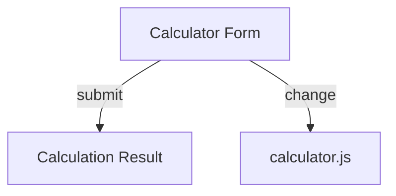

# calculator.md

## Purpose
Defines the Financial Calculator page, allowing users to perform various financial calculations (compound interest, annuities, perpetuities, EAR, etc.).

## Key Elements
- **Form**: For selecting a formula and entering calculation parameters.
- **Result Display**: Shows the result of the calculation.
- **Script Includes**: Loads calculator logic and shared navbar.

## Interactions
- Uses `calculator.js` for all calculation logic and dynamic form fields.
- Reads/writes no persistent data; calculations are session-only.
- Uses `navbar.js` for navigation.

## Diagrams

