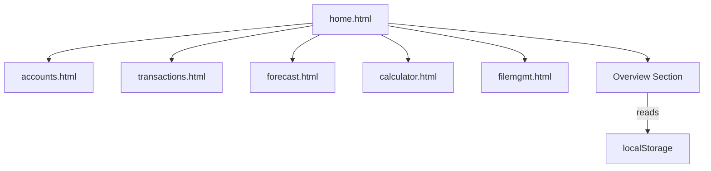

# home.md

## Purpose
Defines the Home (Overview) page, which provides a dashboard summary and navigation entry point for all modules in the app.

## Key Elements
- **Overview Section**: Displays counts and summaries for accounts, transactions, and forecast periods.
- **Navigation**: Links to all major modules (accounts, transactions, forecast, calculator, file management).
- **Script Includes**: Loads all JS modules for data, logic, and UI.

## Interactions
- Reads global state (accounts, transactions, forecast) to display summary data.
- Includes partials for all other modules (for SPA-like experience or modularity).
- Uses `navbar.js` for navigation.

## Diagrams

